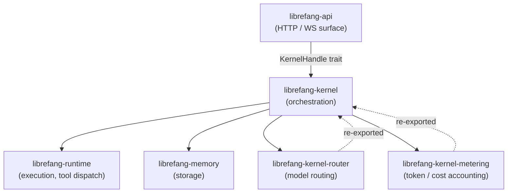

# Other — librefang-kernel

# librefang-kernel

Core orchestration crate for the LibreFang Agent Operating System. Manages agent lifecycles, scheduling, permissions, inter-agent communication, and the message-handling loop that dispatches requests to LLM drivers, tools, and the memory substrate.

## Architecture



The kernel sits between the HTTP surface layer (`librefang-api`) and the execution layer (`librefang-runtime`). It does **not** depend on `librefang-api` or `librefang-extensions`. When those crates need kernel callbacks, the dependency is reversed through the `KernelHandle` trait defined in `librefang-runtime`.

## Boot

Entry point is `LibreFangKernel::boot_with_config(KernelConfig)`. The kernel is a large struct (~18k LOC, 50+ fields — tracked in #3565). Coordinate before adding new fields.

## Subsystem Modules

| Module | Responsibility |
|---|---|
| `kernel::LibreFangKernel` | Top-level orchestrator struct |
| `registry::AgentRegistry` | Concurrent agent table — spawn, lookup, kill |
| `kernel::cron` | Cron scheduling; `session_mode` resolution (per-job > manifest > historical Persistent) |
| `kernel::event_bus` | Broadcast event bus |
| `kernel::session_lifecycle` | Session state machine |
| `approval` | Approval workflows |
| `auth` | Authentication and authorization |
| `auto_dream` | Automatic dream/recall cycles |
| `inbox` | Agent inbox management |
| `pairing` | Agent pairing |
| `scheduler` | Task scheduling |
| `metering` | Token and cost accounting (re-exported from `librefang-kernel-metering`) |
| `router` | Model router and alias resolution (re-exported from `librefang-kernel-router`) |

## Concurrency and Lock Strategy

Choosing the wrong lock type has caused real bugs. Follow these rules for `LibreFangKernel` fields:

| Scenario | Use | Example field |
|---|---|---|
| Hot read, rare write | `arc_swap::ArcSwap` | `model_catalog` |
| Hot read, hot write | `parking_lot::Mutex` or `dashmap::DashMap` | `running_tasks` |
| Append-only history | `parking_lot::Mutex<VecDeque<Arc<T>>>` | `event_bus` history |

### Critical lock details

**`model_catalog: arc_swap::ArcSwap<ModelCatalog>`** — Readers use atomic-load (#3384). Writers call `model_catalog_update(|cat| ...)` which performs an RCU-style swap. Never replace this with `RwLock<ModelCatalog>`.

**`skill_registry: std::sync::RwLock<SkillRegistry>`** — Used for hot-reload on skill install/uninstall. Keep reads brief; copy out what you need.

**`running_tasks: dashmap::DashMap<(AgentId, SessionId), RunningTask>`** — Keyed by `(agent, session)`, not `AgentId` alone. Before #3172 it was keyed only by `AgentId`, which silently overwrote concurrent loops. Do not degrade this.

**`event_bus` history** — `parking_lot::Mutex<VecDeque<Arc<Event>>>` since #3385. Do not switch back to `RwLock<VecDeque<Event>>`.

**`mcp_oauth_provider: Arc<dyn McpOAuthProvider + Send + Sync>`** — Pluggable trait. Implemented in `librefang-api` to keep the daemon free of HTTP concerns. All new OAuth flows must go through this trait, not direct kernel logic.

## Determinism

Anything that reaches an LLM prompt **must** be ordered before stringifying. Use `BTreeMap` / `BTreeSet`. `HashMap` iteration order varies across processes and silently invalidates provider prompt caches. See #3298.

Regression tests enforce this at each boundary — for example, `kernel::tests::mcp_summary_is_byte_identical_across_input_orders`.

## Configuration Knobs

| Knob | Default | Description |
|---|---|---|
| `KernelConfig.max_history_messages` | clamped to `MIN_HISTORY_MESSAGES = 4` | Global default for message history. Per-agent override in `agent.toml`. |
| `KernelConfig.queue.concurrency.trigger_lane` | 8 | Global semaphore on `Lane::Trigger`. |
| `KernelConfig.queue.concurrency.default_per_agent` | 1 | Fallback when `agent.toml: max_concurrent_invocations` is unset. |
| `KernelConfig.workflow_stale_timeout_minutes` | — | Cutoff used by `recover_stale_running_runs` at boot. |

## Adding a Field to `LibreFangKernel`

1. Default visibility is `pub(crate)`. Only relax if an external crate genuinely needs read access.
2. Add a corresponding entry to the `Default` impl on `KernelConfig` if the field has a config-side counterpart. Omitting this silently breaks the build.
3. For `Option<Arc<dyn Trait>>` fields, mark `#[serde(skip)]` and implement `Serialize`, `Deserialize`, `Clone`, and `Debug` manually.
4. Choose lock strategy based on the table in [Concurrency and Lock Strategy](#concurrency-and-lock-strategy).

## Testing

**Unit tests** live inside `crates/librefang-kernel/src/kernel/`. Run them with:

```
cargo test -p librefang-kernel
```

**Integration tests** that need a real router belong in `librefang-api/tests/` using `#[tokio::test]` against `TestServer` (refs #3721).

### Forbidden commands

- `cargo test` (workspace-wide) — causes `target/` contention with active user sessions.
- `cargo build` — use `cargo check --workspace --lib` instead. Real builds run in CI.

## Hard Rules

| Rule | Reason |
|---|---|
| No daemon spawning | The CLI binary owns `start`. The kernel just runs. |
| No `tokio::block_on` | The kernel runs inside an existing runtime. Nesting is unsafe. |
| No direct LLM HTTP calls | Route through `librefang-runtime` drivers. |
| No `Result<_, String>` returns on `KernelHandle` methods | Use typed errors (#3541). |
| No `HashMap` in LLM prompt data | Use `BTreeMap` for deterministic ordering (#3298). |

## Key Dependencies

| Crate | Role |
|---|---|
| `librefang-types` | Shared type definitions |
| `librefang-memory` | Storage layer |
| `librefang-runtime` | Execution engine, tool dispatch, LLM drivers |
| `librefang-skills` | Skill definitions |
| `librefang-hands` | Tool/hand implementations |
| `librefang-kernel-router` | Model routing (re-exported) |
| `librefang-kernel-metering` | Token and cost tracking (re-exported) |
| `librefang-wire` | Wire protocol types |
| `librefang-channels` | Channel adapters (default features disabled) |
| `librefang-llm-driver` | LLM provider abstractions |
| `librefang-extensions` | Extension interfaces |

## Binary

`purge_sentinels` (`bin/purge_sentinels.rs`) — standalone utility for cleaning up sentinel files.