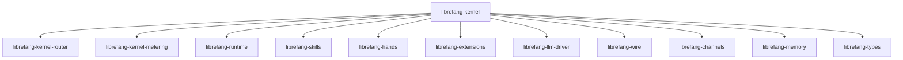

# Other — librefang-kernel

# librefang-kernel

Core kernel for the LibreFang Agent OS. This crate acts as the central orchestrator, wiring together the agent's subsystems—memory, routing, metering, skill execution, LLM integration, extensions, and communications—into a coherent runtime.

## Purpose

The kernel is responsible for:

- **Bootstrapping** the agent from configuration and bringing all subsystems online
- **Coordinating** message flow between skills, hands, the LLM driver, and external channels
- **Persisting** state to SQLite via `rusqlite`
- **Scheduling** recurring and cron-driven tasks
- **Enforcing** authentication and security policies (TOTP, constant-time comparison, zeroization of secrets)

## Architecture

The kernel sits at the top of the dependency graph. It re-exports and composes functionality from sibling crates but is not itself imported by any other `librefang-*` crate. Downstream consumers (binaries, integration tests, the `purge_sentinels` utility) depend on this crate to get a fully wired agent.

## Key Subsystem Integrations

| Dependency | Role |
|---|---|
| `librefang-types` | Shared type definitions (messages, configs, domain types) |
| `librefang-memory` | Conversation and long-term memory storage |
| `librefang-kernel-router` | Message routing between skills and channels |
| `librefang-kernel-metering` | Usage tracking, rate limiting, metrics |
| `librefang-runtime` | Async runtime configuration and lifecycle |
| `librefang-skills` | Skill registry and execution |
| `librefang-hands` | Action/tool execution layer |
| `librefang-extensions` | Extension loading and lifecycle |
| `librefang-llm-driver` | LLM provider abstraction |
| `librefang-wire` | Wire protocol for inter-process/network communication |
| `librefang-channels` | Inbound/outbound channel adapters (no default features) |

## Notable External Dependencies

These reflect specific kernel capabilities:

- **`rusqlite`** — Embedded SQLite for persistent state. The kernel owns the database connection pool and schema migrations.
- **`dashmap`** / **`arc-swap`** / **`crossbeam`** — Lock-free concurrent data structures for hot paths (skill registries, extension state, configuration hot-reload).
- **`cron`** — Cron expression parsing and scheduling of periodic tasks.
- **`totp-rs`** — Time-based one-time password generation and verification for agent authentication.
- **`subtle`** — Constant-time comparison operations for security-sensitive checks.
- **`zeroize`** — Secure memory clearing for secrets and credentials.
- **`reqwest`** — Outbound HTTP client for webhooks and external API calls.
- **`serde`** / **`serde_json`** / **`toml`** / **`serde_yaml`** — Multi-format configuration and serialization.
- **`libc`** *(Unix only)* — Low-level system calls for signal handling or process management.

## Binary: `purge_sentinels`

Located at `bin/purge_sentinels.rs`. A maintenance utility that cleans up stale sentinel records from the database. Typically run as a cron job or scheduled task outside the main agent process.

## Configuration

The kernel reads agent configuration from files in TOML or YAML format (via `serde` deserialization). The `dirs` crate is used to locate platform-appropriate configuration directories.

Key configuration concerns include:
- LLM provider settings (model, endpoint, credentials)
- Channel adapter configurations
- Skill enablement and parameters
- Metering thresholds
- Cron schedules for periodic tasks

## Security Model

The kernel takes several measures to handle secrets responsibly:

- Credentials are held in memory behind `zeroize`-enabled types, ensuring they are overwritten when dropped.
- Authentication challenges use `totp-rs` for time-based codes.
- Secret comparisons use `subtle` to avoid timing side-channels.
- The kernel avoids logging sensitive material by respecting `tracing` level filters.

## Testing

Tests use `tokio-test` for async test helpers and `tempfile` for isolated filesystem-based test fixtures (e.g., ephemeral SQLite databases, temporary configuration files).

## Adding a New Subsystem

To integrate a new component into the kernel:

1. Add the crate dependency to `Cargo.toml`.
2. Initialize the subsystem during kernel bootstrap (typically in the top-level `start` or `init` function).
3. Wire it into the router if it needs to receive or emit messages.
4. Register metering hooks if it consumes billable resources.
5. Expose any new configuration fields through the existing config struct with appropriate `serde` attributes.