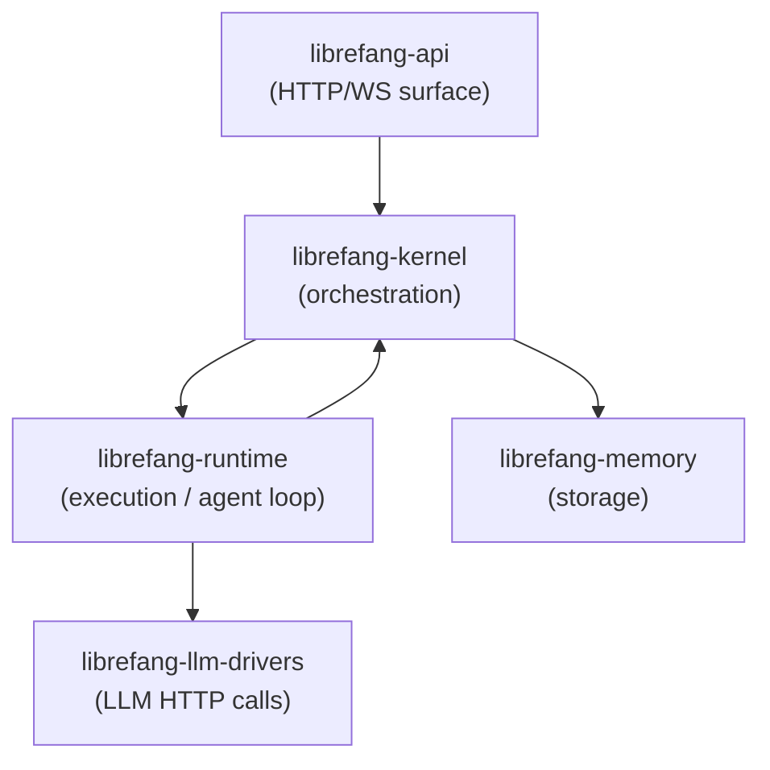

# Other — librefang-kernel

# librefang-kernel

Core orchestration layer for the LibreFang Agent Operating System. Manages agent lifecycles, scheduling, permissions, inter-agent communication, and the message-handling loop that dispatches requests to LLM drivers, tools, and the memory substrate.

## Architecture Positioning



The kernel sits below the HTTP surface (`librefang-api`) and above both the execution layer (`librefang-runtime`) and storage layer (`librefang-memory`). It never makes direct LLM HTTP calls — all model interaction goes through `librefang-runtime` drivers.

## Dependency Boundaries

**The kernel does NOT depend on** `librefang-api` or `librefang-extensions`. When runtime or extensions need a kernel callback, the dependency is inverted through the `KernelHandle` trait (defined in `librefang-runtime`).

**The kernel owns:** registry, scheduling, approval, auth, auto_dream, cron, event_bus, inbox, pairing, scheduler, session_lifecycle, plus re-exported `metering` (from `librefang-kernel-metering`) and `router` (from `librefang-kernel-router`).

**The kernel does NOT own:** the agent loop body, tool dispatch, channel adapters, HTTP routing, or the dashboard SPA. Those live in `librefang-runtime`, `librefang-channels`, and `librefang-api` respectively.

## Key Components

### `kernel::LibreFangKernel`

The top-level orchestrator struct. Boot via:

```rust
let kernel = LibreFangKernel::boot_with_config(KernelConfig { ... });
```

This is currently a large struct (~18k LOC, 50+ fields — tracked in #3565). Adding new fields requires coordination per the guidelines below.

### `registry::AgentRegistry`

Concurrent agent table providing spawn, lookup, and kill operations for agents.

### `kernel::cron`

Cron-based job scheduling. Session mode resolution follows a priority cascade: per-job override → manifest value → historical `Persistent` setting.

### `kernel::event_bus`

Broadcast event bus. Event history is stored as `parking_lot::Mutex<VecDeque<Arc<Event>>>` (changed in #3385). Do not switch back to `RwLock<VecDeque<Event>>` — the previous design caused contention issues.

### `kernel::session_lifecycle`

Session state machine managing the lifecycle of agent sessions.

### `metering` (re-exported from `librefang-kernel-metering`)

Token and cost accounting. Reads from the kernel's `model_catalog` for pricing data.

### `router` (re-exported from `librefang-kernel-router`)

Model router with alias resolution. Selects the appropriate LLM provider and model based on configuration and request context.

## Hot Fields and Lock Strategies

`LibreFangKernel` uses different concurrency primitives depending on access patterns. Choose the right one when adding fields:

| Field | Type | Strategy | Rationale |
| --- | --- | --- | --- |
| `model_catalog` | `arc_swap::ArcSwap<ModelCatalog>` | Atomic-load reads, RCU writes via `model_catalog_update(\|cat\| ...)` | Hot read, rare write (#3384). Never use `RwLock<ModelCatalog>`. |
| `skill_registry` | `std::sync::RwLock<SkillRegistry>` | Brief reads; copy out what you need | Hot-reload on skill install/uninstall. |
| `running_tasks` | `dashmap::DashMap<(AgentId, SessionId), RunningTask>` | Concurrent map | Keyed by `(agent, session)` tuple, not `AgentId` alone. Pre-#3172 used `AgentId` which silently overwrote concurrent loops. |
| `mcp_oauth_provider` | `Arc<dyn McpOAuthProvider + Send + Sync>` | Pluggable trait object | Implemented in `librefang-api` to keep the daemon free of HTTP. All new OAuth flows go through this trait. |

### Decision framework for lock strategy

- **Hot read, rare write** → `arc_swap::ArcSwap<T>`
- **Hot read, hot write** → `parking_lot::Mutex<T>` or `dashmap::DashMap<K, V>`
- **Append-only history** → `parking_lot::Mutex<VecDeque<Arc<T>>>`

## Determinism Requirements

Anything that reaches an LLM prompt **must** be deterministically ordered before stringifying. Use `BTreeMap` / `BTreeSet` exclusively. `HashMap` iteration order varies across processes and silently invalidates provider prompt caches.

Regression tests guard these boundaries — see `kernel::tests::mcp_summary_is_byte_identical_across_input_orders`.

Reference: #3298.

## Configuration Knobs

Kernel-side configuration is managed through `KernelConfig`:

| Knob | Default | Description |
| --- | --- | --- |
| `max_history_messages` | varies | Global default for conversation history length. Clamped up to `MIN_HISTORY_MESSAGES = 4` with a WARN log if set lower. Per-agent override available in `agent.toml`. |
| `queue.concurrency.trigger_lane` | 8 | Global semaphore size for `Lane::Trigger`. |
| `queue.concurrency.default_per_agent` | 1 | Fallback concurrency when `agent.toml: max_concurrent_invocations` is unset. |
| `workflow_stale_timeout_minutes` | varies | Cutoff threshold used by `recover_stale_running_runs` at boot time. |

## Adding a New Field to `LibreFangKernel`

Follow this checklist:

1. **Visibility:** Field must be `pub(crate)` unless an external crate genuinely needs read access.
2. **Config default:** If the field has a config-side counterpart, add it to the `Default` impl on `KernelConfig`. Missing this silently breaks the build.
3. **Trait objects:** If the field is `Option<Arc<dyn Trait>>`, mark it `#[serde(skip)]` and implement `Serialize`, `Deserialize`, `Clone`, and `Debug` manually.
4. **Lock strategy:** Choose from the decision framework above based on read/write frequency.

## Testing

### Unit tests

Most kernel unit tests live inside `crates/librefang-kernel/src/kernel/`. Run them with:

```sh
cargo test -p librefang-kernel
```

### Integration tests

Tests requiring a real router live in `librefang-api/tests/` using `#[tokio::test]` against `TestServer` (refs #3721).

### Forbidden commands

- **`cargo test`** (workspace-wide) — causes `target/` contention with the user's active session.
- **`cargo build`** — use `cargo check --workspace --lib` instead. Real builds run in CI.

## Hard Rules (Taboos)

| Rule | Reason |
| --- | --- |
| No daemon spawning | The CLI binary owns the `start` command. Kernel just runs. |
| No `tokio::block_on` | We are already inside a runtime. Nesting causes panics or deadlocks. |
| No direct LLM HTTP calls | Go through `librefang-runtime` drivers. |
| No `Result<_, String>` returns on `KernelHandle` methods | Use typed errors (#3541). |
| No `HashMap<K, V>` in fields that end up in LLM prompts | Use `BTreeMap` for determinism (#3298). |

## Key Crate Dependencies

| Dependency | Purpose |
| --- | --- |
| `librefang-types` | Shared type definitions |
| `librefang-memory` | Storage substrate |
| `librefang-memory-wiki` | Wiki-style memory |
| `librefang-kernel-router` | Model routing and alias resolution (re-exported) |
| `librefang-kernel-metering` | Token and cost accounting (re-exported) |
| `librefang-runtime` | Agent loop execution, tool dispatch |
| `librefang-skills` | Skill system |
| `librefang-hands` | Tool/hand management |
| `librefang-llm-driver` / `librefang-llm-drivers` | LLM provider abstractions |
| `librefang-wire` | Wire protocol types |
| `librefang-channels` | Channel adapters (default features disabled) |
| `dashmap` | Concurrent hash maps |
| `arc-swap` | Atomic RCU-style swaps |
| `parking_lot` | Efficient sync primitives |
| `tera` | Jinja2-style templating for workflow `Transform` operations — sandboxed, no I/O or shell escape |