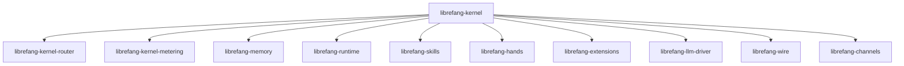

# Other — librefang-kernel

# librefang-kernel

The central orchestrator for the LibreFang Agent OS. This crate wires together all subsystems—routing, metering, memory, skills, hands, extensions, and LLM drivers—into a cohesive runtime that drives agent behavior.

## Role in the System

The kernel sits at the top of the dependency graph. It does not implement low-level logic itself; instead it initializes, configures, and coordinates the crates that do:

| Subsystem | Crate | Purpose |
|---|---|---|
| Types | `librefang-types` | Shared domain types used across all crates |
| Memory | `librefang-memory` | Conversation history, working memory, state persistence |
| Routing | `librefang-kernel-router` | Message/request routing between components |
| Metering | `librefang-kernel-metering` | Usage tracking, rate limiting, quota enforcement |
| Runtime | `librefang-runtime` | Async task execution and lifecycle management |
| Skills | `librefang-skills` | Agent capability definitions and dispatch |
| Hands | `librefang-hands` | Tool-use / action execution layer |
| Extensions | `librefang-extensions` | Plugin/extension loading and management |
| LLM Driver | `librefang-llm-driver` | LLM provider abstraction and inference calls |
| Wire Protocol | `librefang-wire` | Serialization format for inter-service communication |
| Channels | `librefang-channels` | Async message channels (feature-gated, no default features) |



## Key Capabilities

### Concurrency Model

The kernel relies on Tokio for async execution and supplements it with:

- **`dashmap`** — concurrent hash maps for shared mutable state without global locks
- **`arc-swap`** — lock-free atomic swapping of shared configuration or state snapshots
- **`crossbeam`** — multi-producer/multi-consumer channels for inter-task messaging

### Persistence

SQLite via `rusqlite` provides local durable storage. This backs metering data, conversation history, and agent state that must survive restarts.

### Security

Several dependencies indicate security-sensitive operations:

- **`totp-rs`** — TOTP-based two-factor authentication
- **`subtle`** — constant-time comparisons for secret verification
- **`zeroize`** — secure clearing of sensitive data from memory
- **`rand`** / **`hex`** — cryptographic random generation and hex encoding

### Scheduling

The `cron` crate enables cron-expression-based task scheduling, used for periodic maintenance, metering rollups, or timed skill execution. Timezone-aware scheduling is supported through `chrono` and `chrono-tz`.

### Configuration Loading

The kernel loads configuration from multiple formats—**TOML**, **YAML**, and **JSON**—via `toml`, `serde_yaml`, and `serde_json` respectively. The `dirs` crate resolves platform-specific configuration paths.

### HTTP Communication

`reqwest` provides outbound HTTP capability, used by the LLM driver for API calls and potentially by extensions for webhook integrations.

## Binaries

### `purge_sentinels`

Located at `bin/purge_sentinels.rs`. A maintenance utility that cleans up stale sentinel records. Sentinels are likely watchdog or lock markers used to coordinate running agents; this binary removes ones left behind by crashed or terminated processes.

Run directly:

```bash
cargo run --bin purge_sentinels
```

## Platform Notes

On Unix targets, `libc` is linked directly (`cfg(unix)` conditional dependency). This is typically used for low-level process signals, file descriptor management, or daemonization behavior not exposed through higher-level Rust crates.

## Adding a New Subsystem

When integrating a new crate into the kernel:

1. Add the dependency in `Cargo.toml`.
2. Initialize the subsystem during kernel startup, receiving shared state (database handle, channel senders, configuration) as constructor arguments.
3. Register any routes with `librefang-kernel-router` if the subsystem handles incoming messages.
4. Register metering hooks with `librefang-kernel-metering` if the subsystem consumes billable resources.
5. Ensure sensitive data uses `zeroize::Zeroize` on drop where appropriate.