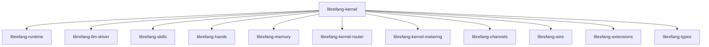

# Other — librefang-kernel

# librefang-kernel

The core orchestration crate for the **LibreFang Agent OS**. This module acts as the central kernel that wires together all subsystems — runtime execution, LLM driving, skill dispatch, hand (action) execution, memory, metering, routing, channel I/O, and extensions — into a cohesive agent platform.

## Architecture

`librefang-kernel` is an **integration layer**. It does not implement subsystem logic itself; instead, it imports every other `librefang-*` crate and coordinates them to provide the top-level agent lifecycle.



## Key Responsibilities

| Area | Delegated Crate | Role of the Kernel |
|------|----------------|-------------------|
| **Message routing** | `librefang-kernel-router` | Wires incoming messages to the correct handler pipeline |
| **Metering / billing** | `librefang-kernel-metering` | Tracks token usage, operation counts, and enforces quotas |
| **Agent runtime** | `librefang-runtime` | Manages agent lifecycle, task spawning, and execution context |
| **LLM interaction** | `librefang-llm-driver` | Drives completion requests, handles streaming responses |
| **Skill dispatch** | `librefang-skills` | Resolves and invokes registered skills based on agent intent |
| **Action execution** | `librefang-hands` | Executes concrete actions (tool calls, API requests, etc.) |
| **Persistence** | `librefang-memory` | Manages conversation history, agent state, and long-term recall |
| **Channel I/O** | `librefang-channels` | Abstracts inbound/outbound communication channels |
| **Wire protocol** | `librefang-wire` | Serialisation and framing for inter-service communication |
| **Extensions** | `librefang-extensions` | Loads and manages third-party or user-supplied extensions |
| **Shared types** | `librefang-types` | Common data structures used across all crates |

## External Dependency Highlights

The kernel pulls in several categories of external crates to support its orchestration role:

- **Async runtime:** `tokio`, `futures`, `async-trait`
- **Serialisation:** `serde`, `serde_json`, `toml`, `serde_yaml`
- **Concurrency primitives:** `dashmap`, `arc-swap`, `crossbeam`
- **Storage:** `rusqlite` (embedded SQLite for local state)
- **Observability:** `tracing`, `tracing-subscriber`
- **Time & scheduling:** `chrono`, `chrono-tz`, `cron`
- **Security:** `totp-rs` (TOTP 2FA), `zeroize` (secure memory clearing), `subtle` (constant-time crypto utilities)
- **Networking:** `reqwest` (HTTP client for outbound calls)
- **Text processing:** `regex`, `regex-lite`

### Platform-specific: Unix

On Unix targets, `libc` is included directly. This is typically used for low-level system interactions such as signal handling, file descriptor management, or process control that `tokio` does not expose.

## Binary: `purge_sentinels`

The crate ships a utility binary:

```
bin/purge_sentinels.rs
```

This tool is responsible for cleaning up **sentinel** records — marker entries used to track in-progress or stale operations (for example, orphaned task locks, incomplete session markers, or expired scheduling tokens). Run it as a maintenance task to reclaim storage and ensure agent state consistency.

```bash
# Run via cargo
cargo run --bin purge_sentinels
```

## Integration Guide

### Adding the Kernel to a Workspace Crate

```toml
[dependencies]
librefang-kernel = { path = "../librefang-kernel" }
```

This transitively brings in the full agent stack. If you only need a subset of functionality, depend on the specific sub-crate directly instead.

### Feature Flags

`librefang-channels` is imported with `default-features = false`, meaning the kernel explicitly opts into only the channel features it needs. If you are consuming the kernel and require additional channel backends, enable them at the `librefang-channels` level in your own `Cargo.toml`.

## Testing

Dev-dependencies include `tokio-test` and `tempfile`, indicating that kernel tests use:

- **Async test utilities** (`tokio-test`) for running agent pipelines under a tokio runtime.
- **Temporary filesystem resources** (`tempfile`) for SQLite databases and file-backed state in isolation.

Run the test suite:

```bash
cargo test -p librefang-kernel
```

## Conventions

1. **No business logic here.** The kernel wires crates together. If you find yourself writing domain logic in this crate, it likely belongs in a sub-crate.
2. **Top-level entry points.** The agent boot sequence, configuration loading, and graceful shutdown live here because they require touching every subsystem.
3. **Configuration is format-agnostic.** With `toml`, `serde_json`, and `serde_yaml` all available, configuration can be supplied in any of these formats. The kernel normalises them into a unified `Config` structure (defined in `librefang-types`).