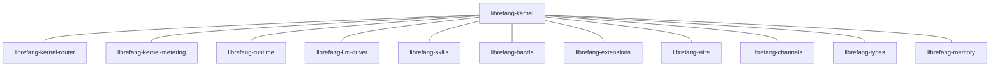

# Other — librefang-kernel

# librefang-kernel

The central orchestration crate for the LibreFang Agent OS. This module serves as the top-level integration point that wires together all subsystems—routing, metering, runtime execution, LLM interaction, skill dispatch, and I/O channels—into a cohesive agent kernel.

## Purpose

While each `librefang-kernel-*` sub-crate encapsulates a specific subsystem, `librefang-kernel` itself is the **composition layer**. It owns the agent lifecycle: loading configuration, initializing subsystems, coordinating message flow between them, and managing persistent state through SQLite.

## Architectural Role

The kernel sits above all other crates. Nothing depends on it; it depends on everything else. This inverted dependency structure keeps subsystems independently testable while allowing the kernel to impose the initialization order and interaction patterns it needs.

## Key Dependency Groups

### Core Kernel Subsystems

| Crate | Role |
|---|---|
| `librefang-kernel-router` | Message/request routing between handlers |
| `librefang-kernel-metering` | Usage tracking, rate limiting, and quota enforcement |

These are the only other crates carrying the `kernel-` prefix. They implement concerns that are meaningless outside a running agent context.

### Agent Capabilities

| Crate | Role |
|---|---|
| `librefang-runtime` | Task execution runtime (async task spawning, cancellation) |
| `librefang-skills` | Skill definitions, registration, and dispatch |
| `librefang-hands` | Tool/actuator abstraction for taking actions |
| `librefang-extensions` | Plugin/extension loading and lifecycle |
| `librefang-llm-driver` | LLM provider abstraction and API interaction |

### I/O and Communication

| Crate | Role |
|---|---|
| `librefang-wire` | Serialization format and protocol definitions |
| `librefang-channels` | Async channel infrastructure (no default features—only what the kernel needs) |

### Shared Infrastructure

| Crate | Role |
|---|---|
| `librefang-types` | Shared type definitions used across all crates |
| `librefang-memory` | Conversation/context memory management |

## Notable External Dependencies

The external dependency selection reveals specific capabilities:

- **Persistence**: `rusqlite` — SQLite for local state, conversation history, or configuration storage. The kernel is likely responsible for schema initialization and connection management.
- **Configuration**: `toml`, `serde_yaml`, `serde_json` — Multi-format config loading. The kernel likely reads agent configuration files in TOML or YAML.
- **Concurrency primitives**: `dashmap` (concurrent hash maps), `arc-swap` (atomic pointer swaps for hot-reloadable state), `crossbeam` (multi-producer/multi-consumer channels). These suggest the kernel manages shared mutable state that subsystems read concurrently.
- **Scheduling**: `cron` — Cron expression parsing indicates scheduled/recurring task support within the agent.
- **Security**: `totp-rs` (TOTP generation), `subtle` (constant-time comparisons), `zeroize` (secure memory clearing). The kernel handles authentication secrets or API key management.
- **HTTP**: `reqwest` — Outbound HTTP for LLM API calls or extension communication.
- **Platform**: `libc` (Unix only) — Low-level system calls, likely for signal handling or process management.

## Conventions for Contributors

### Adding a New Subsystem

The kernel's dependency list is intentionally flat. If you introduce a new `librefang-*` crate that the kernel needs to orchestrate:

1. Add it as a path dependency in `Cargo.toml`.
2. Initialize it within the kernel's startup sequence, respecting the dependency order (types → memory → I/O → capabilities → kernel subsystems).
3. Do **not** create circular dependencies back into the kernel. Subsystems should communicate through types defined in `librefang-types` or `librefang-wire`.

### Configuration

The kernel is the configuration authority. It reads agent config (TOML/YAML) and passes constructed subsystem configs down. Subsystem crates should accept structured config types, not file paths.

### Testing

`tokio-test` and `tempfile` are dev-dependencies, indicating tests spin up temporary directories (likely for SQLite databases or config files) within async test contexts. Follow this pattern for integration tests.

### Feature Flags on Dependencies

`librefang-channels` is imported with `default-features = false`. If you add channel functionality, check which features are actually enabled rather than assuming the full channel API is available.