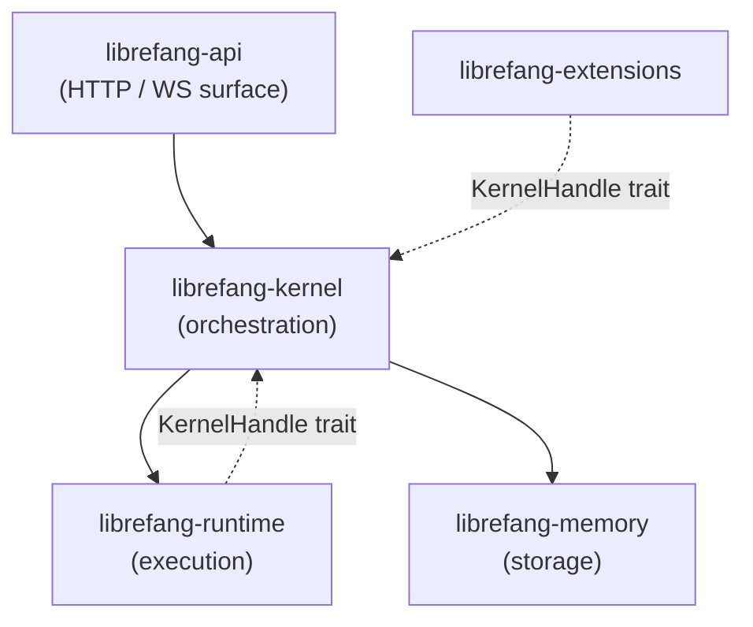

# Other — librefang-kernel

# librefang-kernel

Core orchestration layer for the LibreFang Agent Operating System. Manages agent lifecycles, scheduling, permissions, inter-agent communication, and the message-handling loop that dispatches requests to LLM drivers, tools, and the memory substrate.

## Architecture Position



The kernel sits between the HTTP/WebSocket surface and the execution runtime. It does **not** depend on `librefang-api` or `librefang-extensions`. Those crates access kernel functionality through the `KernelHandle` trait defined in `librefang-runtime`, reversing the dependency.

## Boot Sequence

Entry point is `LibreFangKernel::boot_with_config(KernelConfig)`. This initializes the orchestrator, recovers stale running runs (using `KernelConfig.workflow_stale_timeout_minutes` as the cutoff), and prepares all subsystems.

## Key Components

### `kernel::LibreFangKernel`

Top-level orchestrator. Currently a large struct (~18k LOC, 50+ fields — tracked in #3565). Coordinates all subsystems. Do not add fields without coordination.

### `registry::AgentRegistry`

Concurrent agent table. Provides spawn, lookup, and kill operations for agents.

### Subsystem Modules

| Module | Responsibility |
|---|---|
| `kernel::cron` | Cron scheduling. Resolves `session_mode` per-job → manifest → historical Persistent. |
| `kernel::event_bus` | Broadcast event bus with ordered history. |
| `kernel::session_lifecycle` | Session state machine. |
| `kernel::approval` | Approval workflow. |
| `kernel::auth` | Authentication and authorization. |
| `kernel::auto_dream` | Automatic dream/consolidation cycle. |
| `kernel::inbox` | Agent inbox management. |
| `kernel::pairing` | Agent pairing logic. |
| `kernel::scheduler` | Task scheduling. |

### Re-exports

- `metering` — from `librefang-kernel-metering`. Token and cost accounting. Uses kernel's `model_catalog`.
- `router` — from `librefang-kernel-router`. Model routing and alias resolution.

## Concurrency: Lock Strategies

The kernel uses different synchronization primitives depending on access patterns. Getting this wrong causes subtle bugs.

### `model_catalog: arc_swap::ArcSwap<ModelCatalog>`

Hot read, rare write. Readers get a consistent snapshot via atomic load (#3384). Writers use `model_catalog_update(|cat| ...)` for RCU-style updates. Never replace with `RwLock<ModelCatalog>`.

### `skill_registry: std::sync::RwLock<SkillRegistry>`

Hot-reload on skill install/uninstall. Keep reads brief — copy out the data you need, don't hold the lock across I/O.

### `running_tasks: dashmap::DashMap<(AgentId, SessionId), RunningTask>`

Keyed by `(agent, session)` tuple, **not** `AgentId` alone. Pre-#3172 it was keyed by `AgentId`, which silently overwrote concurrent agent loops. Do not regress this.

### `event_bus` history: `parking_lot::Mutex<VecDeque<Arc<Event>>>`

Append-only history. Uses `parking_lot::Mutex` since #3385. Do not switch back to `RwLock<VecDeque<Event>>` — the previous design caused contention issues.

### `mcp_oauth_provider: Arc<dyn McpOAuthProvider + Send + Sync>`

Pluggable OAuth provider. Implemented in `librefang-api` to keep the daemon free of HTTP concerns. All new OAuth flows must go through this trait, not direct kernel logic.

## Determinism in LLM Prompts

Anything that reaches an LLM prompt must be deterministically ordered before stringification. Use `BTreeMap` / `BTreeSet` everywhere in prompt construction paths. `HashMap` iteration order varies across processes and silently invalidates provider prompt caches.

Regression tests guard this boundary — see `kernel::tests::mcp_summary_is_byte_identical_across_input_orders`.

## Configuration Knobs

| Setting | Default | Purpose |
|---|---|---|
| `KernelConfig.max_history_messages` | varies | Global history limit. Clamped up to `MIN_HISTORY_MESSAGES = 4` with a WARN log. Per-agent override available in `agent.toml`. |
| `KernelConfig.queue.concurrency.trigger_lane` | 8 | Global semaphore on `Lane::Trigger`. |
| `KernelConfig.queue.concurrency.default_per_agent` | 1 | Fallback when `agent.toml: max_concurrent_invocations` is unset. |
| `KernelConfig.workflow_stale_timeout_minutes` | varies | Cutoff for `recover_stale_running_runs` at boot. |

## Adding a New Field to `LibreFangKernel`

Follow this checklist:

1. **Visibility**: Field must be `pub(crate)` unless an external crate genuinely needs read access.
2. **Config default**: If the field has a config-side counterpart, add it to the `Default` impl on `KernelConfig`. Omitting this silently breaks the build.
3. **Trait objects**: If the field is `Option<Arc<dyn Trait>>`, mark it `#[serde(skip)]` and implement `Serialize`, `Deserialize`, `Clone`, and `Debug` manually.
4. **Lock strategy**: Choose based on access pattern:
   - Hot read, rare write → `arc_swap::ArcSwap`
   - Hot read, hot write → `parking_lot::Mutex` or `dashmap::DashMap`
   - Append-only history → `parking_lot::Mutex<VecDeque<Arc<T>>>`

## Testing

Run tests with:

```sh
cargo test -p librefang-kernel
```

**Do not** run workspace-wide `cargo test` — it causes target/ contention with the user's active session.

**Do not** run `cargo build` — use `cargo check --workspace --lib` instead. Real builds run in CI.

Unit tests live inside `crates/librefang-kernel/src/kernel/`. Integration tests that need a real router belong in `librefang-api/tests/` using `#[tokio::test]` against `TestServer` (refs #3721).

## Hard Rules

- **No daemon spawning.** The CLI binary owns the `start` command. The kernel just runs.
- **No `tokio::block_on`.** The kernel executes inside an existing runtime. Nesting runtimes will panic or deadlock.
- **No direct LLM HTTP calls.** All LLM communication goes through `librefang-runtime` drivers.
- **No `Result<_, String>` returns from `KernelHandle` methods** (#3541). Use typed errors.
- **No `HashMap<K, V>` in any field that ends up in an LLM prompt.** Use `BTreeMap` (#3298).

## Dependencies

Internal crates:

- `librefang-types` — shared type definitions
- `librefang-memory`, `librefang-memory-wiki` — storage layer
- `librefang-kernel-router` — model routing (re-exported)
- `librefang-kernel-metering` — token/cost accounting (re-exported)
- `librefang-runtime` — execution layer (provides `KernelHandle` trait)
- `librefang-skills` — skill management
- `librefang-hands` — tool/hand abstractions
- `librefang-extensions` — extension points
- `librefang-llm-driver` — LLM driver traits
- `librefang-wire` — wire protocol types
- `librefang-channels` — channel adapters (default features disabled)

Key external crates: `tokio`, `dashmap`, `arc-swap`, `parking_lot`, `serde`, `rusqlite` (via `r2d2`), `cron`, `reqwest`, `chrono`, `uuid`, `tracing`.