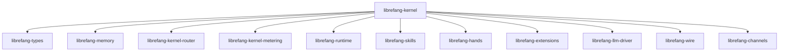
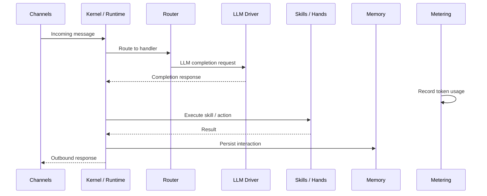

# Other — librefang-kernel

# librefang-kernel

The central orchestration crate for the LibreFang Agent OS. It wires together all subsystems — LLM interaction, skill execution, routing, metering, memory, and channel communication — into a coherent agent runtime.

## Role in the Architecture

`librefang-kernel` sits at the top of the dependency tree. It does not export a library target consumed by other crates; instead, it is the **integration point** that pulls in every subsystem and makes them collaborate. Think of it as the glue layer that owns configuration loading, process lifecycle, and cross-cutting coordination.



## Subsystem Responsibilities

The kernel pulls in each crate for a distinct role:

| Crate | Purpose |
|---|---|
| `librefang-types` | Shared data structures, error types, and domain primitives used across all crates. |
| `librefang-memory` | Persistent storage and recall — conversation history, agent state, and long-term knowledge. |
| `librefang-kernel-router` | Request routing — dispatches incoming messages to the correct agent, skill, or handler. |
| `librefang-kernel-metering` | Usage tracking and rate limiting for LLM calls, token consumption, and resource accounting. |
| `librefang-runtime` | The agent execution runtime — manages the lifecycle and isolation of running agents. |
| `librefang-skills` | Skill definitions — modular capabilities that agents can invoke (e.g., web search, code execution). |
| `librefang-hands` | Action execution layer — carries out concrete operations on behalf of agents. |
| `librefang-extensions` | Plugin/extension system — allows third-party extensions to hook into agent behavior. |
| `librefang-llm-driver` | LLM provider abstraction — communicates with language model APIs. |
| `librefang-wire` | Wire protocol — serialization and transport-level messaging between components. |
| `librefang-channels` | Channel management — handles inbound/outbound communication channels (defaults features disabled, likely feature-gated per deployment). |

## Key External Dependencies

The kernel's dependency selection reveals its operational concerns:

### Async Runtime
- **`tokio`** — all I/O is async; the kernel is built around Tokio's runtime.

### Serialization & Configuration
- **`serde`**, **`serde_json`**, **`toml`**, **`serde_yaml`** — configuration files and message payloads can arrive in JSON, TOML, or YAML. This suggests the kernel reads agent configs and possibly skill definitions from multiple formats.

### Concurrency Primitives
- **`dashmap`** — concurrent hash maps for shared mutable state (agent registries, active sessions).
- **`arc-swap`** — atomic swapping of `Arc` references, used for hot-reloading configuration or swapping active state without locking.
- **`crossbeam`** — multi-producer/multi-consumer channels and concurrent data structures.

### Persistence
- **`rusqlite`** — embedded SQLite. The kernel maintains a local database, likely for agent state, metering records, or session history.

### Security & Authentication
- **`totp-rs`** — TOTP (Time-based One-Time Password) generation/verification, indicating the kernel handles two-factor authentication flows.
- **`subtle`** — constant-time comparisons, used for cryptographic safety (timing-attack resistance when comparing secrets or tokens).
- **`zeroize`** — secure memory clearing for sensitive data (API keys, tokens, passwords).

### Scheduling
- **`cron`** (v0.16) — cron expression parsing and scheduling, used for periodic tasks, health checks, or scheduled agent actions.

### Networking
- **`reqwest`** — outbound HTTP client, used for calling external LLM APIs, webhooks, or remote services.

### Observability
- **`tracing`**, **`tracing-subscriber`** — structured logging and tracing throughout the kernel lifecycle.

### Platform-Specific
- **`libc`** (Unix only) — low-level Unix system calls, gated behind `cfg(unix)`. Likely used for signal handling, file descriptor management, or process control.

## Binaries

### `purge_sentinels`

Located at `bin/purge_sentinels.rs`. A standalone utility binary for cleaning up sentinel files — likely lock files or marker files used to track in-progress operations. Run this to recover from unclean shutdowns that leave stale sentinels on disk.

## Configuration Loading

The presence of `toml`, `serde_yaml`, and `serde_json` together with `dirs` suggests the kernel loads configuration from the user's config directory in multiple possible formats. A typical flow would be:

1. Locate the config directory via `dirs`.
2. Detect and parse the config file (TOML, YAML, or JSON).
3. Populate runtime state using `arc-swap` for lock-free access.
4. Pass config sections to each subsystem (router, metering, LLM driver, etc.).

## Thread Safety Model

The kernel uses a shared-state model built on:

- **`Arc<T>`** for reference-counted shared ownership across Tokio tasks.
- **`ArcSwap<T>`** for configurations or registries that change rarely but are read frequently — readers never block, writers atomically install a new snapshot.
- **`DashMap`** for high-contention mutable maps (active sessions, registered skills, etc.).
- **`crossbeam` channels** for message passing between subsystems, avoiding lock-based coordination.

## Data Flow (Typical Request)



This is a simplified view — extensions can hook into multiple points, and the router may dispatch to sub-agents.

## Testing

Dev-dependencies include:
- **`tokio-test`** — for async test utilities (`tokio::test` macros, mock timers).
- **`tempfile`** — for creating temporary directories and files, used to isolate tests that touch the filesystem (SQLite databases, config files, sentinel files).

Run the test suite:

```bash
cargo test -p librefang-kernel
```

## Contributing

When adding a new subsystem integration:

1. Add the crate dependency in `Cargo.toml`.
2. Wire initialization into the kernel startup sequence.
3. Ensure any shared state is protected with the appropriate concurrency primitive (`Arc`, `ArcSwap`, or `DashMap`).
4. If the subsystem handles secrets or tokens, use `zeroize` to clear sensitive data on drop.
5. Add `tracing` instrumentation at all entry points.
6. Write tests using `tempfile` for any filesystem-dependent behavior.