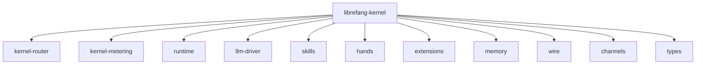

# Other — librefang-kernel

# librefang-kernel

**Core kernel for the LibreFang Agent OS**

The kernel is the central orchestration crate of the LibreFang agent. It wires together the LLM driver, skill system, hand (action) executors, extension loading, routing, metering, memory, and channel subsystems into a coherent agent runtime. Think of it as the process supervisor and message bus that gives all other components a place to plug in and cooperate.

## Architecture



The kernel sits at the top of the dependency tree. Every other `librefang-*` crate provides a focused capability; the kernel owns initialization, configuration loading, lifecycle management, and the glue code that binds those capabilities into a running agent.

## Key Responsibilities

### Configuration Loading
The kernel reads agent configuration from multiple serialization formats — TOML, YAML, and JSON — via the respective `serde` frontends. Configuration covers LLM provider settings, channel definitions, scheduled tasks, and extension parameters.

### Persistence (SQLite)
Uses `rusqlite` for local structured storage. This backs conversation history, metering records, agent state snapshots, and sentinel tracking.

### Concurrency Model
- **`tokio`** provides the async runtime.
- **`dashmap`** is used for lock-free concurrent hash maps (e.g., active session registries, skill lookup tables).
- **`arc-swap`** enables atomic swapping of shared configuration or service handles without stopping the world — important for hot-reload scenarios.

### Authentication & Security
- **`totp-rs`** — Time-based one-time password generation and verification for agent-to-controller authentication.
- **`zeroize`** — Secure clearing of sensitive material (API keys, tokens, secrets) from memory after use.
- **`subtle`** — Constant-time comparisons to prevent timing side-channels during credential checks.

### Scheduled Tasks
The `cron` crate drives periodic agent behaviors — health checks, metering flushes, memory compaction, and similar housekeeping tasks defined in cron-expression syntax.

### Platform-Specific Code
On Unix targets, `libc` is linked directly. This is used for low-level system interactions that `tokio` and the standard library don't cover (e.g., process signal handling, file descriptor management, or privilege operations relevant to an agent OS).

## Subsystems Integration

| Dependency | Role in the Kernel |
|---|---|
| `librefang-types` | Shared domain types exchanged across all subsystems |
| `librefang-memory` | Short-term and long-term agent memory storage and retrieval |
| `librefang-kernel-router` | Message routing between skills, hands, extensions, and the LLM |
| `librefang-kernel-metering` | Token usage tracking, rate limiting, and quota enforcement |
| `librefang-runtime` | Low-level runtime primitives the kernel builds upon |
| `librefang-skills` | Pluggable skill definitions the agent can invoke |
| `librefang-hands` | Action execution layer (tool use, API calls, file operations) |
| `librefang-extensions` | Third-party or user-provided extension loading |
| `librefang-llm-driver` | Unified interface to LLM providers |
| `librefang-wire` | Wire protocol for inter-process and network communication |
| `librefang-channels` | Inbound/outbound channel adapters (e.g., HTTP, WebSocket, CLI) |

## Binary: `purge_sentinels`

Path: `bin/purge_sentinels.rs`

A maintenance utility that cleans up stale sentinel records from the SQLite database. Sentinels are lightweight markers used to track in-flight operations, lock ownership, or deduplication states. Over time, crashed or interrupted sessions can leave orphaned sentinels behind. Run this binary periodically (or via a cron job) to reclaim those resources:

```sh
# Typical usage
librefang-kernel --bin purge_sentinels
```

The binary links against the same `rusqlite` storage layer used by the main kernel, so it operates on the same database and respects the same schema.

## HTTP Client

The kernel depends on `reqwest` for outbound HTTP calls — primarily for contacting LLM provider APIs, but also for webhook delivery and extension endpoint probing.

## Pattern Matching

Both `regex` and `regex-lite` are included. The kernel uses `regex-lite` for lightweight, compile-time-fast pattern matching in hot paths (e.g., message classification), and the full `regex` crate where advanced features like lookahead or Unicode character classes are needed.

## Time Handling

`chrono` and `chrono-tz` provide timezone-aware datetime arithmetic, used in cron scheduling, metering window calculations, and audit log timestamps.

## Development & Testing

Dev dependencies include `tokio-test` for async test utilities and `tempfile` for creating isolated temporary directories during tests — essential for tests that touch the SQLite database or file system without polluting the host environment.