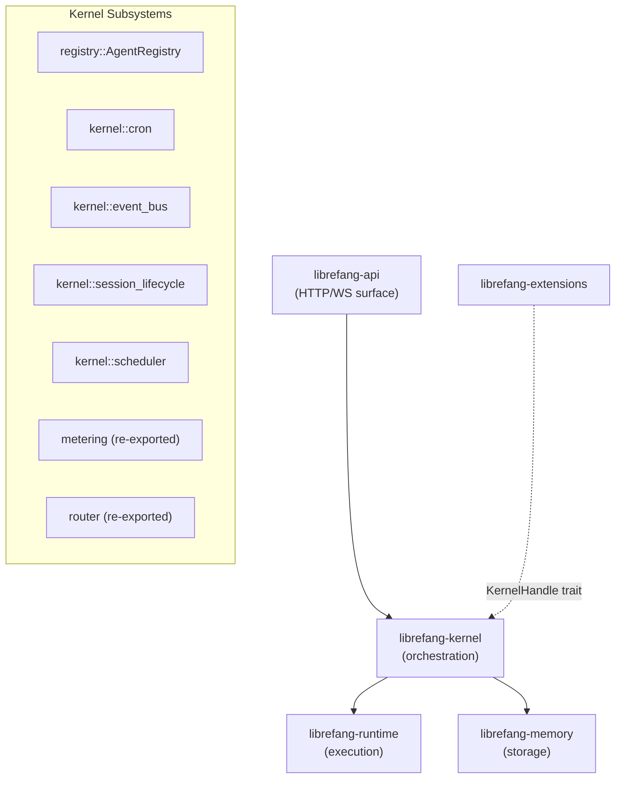

# Other — librefang-kernel

# librefang-kernel

Core orchestration crate for the LibreFang Agent Operating System. Manages agent lifecycles, scheduling, permissions, inter-agent communication, and the message-handling loop that fans requests out to LLM drivers, tools, and the memory substrate.

## Architecture


```mermaid
graph TD
    API["librefang-api<br/>(HTTP/WS surface)"]
    K["librefang-kernel<br/>(orchestration)"]
    RT["librefang-runtime<br/>(execution)"]
    MEM["librefang-memory<br/>(storage)"]
    EXT["librefang-extensions"]

    API --> K
    K --> RT
    K --> MEM
    EXT -.->|KernelHandle trait| K

    subgraph Kernel Subsystems
        REG["registry::AgentRegistry"]
        CRON["kernel::cron"]
        EV["kernel::event_bus"]
        SL["kernel::session_lifecycle"]
        SCH["kernel::scheduler"]
        M["metering (re-exported)"]
        R["router (re-exported)"]
    end
```

The kernel sits between the HTTP surface layer (`librefang-api`) and the execution layer (`librefang-runtime`). It does **not** depend on `librefang-api` or `librefang-extensions`. When those crates need kernel callbacks, they go through the `KernelHandle` trait defined in `librefang-runtime`.

## Boot

Entry point:

```rust
LibreFangKernel::boot_with_config(KernelConfig)
```

`LibreFangKernel` is a large struct (~18k LOC, 50+ fields — tracked in #3565). Do not add new fields without coordination.

## Subsystem Modules

| Module | Responsibility |
|---|---|
| `kernel::LibreFangKernel` | Top-level orchestrator. Boot, shutdown, field access. |
| `registry::AgentRegistry` | Concurrent agent table. Spawn, lookup, kill agents. |
| `kernel::cron` | Cron scheduling. Resolves `session_mode` per-job → manifest → historical Persistent. |
| `kernel::event_bus` | Broadcast event bus. |
| `kernel::session_lifecycle` | Session state machine. |
| `kernel::scheduler` | Task scheduling and queue management. |
| `kernel::approval` | Approval and permission gates. |
| `kernel::auth` | Authentication. |
| `kernel::auto_dream` | Automatic dream/background processing. |
| `kernel::inbox` | Agent inbox management. |
| `kernel::pairing` | Agent pairing. |
| `metering` | Token and cost accounting (re-exported from `librefang-kernel-metering`). Uses kernel's `model_catalog`. |
| `router` | Model router, alias resolution (re-exported from `librefang-kernel-router`). |

## Hot Fields and Lock Strategy

### `model_catalog: arc_swap::ArcSwap<ModelCatalog>`

Atomic-load reads (#3384). Writers use `model_catalog_update(|cat| ...)` for RCU-style updates. Do **not** replace with `RwLock<ModelCatalog>`.

### `skill_registry: std::sync::RwLock<SkillRegistry>`

Hot-reload on skill install/uninstall. Keep reads brief — copy out what you need and drop the lock.

### `running_tasks: dashmap::DashMap<(AgentId, SessionId), RunningTask>`

Keyed by `(agent, session)` tuple, **not** by `AgentId` alone. Pre-#3172 it was keyed only by `AgentId`, which silently overwrote concurrent loops. Do not degrade this.

### `mcp_oauth_provider: Arc<dyn McpOAuthProvider + Send + Sync>`

Pluggable OAuth provider. Implemented in `librefang-api` to keep the daemon free of HTTP concerns. New OAuth flows go through this trait, never as direct kernel logic.

### `event_bus` history: `parking_lot::Mutex<VecDeque<Arc<Event>>>`

Fixed in #3385. Do **not** switch back to `RwLock<VecDeque<Event>>`.

### Choosing a lock strategy for new fields

| Access pattern | Use |
|---|---|
| Hot read, rare write | `arc_swap::ArcSwap` |
| Hot read, hot write | `parking_lot::Mutex` or `dashmap` |
| Append-only history | `parking_lot::Mutex<VecDeque<Arc<T>>>` |

## Determinism (#3298)

Anything that reaches an LLM prompt **must** be ordered before stringifying. Use `BTreeMap` / `BTreeSet`. `HashMap` iteration order varies across processes and silently invalidates provider prompt caches.

Regression tests guard each boundary. See `kernel::tests::mcp_summary_is_byte_identical_across_input_orders`.

**Rule:** No `HashMap<K, V>` in any field that ends up in an LLM prompt. Use `BTreeMap`.

## Configuration Knobs

| Knob | Default | Notes |
|---|---|---|
| `KernelConfig.max_history_messages` | (varies) | Global default. Clamped up to `MIN_HISTORY_MESSAGES = 4` with a WARN log. Per-agent override in `agent.toml`. |
| `KernelConfig.queue.concurrency.trigger_lane` | 8 | Global semaphore on `Lane::Trigger`. |
| `KernelConfig.queue.concurrency.default_per_agent` | 1 | Fallback when `agent.toml: max_concurrent_invocations` is unset. |
| `KernelConfig.workflow_stale_timeout_minutes` | (varies) | Cutoff for `recover_stale_running_runs` at boot. |

## Adding a New Field to `LibreFangKernel`

1. **Visibility:** `pub(crate)` unless an external crate truly needs read access.
2. **Config counterpart:** If the field has a config-side value, add it to the `Default` impl on `KernelConfig`. Omitting this silently breaks the build.
3. **Trait objects:** If the field is `Option<Arc<dyn Trait>>`, mark it `#[serde(skip)]` and implement `Serialize`/`Deserialize`/`Clone`/`Debug` manually.
4. **Lock strategy:** Follow the table in the lock strategy section above.

## Dependency Boundaries

**Owns:** registry, scheduling, approval, auth, auto_dream, cron, event_bus, inbox, pairing, scheduler, session_lifecycle, metering, router.

**Does NOT own:**

- Agent loop body, tool dispatch → `librefang-runtime`
- Channel adapters → `librefang-channels`
- HTTP routing, dashboard SPA → `librefang-api`

**Does NOT depend on:** `librefang-api`, `librefang-extensions`. Reverse the dependency via `KernelHandle` when those crates need a kernel callback.

## Testing

- **Unit tests** live inside `crates/librefang-kernel/src/kernel/`.
- **Integration tests** against a real router belong in `librefang-api/tests/` using `#[tokio::test]` against `TestServer` (refs #3721).

### Commands

```bash
# Run kernel tests only
cargo test -p librefang-kernel

# Type-check the workspace (no full build)
cargo check --workspace --lib
```

### Forbidden commands

- `cargo test` (workspace-wide) — causes target/ contention with active user sessions.
- `cargo build` — use `cargo check --workspace --lib`. Real builds run in CI.

## Hard Rules

- **No daemon spawning.** The CLI binary owns `start`. Kernel just runs.
- **No `tokio::block_on`.** The kernel runs inside an existing runtime. Nesting is dangerous.
- **No direct LLM HTTP calls.** Route through `librefang-runtime` drivers.
- **No `Result<_, String>` returns** on new `KernelHandle` methods (#3541). Use typed errors.
- **No `HashMap` in prompt-bound data** (#3298). Use `BTreeMap`.

## Auxiliary Binary

`purge_sentinels` (`bin/purge_sentinels.rs`) — standalone utility for cleaning up sentinel files.

## Key Dependencies

| Crate | Purpose |
|---|---|
| `librefang-types` | Shared type definitions |
| `librefang-memory` | Storage substrate |
| `librefang-runtime` | Execution engine (agent loops, tool dispatch) |
| `librefang-skills` | Skill definitions |
| `librefang-hands` | Tool/hand implementations |
| `librefang-kernel-router` | Model routing (re-exported) |
| `librefang-kernel-metering` | Token/cost accounting (re-exported) |
| `dashmap` | Concurrent maps (`running_tasks`) |
| `arc-swap` | RCU-style atomic reads (`model_catalog`) |
| `parking_lot` | Lightweight mutex for history buffers |
| `tera` | Jinja2-style templating for workflow `Transform` operations — sandboxed, no I/O, no shell escape |