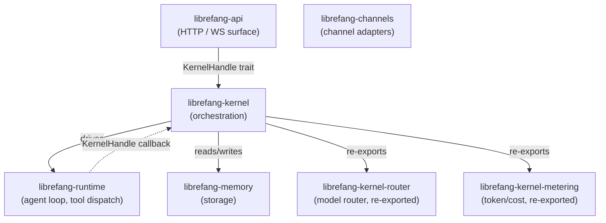

# Other — librefang-kernel

# librefang-kernel

Core orchestration layer for the LibreFang Agent Operating System. Manages agent lifecycles, scheduling, permissions, inter-agent communication, and the message-handling loop that dispatches requests to LLM drivers, tools, and the memory substrate.

## Architecture


```mermaid
graph TD
    API["librefang-api<br/>(HTTP / WS surface)"]
    K["librefang-kernel<br/>(orchestration)"]
    RT["librefang-runtime<br/>(agent loop, tool dispatch)"]
    MEM["librefang-memory<br/>(storage)"]
    CH["librefang-channels<br/>(channel adapters)"]
    KR["librefang-kernel-router<br/>(model router, re-exported)"]
    KM["librefang-kernel-metering<br/>(token/cost, re-exported)"]

    API -->|"KernelHandle trait"| K
    K -->|drives| RT
    K -->|reads/writes| MEM
    K -->|re-exports| KR
    K -->|re-exports| KM
    RT -.->|"KernelHandle callback"| K
```

The kernel sits between the HTTP surface (`librefang-api`) and the execution layer (`librefang-runtime`). Downstream crates that need kernel access do so through the `KernelHandle` trait defined in `librefang-runtime`, which reverses the dependency arrow and keeps the kernel free of HTTP concerns.

## What the Kernel Owns

| Subsystem | Module | Responsibility |
|---|---|---|
| Agent registry | `registry::AgentRegistry` | Concurrent agent table — spawn, lookup, kill |
| Cron scheduling | `kernel::cron` | Per-job cron; resolves `session_mode` (per-job → manifest → historical Persistent) |
| Event bus | `kernel::event_bus` | Broadcast events; append-only history buffer |
| Session lifecycle | `kernel::session_lifecycle` | Session state machine |
| Approval | `approval` | Human-in-the-loop approval gates |
| Auth | `auth` | Authentication and authorization |
| Auto-dream | `auto_dream` | Background introspection / creativity cycle |
| Inbox | `inbox` | Inter-agent message routing |
| Pairing | `pairing` | Agent pairing protocols |
| Scheduler | `scheduler` | Task scheduling and queue management |
| Metering | `metering` (re-exported from `librefang-kernel-metering`) | Token counting and cost accounting; uses kernel's `model_catalog` |
| Router | `router` (re-exported from `librefang-kernel-router`) | Model routing and alias resolution |

## What the Kernel Does NOT Own

- **Agent loop body / tool dispatch** — lives in `librefang-runtime`
- **Channel adapters** — lives in `librefang-channels`
- **HTTP routing / dashboard SPA** — lives in `librefang-api`
- **Extension loading** — lives in `librefang-extensions`

The kernel has **no dependency** on `librefang-api` or `librefang-extensions`. When those crates need a kernel callback, they go through the `KernelHandle` trait.

## Boot and Entry Point

The top-level orchestrator is `kernel::LibreFangKernel`, a large struct (~18k LOC, 50+ fields — tracked in #3565). Boot it with:

```rust
let kernel = LibreFangKernel::boot_with_config(kernel_config);
```

`LibreFangKernel` is the central god-struct. Do not add fields without coordination.

## Concurrency and Lock Strategies

The kernel runs inside a tokio runtime. Choosing the wrong lock type has caused real bugs (see issue references below). Follow these rules:

| Access pattern | Strategy | Example field |
|---|---|---|
| Hot read, rare write | `arc_swap::ArcSwap<T>` | `model_catalog` — readers do an atomic load (#3384); writers use `model_catalog_update(\|cat\| ...)` (RCU-style). Do not reintroduce `RwLock<ModelCatalog>`. |
| Hot read, hot write | `dashmap::DashMap<K, V>` | `running_tasks` — keyed by `(AgentId, SessionId)`, **not** by `AgentId` alone. Pre-#3172 the key was `AgentId`, which silently overwrote concurrent loops. |
| Hot read, moderate write | `std::sync::RwLock<T>` | `skill_registry` — hot-reload on install/uninstall. Keep reads brief; copy out what you need. |
| Append-only history | `parking_lot::Mutex<VecDeque<Arc<T>>>` | `event_bus` history — `parking_lot::Mutex` since #3385. Do not switch back to `RwLock<VecDeque<Event>>`. |
| Pluggable trait object | `Arc<dyn Trait + Send + Sync>` | `mcp_oauth_provider` — implemented in `librefang-api` to keep the daemon free of HTTP. New OAuth flows go through this trait. |

## Determinism Requirement (#3298)

Anything that reaches an LLM prompt **must** be ordered before stringification. Use `BTreeMap` / `BTreeSet` for any data that ends up in a prompt.

`HashMap` iteration order varies across processes. This silently invalidates provider prompt caches and causes flaky behavior. A regression test guards this boundary:

```
kernel::tests::mcp_summary_is_byte_identical_across_input_orders
```

## Configuration Knobs

All knobs live on `KernelConfig` and have sensible defaults.

| Knob | Default | Notes |
|---|---|---|
| `max_history_messages` | varies | Global default; clamped up to `MIN_HISTORY_MESSAGES = 4` with a WARN log. Per-agent override in `agent.toml`. |
| `queue.concurrency.trigger_lane` | 8 | Global semaphore on `Lane::Trigger`. |
| `queue.concurrency.default_per_agent` | 1 | Fallback when `agent.toml: max_concurrent_invocations` is unset. |
| `workflow_stale_timeout_minutes` | varies | Cutoff used by `recover_stale_running_runs` at boot. |

## Adding a New Field to `LibreFangKernel`

1. **Visibility** — `pub(crate)` unless an external crate truly needs read access.
2. **Config counterpart** — If the field has a config-side value, add it to the `Default` impl on `KernelConfig`. Omitting this silently breaks the build.
3. **Trait objects** — If the field is `Option<Arc<dyn Trait>>`, mark it `#[serde(skip)]` and implement `Serialize`, `Deserialize`, `Clone`, and `Debug` manually.
4. **Lock strategy** — Choose based on the access pattern:
   - Hot read, rare write → `arc_swap::ArcSwap`
   - Hot read, hot write → `parking_lot::Mutex` or `dashmap::DashMap`
   - Append-only history → `parking_lot::Mutex<VecDeque<Arc<T>>>`

## Testing

**Unit tests** live inside `crates/librefang-kernel/src/kernel/` alongside the code they test.

**Integration tests** against a real router live in `librefang-api/tests/` — that is where `#[tokio::test]` against `TestServer` belongs (refs #3721).

### Commands

| Command | When to use |
|---|---|
| `cargo test -p librefang-kernel` | Kernel unit tests |
| `cargo check --workspace --lib` | Type-check everything |
| `cargo test` (workspace-wide) | **Forbidden** — causes target/ contention with user sessions |
| `cargo build` | **Forbidden** locally — real builds run in CI |

## Taboos

| Rule | Reason |
|---|---|
| No daemon spawning | The CLI binary owns `start`. The kernel just runs. |
| No `tokio::block_on` | Already inside a runtime; nesting causes deadlocks or panics. |
| No direct LLM HTTP calls | Route through `librefang-runtime` drivers. |
| No `Result<_, String>` on `KernelHandle` methods (#3541) | Use typed errors. |
| No `HashMap` in prompt-bound data (#3298) | Use `BTreeMap` for deterministic ordering. |

## Notable Binaries

The crate ships one auxiliary binary:

- **`purge_sentinels`** (`bin/purge_sentinels.rs`) — maintenance utility for cleaning up sentinel files.

## Key Dependencies

| Crate | Role |
|---|---|
| `librefang-types` | Shared type definitions |
| `librefang-memory` | Storage substrate |
| `librefang-runtime` | Agent loop execution |
| `librefang-skills` | Skill definitions and loading |
| `librefang-hands` | Tool/hand abstractions |
| `librefang-kernel-router` | Model routing (re-exported as `router`) |
| `librefang-kernel-metering` | Token and cost accounting (re-exported as `metering`) |
| `dashmap` / `arc-swap` / `parking_lot` | Concurrency primitives |
| `cron` | Cron expression parsing and scheduling |
| `tera` | Jinja2-style templating for workflow `Transform` operations — sandboxed, no I/O or shell escape |