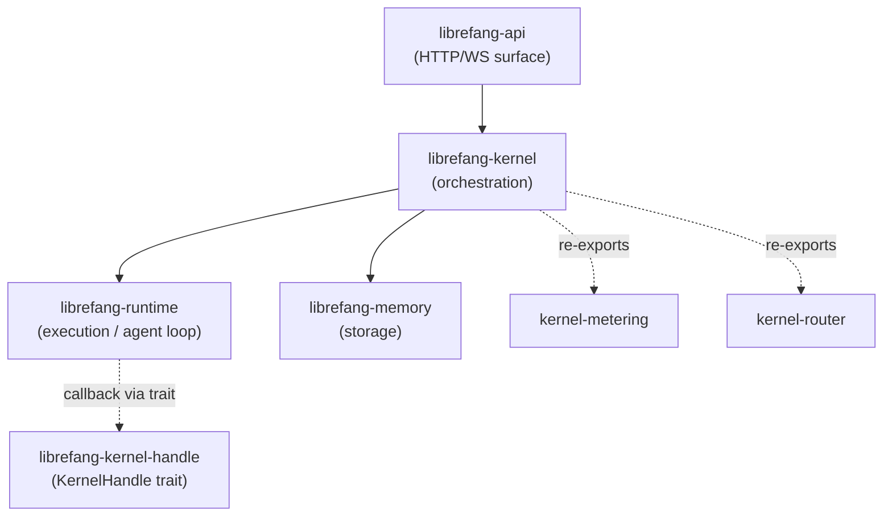

# Other — librefang-kernel

# librefang-kernel

Central orchestrator for the LibreFang Agent OS. Manages agent lifecycles, scheduling, permissions, inter-agent communication, and the message-handling loop that dispatches requests to LLM drivers, tools, and the memory substrate.

## Architecture


```mermaid
graph TD
    API["librefang-api<br/>(HTTP/WS surface)"]
    K["librefang-kernel<br/>(orchestration)"]
    RT["librefang-runtime<br/>(execution / agent loop)"]
    MEM["librefang-memory<br/>(storage)"]
    KH["librefang-kernel-handle<br/>(KernelHandle trait)"]

    API --> K
    K --> RT
    K --> MEM
    RT -.->|"callback via trait"| KH
    K -.->|"re-exports"| KM["kernel-metering"]
    K -.->|"re-exports"| KR["kernel-router"]
```

The kernel sits between the HTTP surface layer (`librefang-api`) and the execution layer (`librefang-runtime`). Downstream crates that need kernel access do so through the `KernelHandle` trait defined in `librefang-kernel-handle`, keeping the dependency arrow pointing inward.

## Boundary

**Owned subsystems:** registry, scheduling, approval, auth, auto_dream, cron, event_bus, inbox, pairing, scheduler, session_lifecycle, metering, router.

**Not owned** (live elsewhere):
- Agent loop body, tool dispatch → `librefang-runtime`
- Channel adapters → `librefang-channels`
- HTTP routing, dashboard SPA → `librefang-api`

**No dependencies on** `librefang-api` or `librefang-extensions`. If runtime or extensions need a kernel callback, reverse the dependency through `KernelHandle`.

## Module Map

### `kernel::LibreFangKernel`

Top-level orchestrator. Boot with:

```rust
let kernel = LibreFangKernel::boot_with_config(config);
```

This is currently a large struct (~18k LOC, 50+ fields — tracked in #3565). Do not add new fields without coordination. See [Adding a New Field](#adding-a-new-field-to-librefangkernel) for the required steps.

### `registry::AgentRegistry`

Concurrent agent table. Supports spawn, lookup, and kill operations for agent instances.

### `kernel::cron`

Cron-based scheduling. Resolves `session_mode` per-job using the priority chain: **per-job config → manifest → historical Persistent**.

### `kernel::event_bus`

Broadcast event bus. Internal history buffer is `parking_lot::Mutex<VecDeque<Arc<Event>>>` (changed in #3385). Do not switch back to `RwLock<VecDeque<Event>>` — the previous design caused contention issues.

### `kernel::session_lifecycle`

Session state machine. Manages transitions between session states.

### `metering` (re-exported from `librefang-kernel-metering`)

Token and cost accounting. Uses the kernel's `model_catalog` for pricing data.

### `router` (re-exported from `librefang-kernel-router`)

Model router with alias resolution. Selects the appropriate LLM provider/model for a given request.

## Concurrency and Locking Strategies

The kernel uses different locking primitives based on access patterns. Choosing the wrong one causes either contention bugs or silent data loss. Follow these rules:

| Access pattern | Strategy | Example field |
|---|---|---|
| Hot read, rare write | `arc_swap::ArcSwap<T>` | `model_catalog` |
| Hot read, hot write | `parking_lot::Mutex<T>` or `DashMap<K, V>` | `running_tasks` |
| Append-only history | `parking_lot::Mutex<VecDeque<Arc<T>>>` | event bus history |
| Hot-reload on install/uninstall | `std::sync::RwLock<T>` | `skill_registry` |

### Critical field details

**`model_catalog: arc_swap::ArcSwap<ModelCatalog>`** — Readers use atomic-load (zero contention, #3384). Writers go through `model_catalog_update(|cat| ...)` which performs an RCU-style swap. Never replace this with `RwLock<ModelCatalog>`.

**`skill_registry: std::sync::RwLock<SkillRegistry>`** — Hot-reloaded on skill install/uninstall. Keep reads brief; copy out what you need immediately.

**`running_tasks: dashmap::DashMap<(AgentId, SessionId), RunningTask>`** — Keyed by the composite `(AgentId, SessionId)`, not `AgentId` alone. Before #3172 it was keyed only by `AgentId`, which silently overwrote concurrent agent loops. Do not regress this.

**`mcp_oauth_provider: Arc<dyn McpOAuthProvider + Send + Sync>`** — Pluggable trait object. The implementation lives in `librefang-api` to keep the daemon free of HTTP concerns. All new OAuth flows must go through this trait, not through direct kernel logic.

## Determinism (#3298)

Any data that reaches an LLM prompt **must** be ordered before stringification. Use `BTreeMap` / `BTreeSet` for these fields. `HashMap` iteration order varies across processes and silently invalidates provider prompt caches (leading to wasted tokens and cost).

Regression tests guard these boundaries. See `kernel::tests::mcp_summary_is_byte_identical_across_input_orders` for an example.

**Rule:** No `HashMap<K, V>` in any field that ends up in an LLM prompt. Use `BTreeMap`.

## Configuration Knobs

| Knob | Default | Description |
|---|---|---|
| `KernelConfig.max_history_messages` | varies | Global default for message history. Clamped up to `MIN_HISTORY_MESSAGES = 4` with a WARN log if set lower. Per-agent override in `agent.toml`. |
| `KernelConfig.queue.concurrency.trigger_lane` | 8 | Global semaphore size for `Lane::Trigger`. |
| `KernelConfig.queue.concurrency.default_per_agent` | 1 | Fallback concurrency when `agent.toml: max_concurrent_invocations` is unset. |
| `KernelConfig.workflow_stale_timeout_minutes` | varies | Cutoff used by `recover_stale_running_runs` at boot to detect stale workflows. |

## Adding a New Field to `LibreFangKernel`

Follow all four steps:

1. **Visibility.** The field must be `pub(crate)` unless an external crate genuinely needs read access. Default to `pub(crate)`.

2. **`Default` impl.** If the field has a config-side counterpart, add it to the `Default` impl on `KernelConfig`. Missing this silently breaks the build.

3. **Trait objects.** If the field is `Option<Arc<dyn Trait>>`, mark it `#[serde(skip)]` and implement `Serialize`, `Deserialize`, `Clone`, and `Debug` manually.

4. **Lock strategy.** Choose based on the access pattern:
   - Hot read, rare write → `arc_swap::ArcSwap`
   - Hot read, hot write → `parking_lot::Mutex` or `dashmap::DashMap`
   - Append-only history → `parking_lot::Mutex<VecDeque<Arc<T>>>`

## Testing

**Unit tests** live inside `crates/librefang-kernel/src/kernel/` alongside the code they test.

**Integration tests** that need a real router or HTTP server belong in `librefang-api/tests/` using `#[tokio::test]` against `TestServer` (#3721).

### Build and test commands

```bash
# Run kernel tests only
cargo test -p librefang-kernel

# Check the whole workspace compiles (no full build)
cargo check --workspace --lib
```

**Do not** run `cargo test` (workspace-wide) — it causes target/ contention with the user's active session. **Do not** run `cargo build` — full builds belong in CI.

## Taboos

- **No daemon spawning.** The CLI binary owns `start`. The kernel just runs.
- **No `tokio::runtime::Handle::block_on`.** The kernel runs inside an existing runtime. Nesting runtimes causes panics or deadlocks.
- **No direct LLM HTTP calls.** All LLM communication goes through `librefang-runtime` drivers.
- **No `Result<_, String>` on new `KernelHandle` methods** (#3541). Use typed errors.
- **No `HashMap` in LLM-bound data** (#3298). Use `BTreeMap`/`BTreeSet`.

## Key Dependencies

| Crate | Role |
|---|---|
| `librefang-types` | Shared type definitions |
| `librefang-memory` | Storage substrate |
| `librefang-runtime` | Execution engine, agent loop, LLM drivers |
| `librefang-skills` | Skill definitions and loading |
| `librefang-hands` | Tool/hand dispatch |
| `librefang-llm-driver` / `librefang-llm-drivers` | LLM provider abstraction |
| `librefang-kernel-router` | Model routing and alias resolution (re-exported) |
| `librefang-kernel-metering` | Token and cost accounting (re-exported) |
| `tera` | Sandboxed Jinja2-style templating for workflow `Transform` operations (#4980) |
| `parking_lot` | Low-contention mutex types |
| `arc-swap` | Atomic RCU-style pointer swaps |
| `dashmap` | Concurrent hash map |