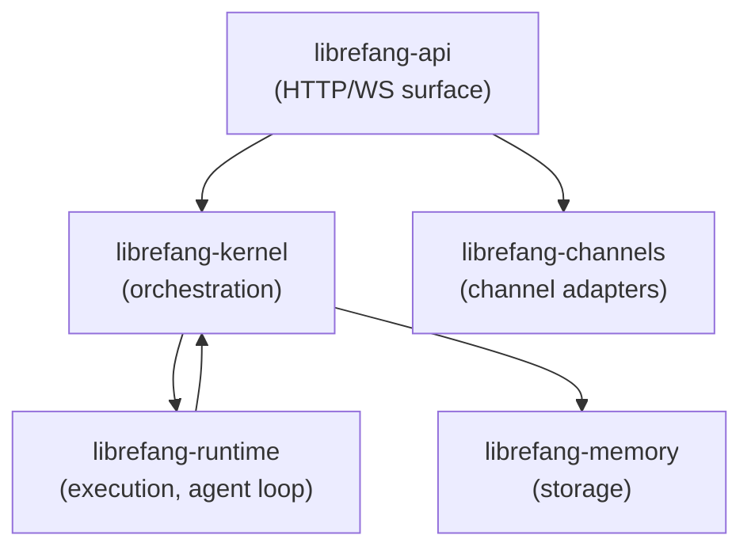

# Other — librefang-kernel

# librefang-kernel

Core orchestration crate for the LibreFang Agent Operating System. Manages agent lifecycles, scheduling, permissions, inter-agent communication, and the message-handling loop that dispatches requests to LLM drivers, tools, and the memory substrate.

## Architecture

The kernel sits between the HTTP/WebSocket surface layer and the execution layer. It does **not** own the agent loop body, tool dispatch, channel adapters, or HTTP routing — those responsibilities belong to `librefang-runtime`, `librefang-channels`, and `librefang-api` respectively.


```mermaid
graph TD
    API["librefang-api<br/>(HTTP/WS surface)"]
    KERNEL["librefang-kernel<br/>(orchestration)"]
    RUNTIME["librefang-runtime<br/>(execution, agent loop)"]
    MEMORY["librefang-memory<br/>(storage)"]
    CHANNELS["librefang-channels<br/>(channel adapters)"]
    API --> KERNEL
    KERNEL --> RUNTIME
    KERNEL --> MEMORY
    RUNTIME --> KERNEL
    API --> CHANNELS
```

Dependency direction is strictly downward. The kernel never depends on `librefang-api` or `librefang-extensions`. When those crates need a kernel callback, they go through the `KernelHandle` trait defined in `librefang-kernel-handle`, reversing the dependency.

## Entry Points

### Boot

```rust
let kernel = LibreFangKernel::boot_with_config(kernel_config);
```

`kernel::LibreFangKernel` is the top-level orchestrator. It is currently a large struct (~18k LOC, 50+ fields — tracked in #3565). Do not add new fields without coordination.

### Subsystem Modules

| Module | Responsibility |
| --- | --- |
| `registry::AgentRegistry` | Concurrent agent table: spawn, lookup, kill |
| `kernel::cron` | Cron scheduling; `session_mode` resolution (per-job > manifest > historical Persistent) |
| `kernel::event_bus` | Broadcast event bus |
| `kernel::session_lifecycle` | Session state machine |
| `approval` | Approval flows |
| `auth` | Authentication and authorization |
| `auto_dream` | Automatic dreaming/consolidation |
| `inbox` | Agent inbox management |
| `pairing` | Agent pairing |
| `scheduler` | Task scheduling |
| `metering` | Re-exported from `librefang-kernel-metering` — token and cost accounting; uses kernel's `model_catalog` |
| `router` | Re-exported from `librefang-kernel-router` — model router, alias resolution |

## Concurrency and Lock Strategies

The kernel uses different synchronization primitives depending on access patterns. Choosing the wrong one causes performance regressions or subtle bugs.

### `model_catalog: arc_swap::ArcSwap<ModelCatalog>`

Hot read, rare write. Readers get an atomic-load snapshot (#3384). Writers go through `model_catalog_update(|cat| ...)` which performs an RCU-style swap. **Do not** replace with `RwLock<ModelCatalog>`.

### `skill_registry: std::sync::RwLock<SkillRegistry>`

Hot-reload on install/uninstall. Reads must be brief — copy out what you need, then drop the lock guard.

### `running_tasks: dashmap::DashMap<(AgentId, SessionId), RunningTask>`

Keyed by `(agent, session)` tuple, **not** by `AgentId` alone. Pre-#3172 it was keyed by `AgentId`, which silently overwrote concurrent agent loops. Do not degrade this.

### `mcp_oauth_provider: Arc<dyn McpOAuthProvider + Send + Sync>`

Pluggable trait object. Implemented in `librefang-api` to keep the daemon free of HTTP concerns. New OAuth flows must go through this trait, not direct kernel logic.

### event_bus history: `parking_lot::Mutex<VecDeque<Arc<Event>>>`

Changed from `RwLock<VecDeque<Event>>` in #3385. Do not switch back. `Arc<Event>` allows cheap cloning for subscribers; the `Mutex` avoids read-starvation issues the old `RwLock` caused.

### Decision Guide for New Fields

| Access pattern | Use |
| --- | --- |
| Hot read, rare write | `arc_swap::ArcSwap` |
| Hot read, hot write | `parking_lot::Mutex` or `dashmap::DashMap` |
| Append-only history | `parking_lot::Mutex<VecDeque<Arc<T>>>` |

## Determinism

Anything that reaches an LLM prompt **must** be ordered before stringification. Use `BTreeMap` and `BTreeSet`. `HashMap` iteration order varies across processes and silently invalidates provider prompt caches (refs #3298).

Regression tests guard this at each boundary. See `kernel::tests::mcp_summary_is_byte_identical_across_input_orders`.

## Configuration

Key knobs exposed through `KernelConfig`:

| Field | Default | Notes |
| --- | --- | --- |
| `max_history_messages` | — | Global default; clamped up to `MIN_HISTORY_MESSAGES = 4` with a WARN log. Per-agent override in `agent.toml`. |
| `queue.concurrency.trigger_lane` | 8 | Global semaphore on `Lane::Trigger`. |
| `queue.concurrency.default_per_agent` | 1 | Fallback when `agent.toml: max_concurrent_invocations` is unset. |
| `workflow_stale_timeout_minutes` | — | Cutoff used by `recover_stale_running_runs` at boot. |

## Adding a Field to `LibreFangKernel`

1. **Visibility.** Field must be `pub(crate)` unless an external crate genuinely needs read access.
2. **Config default.** If the field has a config-side counterpart, add it to the `Default` impl on `KernelConfig`. Otherwise the build breaks silently.
3. **Trait objects.** If the field is `Option<Arc<dyn Trait>>`, mark it `#[serde(skip)]` and implement `Serialize`, `Deserialize`, `Clone`, and `Debug` manually.
4. **Lock strategy.** Choose using the decision guide above.

## Dependencies

### Internal

The kernel depends on sibling crates for types, memory, runtime, skills, hands, LLM drivers, wire protocol, and channels. It re-exports `librefang-kernel-metering` and `librefang-kernel-router` as `metering` and `router` respectively.

Notable: `librefang-extensions` is a dependency, but the kernel does **not** depend on `librefang-api`. That crate calls into the kernel via `KernelHandle`.

### External

Key external dependencies include `tokio`, `dashmap`, `arc-swap`, `parking_lot`, `rusqlite` (via `r2d2`/`r2d2_sqlite` connection pool), `tera` (sandboxed Jinja2-style templating for workflow `Transform` operators), `cron`, and standard serialization crates.

### Binary Target

`purge_sentinels` — a utility binary at `bin/purge_sentinels.rs`.

## Testing

- **Unit tests** live inside `crates/librefang-kernel/src/kernel/`, co-located with the code they test.
- **Integration tests** against a real router belong in `librefang-api/tests/` using `#[tokio::test]` against `TestServer` (refs #3721).
- Time-dependent tests (workflow, cron timing) use `tokio::time::{pause, advance, resume}` via the `test-util` feature on `tokio`.

### Commands

| What you want | Command |
| --- | --- |
| Run kernel unit tests | `cargo test -p librefang-kernel` |
| Type-check the workspace | `cargo check --workspace --lib` |

**Forbidden commands:**
- `cargo test` (workspace-wide) — causes target/ contention with the user's running session.
- `cargo build` — use `cargo check` instead. Real builds run in CI.

## Rules

- No daemon spawning. The CLI binary owns `start`; the kernel just runs.
- No `tokio::block_on` in this crate. The kernel runs inside an existing runtime.
- No direct LLM HTTP calls. Route through `librefang-runtime` drivers.
- No `KernelHandle` methods returning `Result<_, String>` (#3541). Use typed errors.
- No `HashMap<K, V>` in any field that ends up in an LLM prompt. Use `BTreeMap` (#3298).