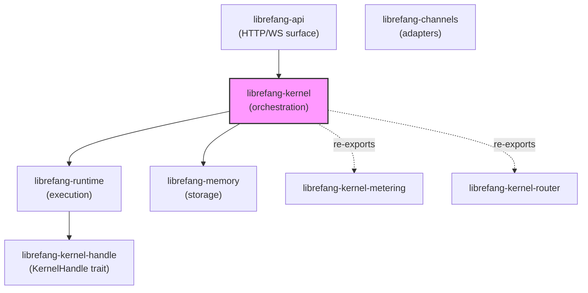

# Other — librefang-kernel

# librefang-kernel

Core orchestration crate for the LibreFang Agent Operating System. Manages agent lifecycles, scheduling, permissions, inter-agent communication, and the message-handling loop that dispatches requests to LLM drivers, tools, and the memory substrate.

## Architecture


```mermaid
graph TD
    API["librefang-api<br/>(HTTP/WS surface)"]
    K["librefang-kernel<br/>(orchestration)"]
    RT["librefang-runtime<br/>(execution)"]
    MEM["librefang-memory<br/>(storage)"]
    CH["librefang-channels<br/>(adapters)"]
    KH["librefang-kernel-handle<br/>(KernelHandle trait)"]

    API --> K
    K --> RT
    K --> MEM
    RT --> KH
    K -.->|"re-exports"| METER["librefang-kernel-metering"]
    K -.->|"re-exports"| ROUTER["librefang-kernel-router"]

    style K fill:#f9f,stroke:#333,stroke-width:2px
```

The kernel sits between the HTTP surface layer (`librefang-api`) and the execution layer (`librefang-runtime`). It does **not** depend on `librefang-api` or `librefang-extensions`. External crates that need kernel callbacks go through the `KernelHandle` trait defined in `librefang-kernel-handle`, reversing the dependency.

## Scope

### Owned subsystems

`registry`, `scheduling`, `approval`, `auth`, `auto_dream`, `cron`, `event_bus`, `inbox`, `pairing`, `scheduler`, `session_lifecycle`, `metering`, `router`

`metering` and `router` are re-exported from their own crates (`librefang-kernel-metering`, `librefang-kernel-router`).

### Not owned here

| Concern | Lives in |
|---|---|
| Agent loop body, tool dispatch | `librefang-runtime` |
| Channel adapters | `librefang-channels` |
| HTTP routing, dashboard SPA | `librefang-api` |

## Key types

### `LibreFangKernel`

Top-level orchestrator. Boot with:

```rust
let kernel = LibreFangKernel::boot_with_config(KernelConfig { ... }).await?;
```

This is a large struct (~18k LOC, 50+ fields — tracked in #3565). Adding fields requires coordination and following the checklist below.

### `AgentRegistry`

Concurrent agent table. Provides spawn, lookup, and kill operations for agents.

### `kernel::cron`

Cron-based scheduling. Session mode resolution follows a priority chain: per-job override → manifest → historical `Persistent` session.

### `kernel::event_bus`

Broadcast event bus. Internal history buffer is `parking_lot::Mutex<VecDeque<Arc<Event>>>`. This was changed from `RwLock<VecDeque<Event>>` in #3385 — do not revert.

### `kernel::session_lifecycle`

Session state machine governing the lifecycle of agent sessions.

## Hot fields and locking strategies

`LibreFangKernel` uses a mix of concurrency primitives, each chosen for the access pattern of its field.

### `model_catalog: arc_swap::ArcSwap<ModelCatalog>`

- **Pattern:** Hot read, rare write.
- Readers use atomic-load (zero contention, #3384). Writers go through `model_catalog_update(|cat| ...)` which performs an RCU-style swap.
- Do not introduce `RwLock<ModelCatalog>`.

### `skill_registry: std::sync::RwLock<SkillRegistry>`

- **Pattern:** Hot-reload on install/uninstall.
- Reads must be brief. Copy out the data you need, then drop the read lock immediately.

### `running_tasks: dashmap::DashMap<(AgentId, SessionId), RunningTask>`

- **Pattern:** Hot read and hot write, concurrent.
- Keyed by the tuple `(AgentId, SessionId)`, **not** by `AgentId` alone. Before #3172 the single-key scheme silently overwrote concurrent loops. Do not regress this.

### `mcp_oauth_provider: Arc<dyn McpOAuthProvider + Send + Sync>`

- **Pattern:** Pluggable trait object.
- Implemented in `librefang-api` to keep the daemon free of HTTP concerns. All new OAuth flows must go through this trait — never add direct OAuth logic to the kernel.

### Choosing a lock strategy for new fields

| Access pattern | Use |
|---|---|
| Hot read, rare write | `arc_swap::ArcSwap` |
| Hot read, hot write | `parking_lot::Mutex` or `dashmap::DashMap` |
| Append-only history | `parking_lot::Mutex<VecDeque<Arc<T>>>` |

## Determinism

Anything that ends up in an LLM prompt **must** be ordered before stringification.

- Use `BTreeMap` / `BTreeSet` for all data that feeds into prompts.
- `HashMap` iteration order varies across processes and silently invalidates provider prompt caches.
- Regression tests guard these boundaries — see `kernel::tests::mcp_summary_is_byte_identical_across_input_orders`.

Reference: #3298.

## Configuration knobs

| Setting | Default | Description |
|---|---|---|
| `KernelConfig.max_history_messages` | (see code) | Global default for conversation history depth. Clamped up to `MIN_HISTORY_MESSAGES = 4` with a WARN log. Per-agent override available in `agent.toml`. |
| `KernelConfig.queue.concurrency.trigger_lane` | 8 | Global semaphore on `Lane::Trigger`. |
| `KernelConfig.queue.concurrency.default_per_agent` | 1 | Fallback when `agent.toml: max_concurrent_invocations` is unset. |
| `KernelConfig.workflow_stale_timeout_minutes` | (see code) | Cutoff used by `recover_stale_running_runs` at boot. |

## Adding a new field to `LibreFangKernel`

Follow this checklist to avoid silent build failures and runtime bugs:

1. **Visibility.** Default to `pub(crate)`. Only make it `pub` if an external crate genuinely needs read access.
2. **Config counterpart.** If the field has a config-side value, add it to the `Default` impl on `KernelConfig`. Missing this silently breaks the build.
3. **Trait objects.** If the field is `Option<Arc<dyn Trait>>`, annotate with `#[serde(skip)]` and manually implement `Serialize`, `Deserialize`, `Clone`, and `Debug`.
4. **Lock strategy.** Pick the appropriate concurrency primitive using the table above.

## Testing

### Unit tests

Most kernel unit tests live inside `crates/librefang-kernel/src/kernel/`. Run them with:

```sh
cargo test -p librefang-kernel
```

**Never** run workspace-wide `cargo test` — it causes `target/` contention with the user's active session.

### Integration tests

Integration tests that need a real router belong in `librefang-api/tests/` using `#[tokio::test]` against `TestServer`. See #3721.

### Build checks

`cargo build` is forbidden in local development. Use:

```sh
cargo check --workspace --lib
```

Real builds run in CI only.

## Constraints (taboos)

| Rule | Reason |
|---|---|
| No daemon spawning | The CLI binary owns `start`. The kernel just runs. |
| No `tokio::block_on` | The kernel runs inside an existing runtime. Nesting is dangerous. |
| No direct LLM HTTP calls | Route through `librefang-runtime` drivers. |
| No `Result<_, String>` returns from `KernelHandle` | Use typed errors (#3541). |
| No `HashMap` in prompt-destined data | Use `BTreeMap` for determinism (#3298). |

## Notable dependencies

| Crate | Role in kernel |
|---|---|
| `librefang-types` | Shared type definitions |
| `librefang-memory` | Persistent storage substrate |
| `librefang-runtime` | Agent loop execution, LLM drivers |
| `librefang-skills` | Skill registry types |
| `librefang-hands` | Tool/hand types |
| `librefang-wire` | Wire protocol types |
| `arc-swap` | Lock-free reads for `model_catalog` |
| `dashmap` | Concurrent maps for `running_tasks` |
| `parking_lot` | Efficient `Mutex` for event bus and history |
| `tera` | Sandboxed Jinja2-style templating for workflow `Transform` operations (#4980) |
| `cron` | Cron expression parsing and scheduling |

## Binary utilities

### `purge_sentinels`

Located at `bin/purge_sentinels.rs`. Standalone utility for cleaning up sentinel files.