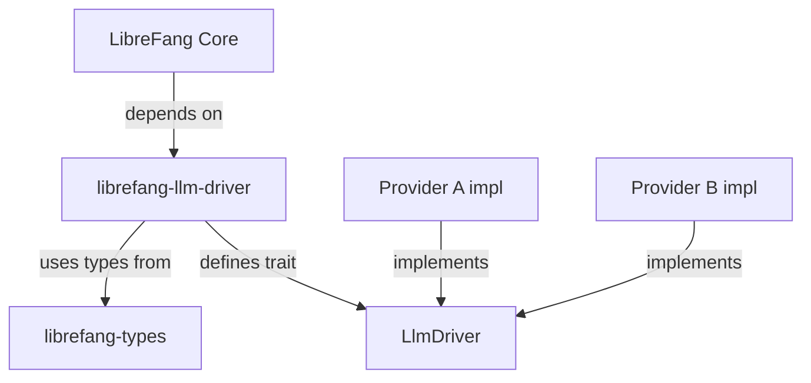

# Other — librefang-llm-driver

# librefang-llm-driver

LLM driver abstraction layer for LibreFang. This crate defines the trait interface and shared data types that concrete LLM provider implementations must satisfy.

## Purpose

This crate serves as a **trait-only abstraction boundary** between LibreFang's core logic and any specific LLM backend. It exists so that the rest of the codebase can program against a generic driver interface without coupling to a particular provider's API, request format, or SDK.

## Architecture

The crate itself contains **no concrete implementations** and performs **no outbound calls**. It is purely a contract: types, error definitions, and an async trait that downstream provider crates fulfill.

## Key Dependencies

| Crate | Role |
|---|---|
| `async-trait` | Enables async methods in the driver trait definition |
| `serde` / `serde_json` | Serialization for shared request/response types |
| `thiserror` | Derive-based error types for driver failures |
| `librefang-types` | Reuses domain types from the broader LibreFang type system |
| `tokio` | Async runtime primitives needed by trait signatures |

## What This Crate Provides

### Driver Trait

An async trait (built with `async-trait`) representing the contract for an LLM backend. Any provider-specific crate implements this trait to integrate with LibreFang. The trait methods define the operations the core system needs from an LLM — typically prompt submission and response retrieval.

### Shared Types

Common data structures for LLM interactions: request shapes, response shapes, configuration parameters, and any intermediate types that both the core system and provider implementations need to agree on. These are annotated with `serde` derives to support serialization.

### Error Types

A structured error enum (via `thiserror`) capturing the failure modes common across LLM drivers — for example, network errors, rate limiting, malformed responses, or authentication failures. Provider implementations map their specific errors into these shared variants.

## Relationship to Other Crates

- **Depends on `librefang-types`**: Imports and reuses domain-level types rather than duplicating definitions.
- **Implemented by provider crates**: Any crate that wraps a specific LLM API depends on `librefang-llm-driver` and provides a concrete trait implementation.
- **Consumed by core**: The main LibreFang application accepts a boxed trait object and calls through the abstraction.

## Adding a New LLM Provider

To integrate a new backend:

1. Create a new crate (or module) that depends on `librefang-llm-driver`.
2. Define a struct holding provider-specific configuration and any client state.
3. Implement the driver trait for that struct.
4. Map provider-specific errors into the shared error types defined here.
5. Register the implementation with the core system at startup.

Because the trait is async and the error types are standardized, swapping or layering providers requires no changes to downstream consumers.