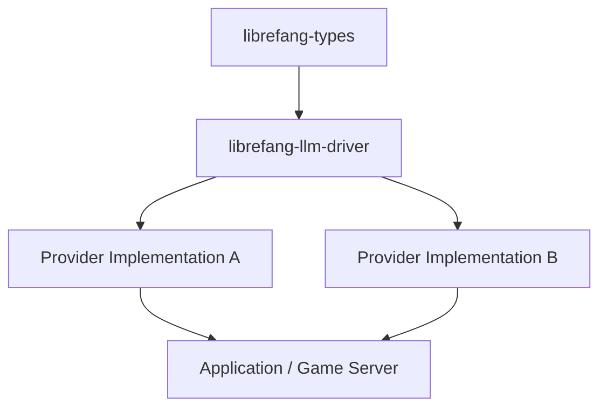

# Other — librefang-llm-driver

# librefang-llm-driver

LLM driver trait and shared types for LibreFang.

## Purpose

This crate defines the abstraction layer through which the rest of the LibreFang codebase interacts with large language models. Rather than coupling the application directly to any specific LLM provider, `librefang-llm-driver` exposes a provider-agnostic trait (or set of traits) along with the shared types that callers and implementors rely on — request/response structures, configuration types, and error definitions.

Concrete implementations (e.g., an OpenAI driver, a local-model driver) depend on this crate and fill in the trait with provider-specific HTTP calls, token handling, and so on. Downstream crates that *consume* LLM capabilities depend only on this abstraction, making it straightforward to swap or mock providers.

## Dependencies

| Dependency | Role in this crate |
|---|---|
| `librefang-types` | Shared domain types (game concepts, prompts, etc.) that the LLM driver may reference |
| `async-trait` | Enables async methods in trait definitions |
| `serde` / `serde_json` | Serialization of requests to and deserialization of responses from LLM providers |
| `thiserror` | Derive `Error` for the driver-specific error enum |
| `tokio` | Async runtime primitives used by the trait's async methods |

## Architecture

The crate sits between the domain types (`librefang-types`) and one or more concrete provider crates. The application holds a trait object and dispatches calls without knowing which provider backs it.

## What This Crate Provides

### Driver trait

An async trait that represents the capability to prompt an LLM and receive a structured or unstructured response. Callers use this trait as the boundary; implementors satisfy it with provider-specific logic.

### Request and response types

Shared data structures that normalize how prompts are composed and how completions are represented, independent of any single provider's wire format.

### Error type

A consolidated error enum (derived via `thiserror`) that captures the failure modes common across LLM providers — network errors, rate-limit responses, deserialization failures, and similar. Provider crates wrap their specific errors into these variants so that consumers handle a single, uniform error type.

## How It Connects to the Codebase

- **Upstream**: `librefang-types` supplies the domain vocabulary. The driver trait may accept or return types defined there (for example, structured game-state objects the LLM should reason about).
- **Downstream**: Concrete provider crates implement the trait and are selected at application startup (via feature flags, configuration, or runtime plugin selection). The game server or other consumers accept a `dyn LlmDriver` (or similar) and remain decoupled from the backing service.

## Adding a New Provider

1. Create a new crate (or module) that depends on `librefang-llm-driver`.
2. Implement the driver trait, translating the generic request types into the provider's HTTP API format.
3. Map provider-specific errors into the crate's error enum.
4. Register the provider in the application's startup/configuration logic.

Because the trait and shared types live here, no changes to downstream consumers are required when a new provider is added.