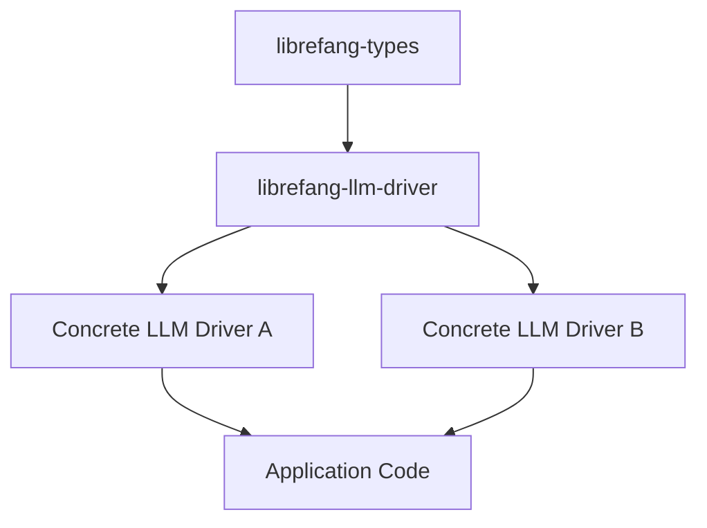

# Other — librefang-llm-driver

# librefang-llm-driver

Abstraction layer for LLM (Large Language Model) integrations in LibreFang. This crate defines the core `LlmDriver` trait and shared types that concrete LLM implementations must satisfy.

## Purpose

LibreFang needs to interact with language models for various tasks. Rather than coupling the codebase to a single LLM provider, this module provides a trait-based abstraction. Any LLM backend—OpenAI, local models, custom endpoints—can be integrated by implementing the driver trait defined here.

This crate **does not** contain any LLM implementations itself. It solely defines the contract.

## Architecture

The application depends on the trait from this crate and injects a concrete driver at runtime.

## Key Dependencies

| Dependency | Role |
|---|---|
| `librefang-types` | Shared domain types used across LibreFang crates |
| `async-trait` | Enables async methods in trait definitions |
| `serde` / `serde_json` | Serialization of request/response types |
| `thiserror` | Ergonomic error type definitions |
| `tokio` | Async runtime primitives |

## Implementing a New LLM Driver

To add support for a new LLM provider:

1. Create a new crate (or module) that depends on `librefang-llm-driver`.
2. Implement the `LlmDriver` trait for a struct representing your provider's client.
3. Ensure your implementation handles serialization, error mapping, and any provider-specific authentication or configuration.

All request and response types should derive `Serialize` and `Deserialize` where applicable, as this crate relies on `serde` for structured data interchange.

## Error Handling

Error types in this crate use `thiserror`, providing structured, ergonomic error variants. Implementations should map provider-specific errors into the error types defined here to maintain a uniform interface for consumers.

## Relationship to Other Crates

- **Depends on** `librefang-types` — reuses shared domain types rather than redefining them.
- **Consumed by** concrete LLM driver implementations and application-level code that needs a generic LLM interface.