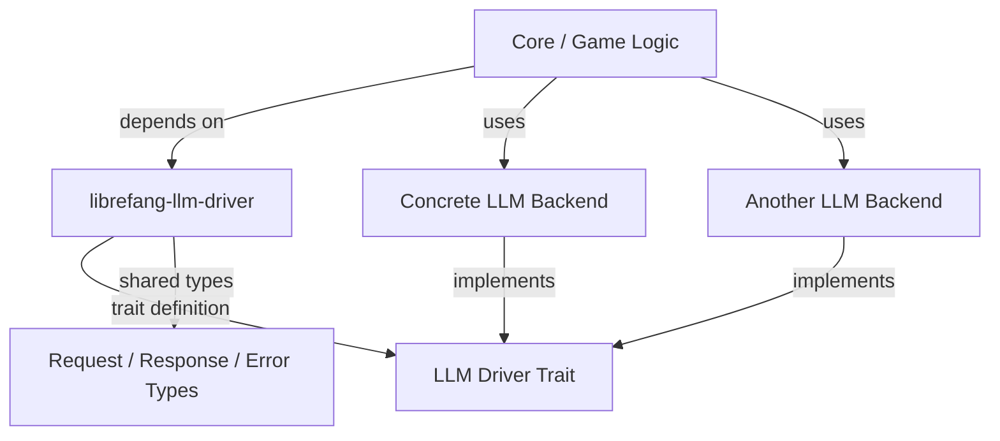

# Other — librefang-llm-driver

# librefang-llm-driver

## Purpose

`librefang-llm-driver` provides the abstract interface and shared types that decouple LibreFang's core logic from any specific LLM provider. It defines the **trait** that concrete LLM backends must implement, along with the request/response types and error definitions they share.

This module contains no concrete implementations — it exists so that the rest of the codebase can depend on a stable abstraction without being tied to a particular LLM service.

## Dependencies

| Crate | Role |
|---|---|
| `librefang-types` | Shared domain types used across the project |
| `async-trait` | Enables `async fn` in trait definitions |
| `serde` / `serde_json` | Serialization of request and response types |
| `thiserror` | Derived `Error` enum for driver-specific failures |
| `tokio` | Async runtime support |

## Architecture



The core game logic only knows about the trait defined here. Concrete backends (e.g., an OpenAI driver, a local model driver) depend on this crate, implement the trait, and are injected at runtime.

## Key Components

### LLM Driver Trait

An async trait (via `async-trait`) that defines the contract every LLM backend must satisfy. Implementors receive a request, interact with their specific LLM service, and return a typed response.

### Shared Types

Request and response structures annotated with `serde` derive macros. These are the common language between callers and drivers — regardless of which LLM provider sits behind the trait, the data flowing in and out uses the same shapes.

### Error Type

A `thiserror`-derived error enum representing failures that can occur during LLM interaction (e.g., network errors, rate limits, malformed responses). This gives callers a uniform error type to match on, independent of the backend.

## Integration

To use this module from another crate:

```toml
[dependencies]
librefang-llm-driver = { path = "../librefang-llm-driver" }
```

To implement a new LLM backend, depend on this crate, import the driver trait, and implement it for your backend struct. The rest of LibreFang can then accept your backend as a generic or trait object.