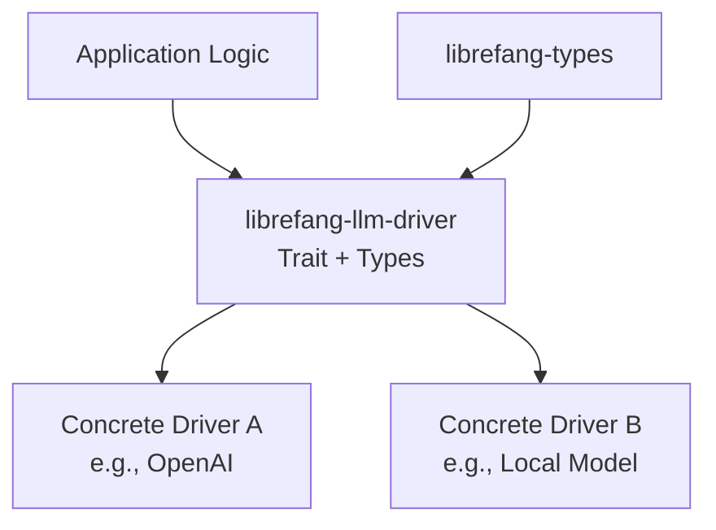

# Other — librefang-llm-driver

# librefang-llm-driver

## Purpose

`librefang-llm-driver` provides the abstract interface and shared types for LLM (Large Language Model) integration within LibreFang. It defines the contract that concrete LLM backend implementations must satisfy, while remaining backend-agnostic. This separation allows the rest of the codebase to interact with LLM services through a uniform API, regardless of whether the underlying provider is OpenAI, a local model, or any other backend.

## Role in the Architecture

This module sits between the application logic and concrete LLM implementations. It is a **pure interface module** — it contains no executable business logic, no network calls, and no side effects. Other crates depend on it to:

- Implement concrete LLM drivers against the defined trait
- Consume LLM capabilities without coupling to a specific provider

## Key Dependencies

| Dependency | Purpose |
|---|---|
| `librefang-types` | Shared domain types used across the LibreFang workspace |
| `async-trait` | Enables async methods in trait definitions |
| `serde` / `serde_json` | Serialization of request/response types and error payloads |
| `thiserror` | Derived `Error` enum for driver-specific error variants |
| `tokio` | Async runtime primitives for trait signatures |

## Core Components

### LlmDriver Trait

The central abstraction, defined via `async-trait`. Any struct that represents an LLM backend must implement this trait. The trait defines the operations available for interacting with an LLM, such as sending prompts and receiving completions.

Implementors are expected to handle:

- Constructing provider-specific HTTP requests internally
- Translating provider-specific errors into the module's error type
- Returning results using the shared response types defined here

### Request and Response Types

Shared data structures that represent:

- **Requests**: Prompts, system messages, conversation context, and configuration parameters (temperature, max tokens, etc.)
- **Responses**: Generated text, token usage metadata, and model identification

These types derive `Serialize` and `Deserialize` to support serialization for logging, caching, or inter-process communication.

### Error Types

A consolidated error enum (via `thiserror`) representing failure modes common across LLM backends:

- Network or connectivity failures
- API-level errors (rate limiting, authentication, invalid requests)
- Response parsing errors
- Timeout errors

Concrete drivers map their provider-specific error codes into these variants, keeping the consumer's error handling provider-agnostic.

## Implementing a New Driver

To add support for a new LLM backend:

1. Create a new crate that depends on `librefang-llm-driver`
2. Define a struct representing your backend connection (API key, endpoint URL, client handle, etc.)
3. Implement the `LlmDriver` trait for that struct
4. Translate the backend's native response format into the shared response types
5. Map backend-specific errors into the module's error enum

## Design Decisions

- **No default implementation**: This module intentionally provides no concrete driver, no HTTP client, and no fallback logic. It exists solely to define the interface.
- **Async-first**: All trait methods are async, reflecting the inherently I/O-bound nature of LLM API calls.
- **Minimal dependency surface**: Aside from `librefang-types`, this module carries no domain-specific logic, keeping the trait contract clean and focused.