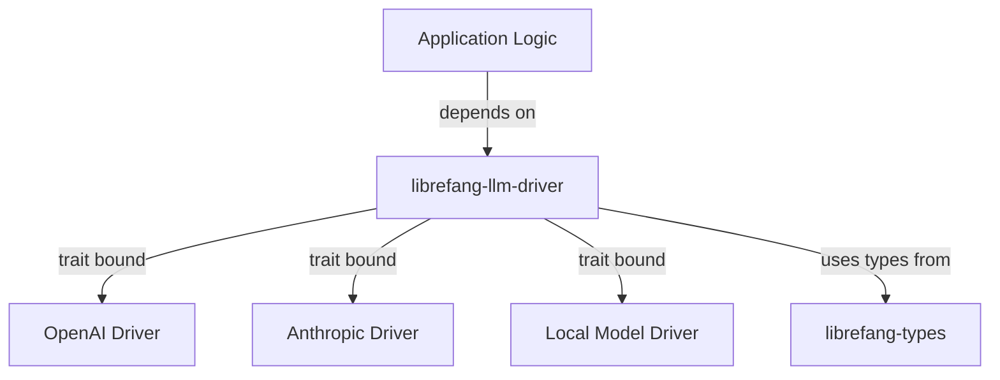

# Other — librefang-llm-driver

# librefang-llm-driver

## Purpose

`librefang-llm-driver` defines the abstraction layer for LLM (Large Language Model) integration within the LibreFang project. It provides a shared trait interface and common types that concrete LLM provider implementations must satisfy, decoupling the rest of the codebase from any specific LLM vendor or API.

## Role in the Architecture

This crate sits between the application logic and concrete LLM implementations. Other LibreFang crates depend on `librefang-llm-driver` to interact with LLMs without knowing which provider (OpenAI, Anthropic, local models, etc.) is actually in use.

## Dependencies

| Dependency | Purpose |
|---|---|
| `librefang-types` | Shared domain types used across LibreFang crates |
| `async-trait` | Enables async methods in trait definitions |
| `serde` / `serde_json` | Serialization of LLM request/response payloads |
| `thiserror` | Derived error types for driver-level failures |
| `tokio` | Async runtime support |

## Key Concepts

### Driver Trait

The core of this module is an async trait that concrete LLM drivers implement. Any provider-specific crate must implement this trait to be usable by the rest of the system. The trait abstracts over request construction, response parsing, and error handling so that swapping LLM providers requires no changes to consuming code.

### Shared Error Types

Driver-level errors are defined here using `thiserror`. These cover common failure modes—network errors, rate limiting, malformed responses, authentication failures—that all LLM providers share. Concrete drivers map their provider-specific errors into these common types.

### Request and Response Types

Common structures for LLM interactions (prompts, completions, token counts, etc.) are defined here or re-exported from `librefang-types`, ensuring all drivers and consumers speak the same data language.

## Implementing a New Driver

To add support for a new LLM provider:

1. Create a new crate (e.g., `librefang-llm-openai`)
2. Depend on `librefang-llm-driver`
3. Implement the driver trait for a struct representing your provider's client
4. Map all provider-specific errors into the shared error types
5. Register the driver in the application's driver registry or configuration

## Integration Points

- **Downstream consumers** import `librefang-llm-driver` to accept a trait object or generic parameter bounded by the driver trait.
- **Concrete driver crates** implement the trait and re-export the shared types as needed.
- **Configuration layers** select which driver to instantiate at runtime based on user settings.