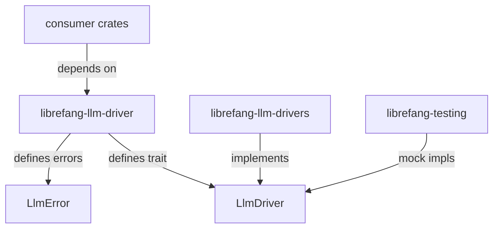

# Other — librefang-llm-driver

# librefang-llm-driver

Pure trait and shared types for the LLM driver interface. No concrete provider implementations.

## Architecture

This crate intentionally contains only the `LlmDriver` trait, the `LlmError` enum, and shared driver-side types. Every concrete provider (Anthropic, OpenAI, Gemini, Groq, etc.) lives in the sibling crate `librefang-llm-drivers` (note the trailing **s**).

### Why two crates

Splitting trait from implementations avoids pulling `reqwest`, TLS libraries, and vendored SDKs into test builds. Test crates depend on this crate alone and use mock implementations from `librefang-testing`. **Do not merge the two crates.**

## Key Components

### `LlmDriver` trait (`lib.rs`)

The async trait that every provider must implement. New methods should not be added without discussion in an issue first — the surface is kept minimal.

### `LlmError` enum (`llm_errors.rs`)

The LLM-specific error type returned by `LlmDriver` methods. Each variant is structured (not a `String` catch-all) and answers practical questions:

| Method | Purpose |
|---|---|
| `is_retryable()` | Can the caller safely retry this operation? |
| Related helpers | Distinguish quota/auth failures from model output problems |

**`Partial` variant** — When a streaming response fails partway through, this variant preserves the bytes received so far. Callers use these bytes to settle metering before propagating the error. This traces back to issue #3552.

Error chains are preserved via `thiserror` `#[source]` attributes (#3745). Do not break the `source()` chain when adding variants.

### Shared driver-side types

Common types used across provider implementations. These stay generic enough to avoid coupling to any single provider's API shape.

## Dependencies

Intentionally light:

- `librefang-types` — shared domain types
- `async-trait` — async trait support
- `serde` / `serde_json` — serialization
- `thiserror` — error derive macros
- `tokio` — async runtime primitives

No HTTP clients. No TLS. No vendor SDKs.

## Adding a New Driver

New drivers go in **`librefang-llm-drivers`**, not here. Implement `LlmDriver` for your provider struct. You should not need to touch this crate unless one of these is true:

1. **A new trait method is genuinely required.** Rare. Open an issue to discuss first.
2. **A new `LlmError` variant is needed.** Add a typed variant with structured fields. Preserve the `#[source]` chain.
3. **A new shared type is needed.** Only if the type is genuinely cross-provider.

## Error Design Rules

- **No `String` catch-all variants.** Use structured enum fields. This is enforced per #3541 / #3711.
- **No `Box<dyn Error>` in trait return types.** Use `LlmError`.
- Every new variant should allow callers to distinguish retryable vs. fatal, quota vs. auth vs. model errors.

## Testing

- Trait conformance is exercised by mock drivers in `librefang-testing` (`MockKernelBuilder`).
- Do not add HTTP fixture tests in this crate. Those belong in `librefang-llm-drivers` next to the implementation under test.

## Hard Boundaries

| Forbidden | Reason |
|---|---|
| `reqwest`, TLS deps, vendored client SDKs | This crate is pure trait + types |
| `librefang-llm-drivers` import | Circular dependency |
| `librefang-runtime` / `librefang-kernel` imports | Driver trait must stand alone |
| `String`-typed error variants | Use structured enum fields |
| `Box<dyn Error>` in trait signatures | Use `LlmError` |