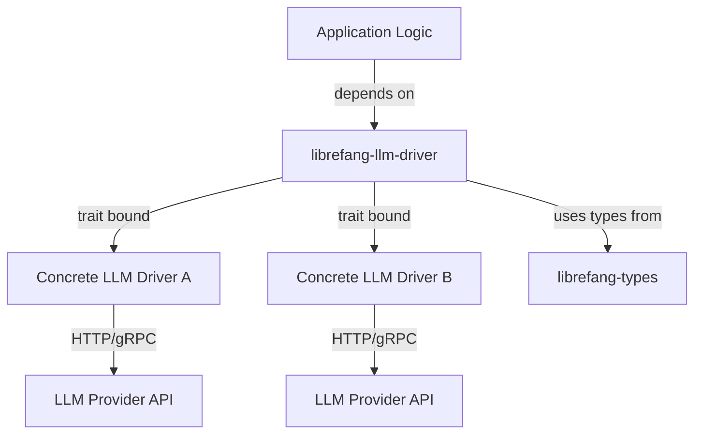

# Other — librefang-llm-driver

# librefang-llm-driver

LLM driver trait and shared types for LibreFang.

## Purpose

This crate defines the abstraction layer through which the rest of the LibreFang codebase communicates with large language model backends. It provides a common trait that concrete LLM integrations must implement, along with the shared types used in request/response flows. By isolating the driver contract here, higher-level modules remain decoupled from any specific LLM provider.

## Role in the Architecture

`librefang-llm-driver` sits between the application logic and concrete LLM implementations. It has no knowledge of specific providers — it only defines *what* a driver must do, not *how*.

## Dependencies and What They Signal

| Dependency | Purpose in this crate |
|---|---|
| `librefang-types` | Shared domain types (messages, conversation context, configuration) that cross module boundaries |
| `async-trait` | Enables async methods in trait definitions — LLM calls are inherently I/O-bound and must be non-blocking |
| `serde` / `serde_json` | Serialization of request/response types for transport and configuration parsing |
| `thiserror` | Ergonomic, typed error definitions for driver-level failures |
| `tokio` | Async runtime primitives used by driver implementations |

## What This Crate Provides

### Driver Trait

The core export is an async trait that concrete LLM backends implement. Any new provider is integrated by implementing this trait and wiring it into the application at startup.

### Request and Response Types

Shared structures representing prompts, chat histories, completion parameters, and model responses. These types are what the application logic constructs and consumes, keeping it agnostic to provider-specific wire formats.

### Error Types

A unified error enum covering common failure modes — network errors, rate limiting, invalid responses, authentication failures, and context-length violations. Drivers translate provider-specific errors into these common types so that callers handle a single error surface.

## Contributing a New LLM Driver

1. Create a new crate (or module) for the provider.
2. Depend on `librefang-llm-driver` and `librefang-types`.
3. Implement the driver trait against the provider's API.
4. Map all provider-specific error cases into the shared error types defined here.
5. Register the driver in the application's startup/configuration logic.

## Relationship to `librefang-types`

Types defined in `librefang-types` represent domain concepts that are meaningful across the entire codebase. This crate reuses those types in its trait signatures rather than defining its own parallel versions, ensuring consistency and avoiding mapping layers.