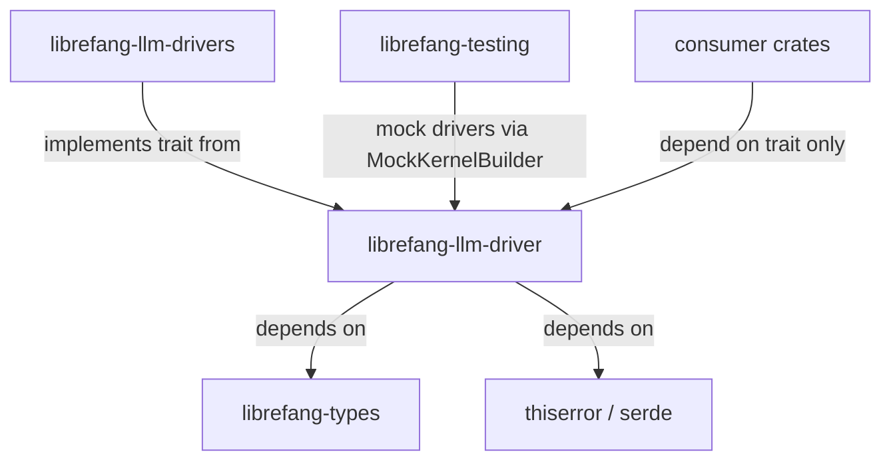

# Other — librefang-llm-driver

# librefang-llm-driver

Trait definition and shared error types for LibreFang's LLM abstraction layer. This crate owns the `LlmDriver` trait and the `LlmError` enum — nothing else. All concrete provider implementations (Anthropic, OpenAI, Gemini, Groq, etc.) live in the sibling `librefang-llm-drivers` crate.

## Architecture

The split between this crate and `librefang-llm-drivers` is intentional and must be preserved. Consumer and test crates can depend on the trait without pulling in `reqwest`, TLS libraries, or vendored provider SDKs. This keeps unit test builds fast and dependency graphs narrow.

## Key Components

### `LlmDriver` Trait

The core async trait that every LLM provider must implement. Defined in `lib.rs` using `async-trait`. Any new provider is implemented against this trait in `librefang-llm-drivers` — no changes to this crate are required unless the trait's surface itself needs expanding.

Adding a new method to the trait is a rare event. Open an issue for discussion first.

### `LlmError` Enum

Defined in `llm_errors.rs`. This is the single error type returned by `LlmDriver` methods. It is built with `thiserror` and provides structured error classification rather than collapsed string messages.

Key design properties:

- **No `String` catch-all variant.** Every variant is typed with structured fields. This is enforced by convention and review (see #3541, #3711).
- **Error source chains are preserved** via `#[source]` annotations (#3745). Callers can walk the cause chain.
- **Retry classification.** The enum exposes `is_retryable()` and similar query methods so callers can decide whether to re-attempt a request without matching on every variant.
- **Partial response preservation.** A `Partial` variant exists to carry bytes received so far when a streaming error occurs (#3552). This allows callers to settle metering and accounting even on failed streams.

Common variant categories:

| Category | Purpose | Example query method |
|---|---|---|
| Network / transport | Connection failures, timeouts | `is_retryable()` |
| Auth / quota | API key invalid, rate limited | `is_retryable()` returns false for auth, true for quota |
| Model output | Malformed or unexpected response | Structured fields describing what was expected vs. received |
| Partial | Stream interrupted mid-response | Carries bytes-so-far |

### Shared Driver-Side Types

Any types that multiple providers need in common (request/response wrappers, capability descriptors, etc.) are defined here rather than duplicated across implementations. Keep this set minimal — provider-specific types belong in `librefang-llm-drivers`.

## Dependencies

This crate is intentionally dep-light:

| Dependency | Reason |
|---|---|
| `librefang-types` | Shared domain types (prompts, messages, tool definitions) |
| `async-trait` | Trait definition |
| `serde` / `serde_json` | Serialization of shared types |
| `thiserror` | Error enum derivation |
| `tokio` | Async runtime primitives |

Dependencies that must **never** be added: `reqwest`, any TLS crate, any vendored provider SDK, `librefang-runtime`, `librefang-kernel`, or `librefang-llm-drivers` (circular).

## Implementing a New Provider

1. Add the implementation in `librefang-llm-drivers`, not here.
2. Implement the `LlmDriver` trait for your provider's client struct.
3. If you need a new `LlmError` variant, add it to `llm_errors.rs` in this crate with a structured field and a `#[source]` annotation where applicable.
4. If you need a new shared type, add it to this crate only if at least two providers will use it.
5. Write HTTP fixture tests in `librefang-llm-drivers` next to the implementation.

## Testing

This crate contains no HTTP tests. Trait conformance is verified by mock drivers built in `librefang-testing` using `MockKernelBuilder`. If you add logic to `LlmError` methods (e.g., `is_retryable()`), unit test those here. Integration and contract tests against real providers belong in `librefang-llm-drivers`.