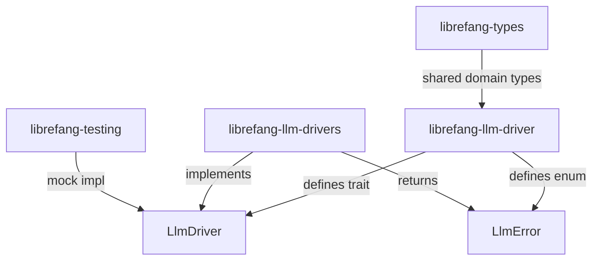

# Other — librefang-llm-driver

# librefang-llm-driver

Trait definition and shared error types for LLM driver interactions. This crate contains **no concrete provider implementations** — only the interface that providers implement and the error types they return.

## Architecture

The sibling crate `librefang-llm-drivers` (note the trailing **s**) holds all concrete provider implementations: Anthropic, OpenAI, Gemini, Groq, and any future additions. Test crates depend on this crate alone for mock driver setup, avoiding transitive `reqwest` and TLS dependencies.

## Why Two Crates

Splitting trait from implementations is intentional and must be preserved. Merging them would force every test crate that needs a mock `LlmDriver` to pull in the full HTTP stack of every provider. This is not worth trading for "simplicity."

## Key Components

### `LlmDriver` Trait

The async trait that every LLM provider must implement. Defined in `lib.rs`. All provider implementations live in `librefang-llm-drivers` and satisfy this interface.

### `LlmError` Enum

Defined in `llm_errors.rs`. The single error type returned by `LlmDriver` methods.

Design rules for `LlmError`:

- **Structured variants only.** Each variant is a typed enum field — no `String` catch-all, no `Box<dyn Error>` in trait return types.
- **Composable semantics.** Every variant can answer: *Is this retryable? Is this a quota or auth issue? Did the model produce invalid output?* Methods like `is_retryable()` live on the enum.
- **Partial response preservation.** The `Partial` variant carries bytes received so far when a streaming error occurs. Callers use this to settle metering and billing.
- **Source chain intact.** Variants that wrap underlying errors preserve the `source()` chain (per #3745). Use `#[source]` attribute from `thiserror`.

### Shared Driver-Side Types

Common types used across multiple provider implementations. These live here so they can be shared without creating circular dependencies.

## Dependencies

Intentionally minimal:

| Dependency | Purpose |
|---|---|
| `librefang-types` | Shared domain types |
| `async-trait` | Trait definition |
| `dashmap` | Concurrent maps for driver-side caching/state |
| `serde` / `serde_json` | Serialization of request/response types |
| `thiserror` | Error derive macros |
| `tokio` | Async runtime primitives |
| `tracing` | Instrumentation |

**Not present and must never be added:** `reqwest`, any TLS crate, any vendored provider SDK.

## Adding a New LLM Provider

Do **not** modify this crate. The new driver belongs in `librefang-llm-drivers`.

You only need to touch this crate if one of these is true:

- **A new trait method is needed.** Extremely rare. Open an issue to discuss before implementing.
- **A new `LlmError` variant is needed.** Add a structured variant with typed fields. Preserve the `source()` chain.
- **A new shared type is needed** across multiple providers.

## Testing

Trait conformance is verified through mock drivers in `librefang-testing`, specifically via `MockKernelBuilder`. Do not add HTTP fixture or integration tests here — those belong alongside the concrete provider implementation in `librefang-llm-drivers`.

## Hard Boundaries

| Forbidden | Reason |
|---|---|
| Importing `librefang-llm-drivers` | Circular dependency |
| Importing `librefang-runtime` or `librefang-kernel` | Driver trait must stand alone |
| Adding `reqwest`, TLS, or vendor SDKs | This crate is pure trait + types |
| New `String`-typed error variants | Use structured enum fields |
| `Box<dyn Error>` in trait signatures | Use `LlmError` |