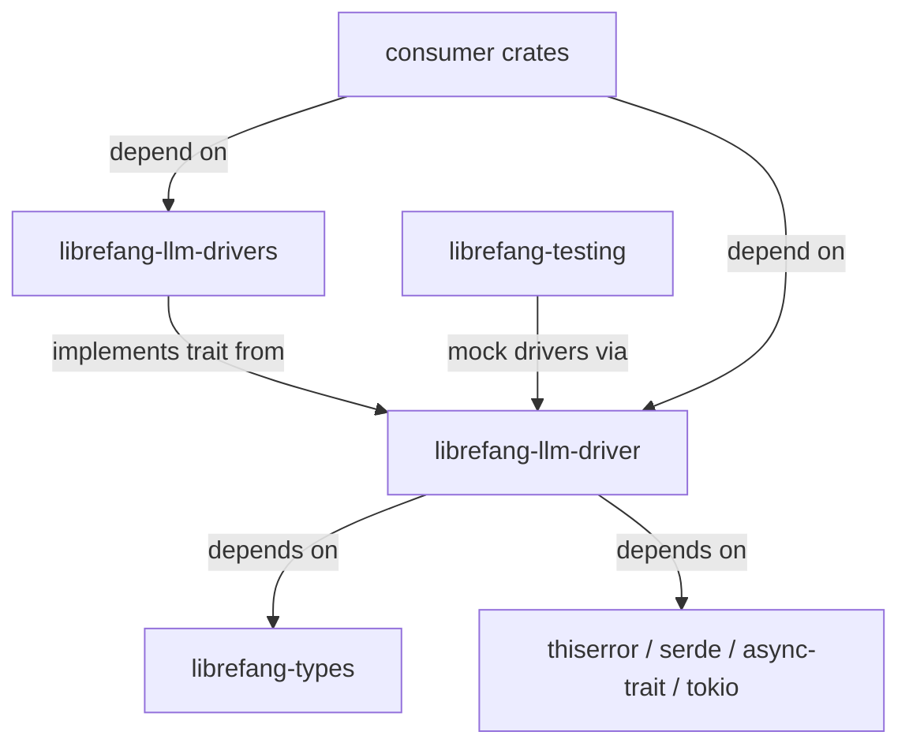

# Other — librefang-llm-driver

# librefang-llm-driver

Trait definitions, error types, and shared driver-side types for the LibreFang LLM subsystem. This crate is intentionally abstract — it contains **no concrete provider implementations**. All provider-specific wiring (Anthropic, OpenAI, Gemini, Groq, etc.) lives in the sibling crate `librefang-llm-drivers` (note the trailing `s`).

## Architecture

The trait crate is split from the implementations crate for a concrete reason: test crates and lightweight consumers can depend on `librefang-llm-driver` alone, avoiding a transitive pull of `reqwest`, TLS libraries, and vendored SDKs into their build. **Do not merge these two crates.**

## Key Components

### `LlmDriver` Trait

The core async trait that every LLM provider must implement. Defined in `lib.rs`. Any new provider adds an implementation in `librefang-llm-drivers` — the trait itself rarely changes.

When a new trait method is genuinely needed, open an issue for discussion first. The trait surface is kept minimal by design.

### `LlmError` Enum

Defined in `llm_errors.rs`. This is the single error type returned by `LlmDriver` methods. Every variant is structured — there are **no `String` catch-all variants** and **no `Box<dyn Error>` returns**.

Key properties:

- **Compositional query methods**: `is_retryable()`, and similar helpers, live directly on the enum. Each variant should answer questions like "is this retryable?", "is this a quota or auth issue?", and "did the model produce invalid output?".
- **Source chain preservation**: Error variants use `#[source]` annotations (per #3745) so that `std::error::Error::source()` chains remain intact through the call stack.
- **Partial response recovery**: The `Partial` variant carries the bytes accumulated so far during a streaming failure. Consumers use this to settle metering and billing without losing partial work (#3552).

#### Adding a new error variant

1. Add a typed variant with structured fields (not a `String`).
2. Preserve the `#[source]` chain where the error wraps an underlying cause.
3. Ensure `is_retryable()` and any other query methods handle the new variant.

### Shared Driver-Side Types

Common types used across multiple provider implementations. These stay generic — nothing provider-specific belongs here.

## Dependencies

The crate is deliberately dep-light:

| Dependency | Purpose |
|---|---|
| `librefang-types` | Shared domain types |
| `async-trait` | Async trait macro for `LlmDriver` |
| `serde` / `serde_json` | Serialization of shared types |
| `thiserror` | Derived `Error` impl for `LlmError` |
| `tokio` | Async runtime primitives |

No networking libraries. No TLS. No vendored client SDKs.

## Boundaries

### What belongs here

- The `LlmDriver` trait definition
- `LlmError` and its query methods
- Shared types used by multiple provider implementations

### What does NOT belong here

- HTTP client wiring or request construction
- Retry strategies or backoff logic
- Prompt formatting or provider-specific protocol details
- Provider-specific response parsing

Those all go into `librefang-llm-drivers`.

### Forbidden imports

| Must not import | Reason |
|---|---|
| `reqwest` or TLS crates | Would violate the dep-light guarantee |
| `librefang-llm-drivers` | Circular dependency |
| `librefang-runtime` / `librefang-kernel` | Driver trait must stand alone |

## Testing

This crate has **no HTTP fixture tests**. Trait conformance is exercised through mock drivers built in `librefang-testing` (see `MockKernelBuilder`). Provider-specific integration tests live in `librefang-llm-drivers` next to the implementation under test.

## Adding a New Driver

New drivers are implemented in `librefang-llm-drivers`. You should not need to touch this crate unless one of these is genuinely required:

- A new method on the `LlmDriver` trait (rare — discuss in an issue first).
- A new `LlmError` variant for a failure mode not yet covered.
- A new shared type that multiple providers need.