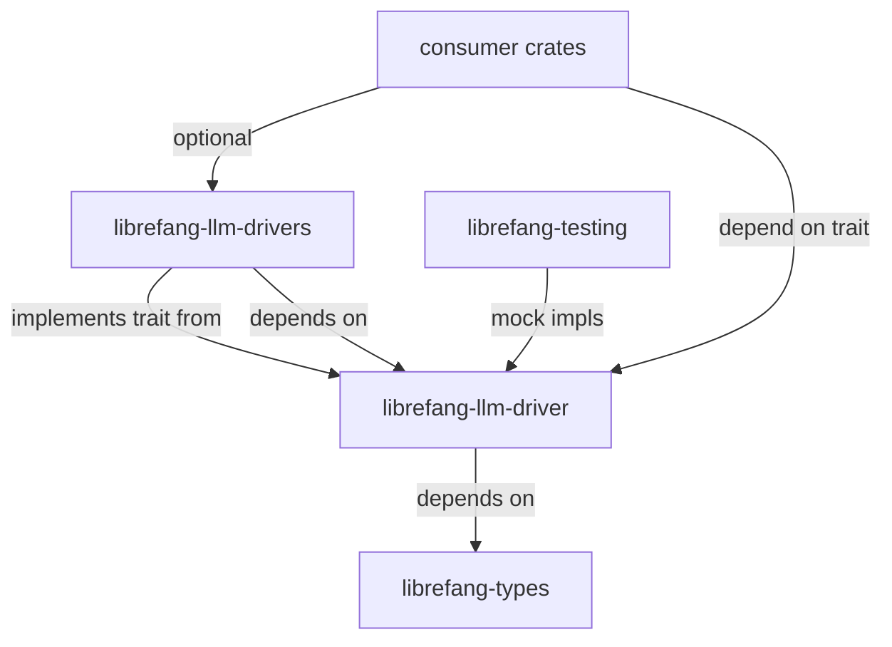

# Other — librefang-llm-driver

# librefang-llm-driver

Trait definitions and shared error types for LibreFang's LLM integration layer. This crate defines the `LlmDriver` trait and the `LlmError` enum — the contract that every provider implementation must satisfy. **No concrete provider code lives here.**

## Why This Crate Exists

Splitting the trait from its implementations serves a specific purpose: downstream crates (tests, kernel orchestration) can depend on the trait alone without pulling in `reqwest`, native TLS libraries, or vendored SDKs. The concrete implementations live in the sibling crate `librefang-llm-drivers` (note the trailing **s**).

This is an intentional architectural boundary. Do not merge the two crates.

## Architecture

```mermaid
graph TD
    A[librefang-llm-driver] -->|depends on| B[librefang-types]
    C[librefang-llm-drivers] -->|implements trait from| A
    C -->|depends on| A
    D[librefang-testing] -->|mock impls| A
    E[consumer crates] -->|depend on trait| A
    E -->|optional| C
```

- **This crate** owns the interface and shared types only.
- **`librefang-llm-drivers`** provides concrete implementations (Anthropic, OpenAI, Gemini, Groq, etc.).
- **`librefang-testing`** provides mock driver implementations for unit testing (see `MockKernelBuilder`).
- Consumer crates depend on `librefang-llm-driver` for the trait. They opt into `librefang-llm-drivers` only when they need a real HTTP-backed provider.

## Key Components

### `LlmDriver` Trait

The core async trait that every LLM provider must implement. Defined in `lib.rs` using `async-trait`. This trait is the sole integration point between LibreFang's runtime and any LLM provider.

### `LlmError` Enum

Defined in `llm_errors.rs`. The structured error type returned by `LlmDriver` methods. Uses `thiserror` for ergonomic error derivation and `source()` chain preservation.

Each variant answers specific diagnostic questions:

| Question | Method |
|---|---|
| Can the caller safely retry? | `is_retryable()` |
| Is this an auth or quota issue? | Structured into the variant |
| Did the model produce invalid output? | Dedicated variant |

The `Partial` variant preserves bytes received before a streaming error occurred. Callers use these bytes to settle metering and billing rather than discarding partial work.

### Shared Driver-Side Types

Common types used across all provider implementations. These live here to avoid duplication and to keep `librefang-llm-drivers` focused on HTTP wiring and provider-specific serialization.

## Error Handling Design

`LlmError` follows specific conventions:

- **Structured variants only.** Every variant carries typed fields, not a catch-all `String`. This enables programmatic matching and recovery logic.
- **No `Box<dyn Error>` in trait return types.** All `LlmDriver` methods return `Result<_, LlmError>`.
- **Source chains are preserved** per the pattern established in `#3745`. Each variant that wraps an underlying error implements `std::error::Error::source()` correctly.
- **Retry classification is built in.** `is_retryable()` and similar methods live directly on the enum, so callers don't need to match on variants to decide whether to retry.

## Dependencies

Intentionally minimal:

| Dependency | Purpose |
|---|---|
| `librefang-types` | Shared domain types |
| `async-trait` | Async trait definition |
| `dashmap` | Concurrent map for driver-side caches/state |
| `serde` / `serde_json` | Serialization of shared types |
| `thiserror` | Error enum derivation |
| `tokio` | Async runtime primitives |
| `tracing` | Instrumentation |

**Notably absent:** `reqwest`, TLS crates, vendor SDKs, `librefang-runtime`, `librefang-kernel`. This crate must compile fast and stay lightweight.

## When to Modify This Crate

Most changes to LLM integration happen in `librefang-llm-drivers`. You should only touch this crate when:

- **A new trait method is genuinely needed.** This is rare. Open an issue for discussion first.
- **A new `LlmError` variant is needed.** Add it as a structured variant with typed fields. Preserve the `source()` chain. Do not add a `String` catch-all.
- **A new shared driver-side type is needed** by multiple providers.

If you're adding a new provider (Anthropic, Mistral, etc.), the implementation goes entirely in `librefang-llm-drivers`. No changes here should be required.

## Testing

- **Trait conformance** is validated by mock implementations in `librefang-testing` (see `MockKernelBuilder`).
- **No HTTP fixture tests belong here.** Those live in `librefang-llm-drivers` alongside the provider implementation under test.
- This crate's own tests should cover error variant behavior (`is_retryable()`, source chains, `Partial` byte preservation) and type serialization round-trips.

## Hard Boundaries

These are non-negotiable constraints:

1. **No `reqwest` or TLS dependencies.** This crate defines interfaces, not HTTP clients.
2. **No import of `librefang-llm-drivers`.** It would create a circular dependency.
3. **No import of `librefang-runtime` or `librefang-kernel`.** The driver trait must stand alone.
4. **No `String`-typed error variants.** Use structured enum fields.
5. **No `Box<dyn Error>` in trait signatures.** Use `LlmError`.