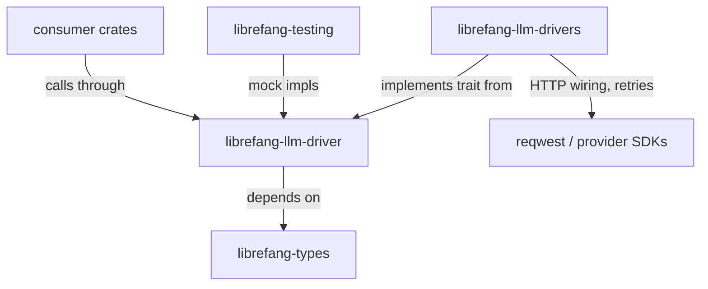

# Other — librefang-llm-driver

# librefang-llm-driver

The LLM driver abstraction layer for LibreFang. This crate owns the trait definition, error types, and shared driver-side types that all LLM provider implementations consume. **No concrete provider implementations live here.**

## Architecture

```mermaid
graph TD
    A[librefang-llm-driver] -->|depends on| B[librefang-types]
    C[librefang-llm-drivers] -->|implements trait from| A
    D[librefang-testing] -->|mock impls| A
    E[consumer crates] -->|calls through| A
    C -->|HTTP wiring, retries| F[reqwest / provider SDKs]
```

The crate exists as a standalone dependency island. It imports no networking crates, no runtime crates, and no provider SDKs. Anything that needs to *call* an LLM depends on this crate for the trait; anything that *implements* a provider depends on it for the contract.

## Why Two Crates

`librefang-llm-driver` (trait) is split from `librefang-llm-drivers` (implementations) to keep dependency graphs narrow:

- Test crates and consumer crates depend on the trait alone — no transitive `reqwest`, TLS, or vendored SDKs pulled into unit test builds.
- Provider implementations can add heavy HTTP dependencies without infecting the rest of the workspace.

**Do not merge these two crates.** The split is intentional and permanent.

## Key Components

### `LlmDriver` Trait

The canonical async trait that every LLM provider must implement. Defined in `lib.rs`. All consumer code programs against this trait; concrete types are injected at wiring time.

### `LlmError` Enum

Defined in `llm_errors.rs`. The single error type surfaced through the `LlmDriver` trait. Each variant is a structured, typed field — not a `String` catch-all.

The enum answers operational questions through inherent methods:

| Method | Purpose |
|---|---|
| `is_retryable()` | Can the caller safely retry this request? |
| Quota/auth helpers | Is this a rate-limit or authentication failure? |
| Model-output helpers | Did the model produce invalid or unusable output? |

The `Partial` variant preserves bytes received so far when a streaming error occurs. Callers use this to settle metering and partial-response accounting (#3552).

Error chaining is preserved through `thiserror`'s `#[source]` attribute. Don't break the `source()` chain (#3745).

### Shared Driver-Side Types

Any type that multiple provider implementations need in common lives here. Keep this surface minimal — if only one provider uses a type, it belongs in `librefang-llm-drivers` instead.

## Dependencies

The crate is deliberately dep-light:

- `librefang-types` — shared domain types
- `async-trait` — trait definition
- `dashmap` — concurrent maps for driver-side bookkeeping
- `serde` / `serde_json` — serialization
- `thiserror` — error derives
- `tokio` — async runtime primitives
- `tracing` — instrumentation

**Forbidden dependencies:** `reqwest`, any TLS crate, any vendored provider SDK, `librefang-llm-drivers` (circular), `librefang-runtime`, `librefang-kernel`.

## Adding a New Error Variant

1. Add a new struct variant to `LlmError` with a descriptive name and typed fields.
2. Attach `#[error(...)]` and `#[source]` as appropriate.
3. Ensure `is_retryable()` (and any other match-based helpers) handle the new variant.
4. Do **not** add a `String`-typed or `Box<dyn Error>` catch-all variant.

## Adding a New Driver

New drivers go in `librefang-llm-drivers`, **not** here. You should not need to touch this crate unless:

- A genuinely new method is required on the `LlmDriver` trait. This is rare — raise an issue first.
- A new `LlmError` variant is needed (see above).
- A new shared type is needed by multiple providers.

## Testing

- **Trait conformance** is tested via mock drivers in `librefang-testing` (see `MockKernelBuilder`).
- **No HTTP fixture tests belong here.** Those live in `librefang-llm-drivers` alongside the implementation under test.

## Constraints

| Rule | Reason |
|---|---|
| No `reqwest` / TLS / SDK deps | Keeps the crate lightweight; no network code in a trait crate |
| No `librefang-llm-drivers` import | Would create a circular dependency |
| No `librefang-runtime` / `librefang-kernel` imports | Driver trait must stand alone |
| No `String` error variants | Structured errors only; preserves programmatic handling |
| No `Box<dyn Error>` in trait returns | Use `LlmError` |