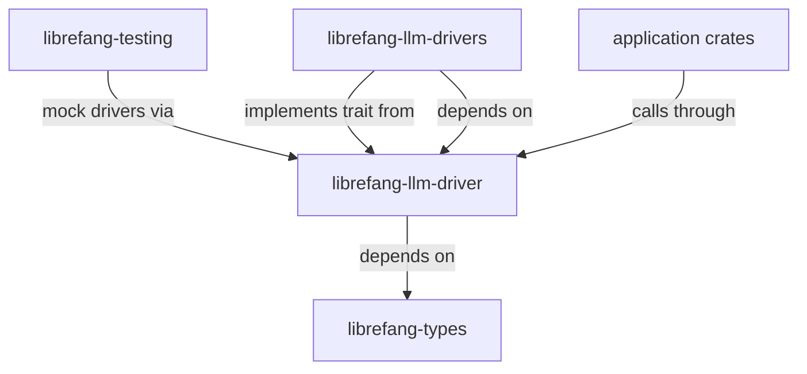

# Other — librefang-llm-driver

# librefang-llm-driver

Trait definition and shared error types for the LLM driver interface. This crate contains **no concrete provider implementations** — it exists purely to define the contract that providers fulfill.

Concrete drivers (Anthropic, OpenAI, Gemini, Groq, etc.) live in the sibling crate `librefang-llm-drivers` (note the plural **s**).

## Why a Separate Trait Crate

Splitting the trait from its implementations lets downstream crates — especially test crates — depend on the interface alone. No transitive `reqwest`, TLS, or vendored SDKs leak into unit-test builds. Do not merge the two crates.

## Architecture

```mermaid
graph TD
    A[librefang-llm-driver] -->|depends on| B[librefang-types]
    C[librefang-llm-drivers] -->|implements trait from| A
    D[librefang-testing] -->|mock drivers via| A
    E[application crates] -->|calls through| A
    C -->|depends on| A
```

## Key Components

### `LlmDriver` Trait (`lib.rs`)

The async trait that every LLM provider must implement. Defines the canonical interface for sending prompts, receiving completions, and streaming responses.

Implementations live exclusively in `librefang-llm-drivers`. Adding a new provider does not require changes to this crate unless the trait itself needs a new method (rare — open an issue to discuss first).

### `LlmError` Enum (`llm_errors.rs`)

The LLM-specific error type surfaced through the `LlmDriver` trait. Designed to answer three questions at the call site:

| Question | Method |
|---|---|
| Can I retry this? | `is_retryable()` |
| Is this a quota or auth problem? | Variant inspection |
| Did the model produce garbage? | Variant inspection |

**Structured variants only.** Do not add a `String` catch-all variant (see #3541 / #3711). Each variant carries typed fields, not free-form strings. Preserve the `source()` chain so error context is not lost (#3745).

#### Streaming Partial Responses

The `Partial` variant exists for streaming failures. It carries the bytes received so far, allowing callers to settle metering and account for partial output. Do not discard this data (#3552 lineage).

## Dependencies

Intentionally minimal:

| Dependency | Reason |
|---|---|
| `librefang-types` | Shared domain types used in driver signatures |
| `async-trait` | Trait definition |
| `thiserror` | `LlmError` derive |
| `serde` / `serde_json` | Serialization of shared driver-side types |
| `dashmap` | Concurrent map for driver-side state |
| `tokio` | Async runtime primitives |
| `tracing` | Instrumentation |

Adding `reqwest`, a TLS library, a vendored client SDK, or any heavy dependency is prohibited. This crate must remain compile-light.

## When to Modify This Crate

Most changes belong in `librefang-llm-drivers`. You should only open a PR against `librefang-llm-driver` when:

1. **A new trait method is genuinely needed.** This is rare. Discuss in an issue first.
2. **A new `LlmError` variant is needed.** Add a structured variant with typed fields. Implement the relevant query methods (`is_retryable()`, etc.) and preserve `source()` chains.
3. **A new shared driver-side type is needed.** If multiple providers would use the same struct or enum, it belongs here.

## Testing

Trait conformance is verified through mock drivers in `librefang-testing` (see `MockKernelBuilder`). Do not add HTTP fixture tests or provider-specific tests here — those belong next to the implementation in `librefang-llm-drivers`.

## Prohibited Patterns

| Prohibition | Reason |
|---|---|
| `reqwest` or TLS deps | Violates the dep-light contract; belongs in `librefang-llm-drivers` |
| `use librefang_llm_drivers` | Circular dependency |
| `use librefang_runtime` / `librefang_kernel` | Driver trait must stand alone |
| `String` catch-all error variants | Use structured enum fields (see #3541) |
| `Box<dyn Error>` in trait signatures | Use `LlmError` |
| Vendored client SDKs | Belongs in `librefang-llm-drivers` |