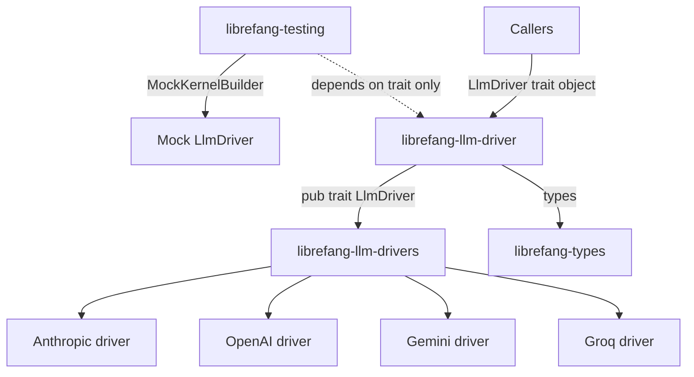

# Other — librefang-llm-driver

# librefang-llm-driver

The LLM driver interface crate. Defines the `LlmDriver` trait, the `LlmError` error enum, and shared types that all LLM provider implementations depend on. Contains **no concrete provider implementations** — those live in the sibling `librefang-llm-drivers` crate.

## Architecture

```mermaid
graph TD
    A[librefang-llm-driver] -->|pub trait LlmDriver| B[librefang-llm-drivers]
    B --> B1[Anthropic driver]
    B --> B2[OpenAI driver]
    B --> B3[Gemini driver]
    B --> B4[Groq driver]
    A -->|types| C[librefang-types]
    D[librefang-testing] -->|MockKernelBuilder| E[Mock LlmDriver]
    D -.->|depends on trait only| A
    F[Callers] -->|LlmDriver trait object| A
```

The split between this crate and `librefang-llm-drivers` is intentional and must be preserved. Test crates and consumer modules depend on this crate alone for the trait and types — no transitive `reqwest`, TLS, or vendored SDKs are pulled in. This keeps unit test builds fast and dependency graphs clean.

## Key Components

### `LlmDriver` Trait

The canonical async trait that every LLM provider must implement. Defined in `lib.rs`.

Implementations are `async_trait`-based. The trait methods define the contract for sending prompts, receiving completions, and handling streaming responses.

### `LlmError` Enum

Defined in `llm_errors.rs`. The single error type returned by `LlmDriver` methods.

Each variant is structured — not a `String` catch-all. Variants answer practical questions callers need:

| Question | How |
|---|---|
| Is this retryable? | `is_retryable()` on the enum |
| Is this a quota or auth problem? | Dedicated variants (`RateLimit`, `Authentication`, etc.) |
| Did the model produce garbage? | Dedicated variant for malformed output |
| Was partial data received before failure? | `Partial` variant carries `bytes_so_far` |

Error chains are preserved via `#[source]` attributes (tracking issue #3745). The `Partial` variant exists specifically for streaming failures — it retains whatever bytes were received so callers can settle metering and billing accurately (#3552 lineage).

**Do not** add `String` or `Box<dyn Error>` variants. Use typed enum fields.

### Shared Driver-Side Types

Provider-agnostic types used across all driver implementations. These live here so every provider in `librefang-llm-drivers` shares the same definitions without duplication.

## Dependencies

Intentionally minimal:

- `librefang-types` — canonical type definitions for the project
- `async-trait` — trait definition
- `dashmap` — concurrent map (likely for driver registry or caching)
- `serde` / `serde_json` — serialization for request/response types
- `thiserror` — derive for `LlmError`
- `tokio` — async runtime primitives
- `tracing` — instrumentation

No `reqwest`. No TLS. No vendor SDKs.

## When to Modify This Crate

Most changes to LLM support belong in `librefang-llm-drivers`. Touch this crate **only** when:

1. **A new trait method is genuinely needed.** This is rare. Open an issue for discussion first.
2. **A new `LlmError` variant is needed.** Add it as a typed variant with proper `#[source]` chain.
3. **A new shared type is needed** across multiple provider implementations.

### Adding a new LLM provider

1. Add the implementation in `librefang-llm-drivers`, not here.
2. Implement `LlmDriver` for your provider struct.
3. No changes to this crate should be required unless the trait itself is missing something (see above).

## Testing

This crate has no HTTP fixture tests. Trait conformance is exercised through mock drivers built in `librefang-testing` — see `MockKernelBuilder` there. Provider-specific integration tests with real HTTP belong in `librefang-llm-drivers` next to the implementation under test.

## Hard Rules

- **No** `reqwest`, TLS, or vendored client SDKs — pure trait + types.
- **No** import of `librefang-llm-drivers` — would create a circular dependency.
- **No** import of `librefang-runtime` or `librefang-kernel` — the driver trait stands alone.
- **No** `String`-typed error variants — use structured enum fields.
- **No** `Box<dyn Error>` in trait return types — use `LlmError`.
- **Do not** merge this crate with `librefang-llm-drivers`.