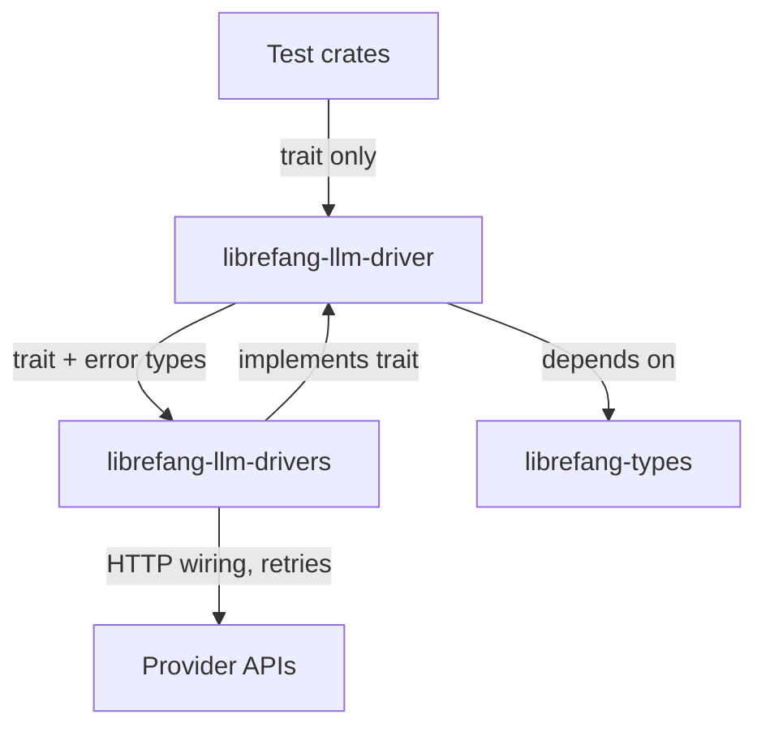

# Other — librefang-llm-driver

# librefang-llm-driver

Trait definition and shared error types for the LibreFang LLM driver interface. This crate contains **no concrete provider implementations** — those live in the sibling crate `librefang-llm-drivers` (note the trailing **s**).

## Architecture

The LLM driver layer is split into two crates by design:


```mermaid
graph TD
    A[librefang-llm-driver] -->|trait + error types| B[librefang-llm-drivers]
    A -->|depends on| C[librefang-types]
    B -->|implements trait| A
    B -->|HTTP wiring, retries| D[Provider APIs]
    E[Test crates] -->|trait only| A
```

**Why two crates.** Test crates depend on `librefang-llm-driver` to get the `LlmDriver` trait. They never touch `librefang-llm-drivers`. This avoids pulling `reqwest`, TLS libraries, and vendored provider SDKs into unit-test builds. Do not merge the two crates.

## Key Types

### `LlmDriver` trait (`lib.rs`)

The async trait that every LLM provider must implement. Defined with `#[async_trait]`. Consumers call methods on `dyn LlmDriver` without knowing which provider backs it.

All concrete implementations — Anthropic, OpenAI, Gemini, Groq, and any future providers — live in `librefang-llm-drivers` and implement this trait.

### `LlmError` enum (`llm_errors.rs`)

The single error type returned by `LlmDriver` methods. Structured variants only — no `String` catch-all, no `Box<dyn Error>`.

Each variant answers practical questions for callers:

| Question | Method |
|---|---|
| Can I retry this? | `is_retryable()` |
| Is this a quota or auth problem? | Check the variant kind |
| Did the model produce garbage? | Check the variant kind |

**Partial streaming responses.** The `Partial` variant preserves bytes received so far when a streaming error occurs. Callers use this to settle metering and billing even on failed streams.

**Error chains.** Variants carry structured source errors. The `source()` impl preserves the chain — don't flatten it into a string. See #3745.

## Dependencies

Intentionally minimal:

- `librefang-types` — shared domain types
- `async-trait` — trait definition
- `dashmap` — concurrent map for shared driver-side state
- `serde` / `serde_json` — serialization
- `thiserror` — derive `Error` for `LlmError`
- `tokio` — async runtime primitives
- `tracing` — instrumentation

This crate must never depend on `reqwest`, any TLS library, any vendored client SDK, `librefang-llm-drivers` (circular), `librefang-runtime`, or `librefang-kernel`.

## Adding a New Error Variant

Add a structured variant to `LlmError` in `llm_errors.rs`:

```rust
#[error("description of what went wrong")]
NewVariant { field: SomeType },
```

Update `is_retryable()` and any other classification methods. Preserve the `source()` chain — wrap the upstream error rather than converting it to a string.

## Adding a New Trait Method

Rare. Open an issue for discussion first. If approved, add the method with a default implementation (or accept that all providers in `librefang-llm-drivers` must be updated simultaneously).

## Adding a New Driver

Do not touch this crate. The new driver goes entirely in `librefang-llm-drivers`. Implement the existing `LlmDriver` trait. Only come back here if a new trait method or error variant is genuinely required.

## Testing

- **Trait conformance** — exercised by mock drivers in `librefang-testing` via `MockKernelBuilder`.
- **No HTTP fixture tests** — those belong in `librefang-llm-drivers` next to the provider implementation under test.
- **No provider-specific tests** — this crate has no provider code to test.