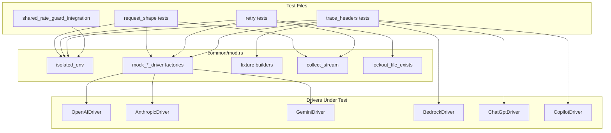

# Other — librefang-llm-drivers-tests

# librefang-llm-drivers-tests

Integration test suite for the LLM driver layer. Every test spins up an in-process HTTP mock (via `wiremock`), constructs a real driver instance pointed at it, and asserts on either the outbound request shape, the parsed response, or the retry/error-handling behaviour. No test contacts a live provider.

## Architecture



## Test Isolation

Every test follows the same setup pattern:

```rust
let _env = isolated_env();
let server = MockServer::start().await;
```

`isolated_env()` (in `common/mod.rs`) does three things:

1. Creates a **temporary `LIBREFANG_HOME`** directory so rate-limit lockout files, backoff state, and other filesystem artifacts never leak between tests or pollute the developer's real config.
2. Sets `NO_PROXY` / `no_proxy` to `127.0.0.1,localhost` so the reqwest client connects directly to the wiremock server even if the host has an HTTP proxy configured.
3. Enables **zero-backoff mode** via `backoff::enable_test_zero_backoff()` — all `tokio::time::sleep` calls inside the driver's retry loop are skipped so tests complete in milliseconds rather than waiting for real backoff intervals.

All tests are marked `#[serial_test::serial]` because they mutate shared process state (`LIBREFANG_HOME` env var, global backoff flag).

## Test Categories

### 1. Request Shape Tests

Files: `openai_request_shape.rs`, `anthropic_request_shape.rs`, `gemini_request_shape.rs`

Lock in the **provider wire contract** — the exact HTTP method, path, headers, and JSON body the driver sends. These tests inspect the recorded `wiremock::Request` after a `driver.complete()` call to assert:

- **Authentication headers** are present (`Authorization: Bearer` for OpenAI, `x-api-key` for Anthropic, `?key=` query param for Gemini).
- **Content-Type** is `application/json`.
- **Request body** carries the caller-supplied model, messages, tools, system prompt, and `max_tokens` in the provider-specific envelope.
- **Tool definitions** survive serialization (OpenAI's `[{type: "function", function: {...}}]`, Anthropic's `[{name, input_schema}]`, Gemini's `[{functionDeclarations}]`).

These tests also verify **tool-call response parsing**: a mock response containing a `tool_calls` / `tool_use` / `functionCall` block parses into `CompletionResponse.tool_calls` with `StopReason::ToolUse`, correct id/name/input, and accurate usage counters.

**Streaming contract** is verified by asserting that concatenated `StreamEvent::TextDelta` events equal `CompletionResponse.text()`, and that the stream terminates with `StreamEvent::ContentComplete`.

### 2. Retry Tests

Files: `openai_retry_complete.rs`, `openai_retry_stream.rs`, `anthropic_retry.rs`, `gemini_retry.rs`

Exercise the driver's **retry and error-classification logic**:

| Scenario | Behaviour |
|---|---|
| 429 with `retry-after` | Retries up to `max_retries`, then returns `LlmError::RateLimited` |
| 529 / 503 overloaded | Retries, returns `LlmError::Overloaded` on exhaustion |
| 403 authentication failure | Immediate `LlmError::AuthenticationFailed`, no retry |
| Generic 500 | No retry (unless tools are present — see below) |
| Pre-existing lockout file | Short-circuits without network call |

**OpenAI-specific adaptive retries** (in `openai_retry_complete.rs`):

- **`max_tokens` → `max_completion_tokens`**: On 400 "unsupported parameter: max_tokens", retries with the renamed field.
- **Temperature strip**: On 400 "unsupported parameter: temperature", retries without `temperature`.
- **Tool strip on 500**: If a tool-bearing request gets a 500, retries without `tools` or `tool_choice`.
- **`max_tokens` auto-cap**: On 400 complaining about a maximum, retries with the server-advertised cap.
- **`stream_options` strip** (streaming): On 400 "unrecognized argument: stream_options", retries without it.
- **`tool_use_failed` retry**: On 400 `tool_use_failed` from Groq-like providers.

**Lockout file semantics**:
- 429 creates a lockout file at `$LIBREFANG_HOME/rate_limits/{provider}__{key_id_hash}.json`.
- 529/503 does **not** create a lockout file (overloaded is transient, not account-level rate limiting).
- `lockout_file_exists()` in `common/mod.rs` checks for the file via `shared_rate_guard::key_id_hash`.

### 3. Trace Header Tests

Files: `openai_trace_headers.rs`, `anthropic_trace_headers.rs`, `gemini_trace_headers.rs`, `bedrock_trace_headers.rs`, `chatgpt_trace_headers.rs`, `copilot_trace_headers.rs`

Verify that the `x-librefang-agent-id`, `x-librefang-session-id`, and `x-librefang-step-id` headers are emitted on outbound requests when the corresponding `CompletionRequest` fields are populated. These headers allow observability sidecars to correlate requests without parsing the JSON body.

Every driver follows the same contract:

| Condition | Behaviour |
|---|---|
| All three IDs populated | All three headers present |
| Subset populated | Only those headers appear |
| All `None` | No trace headers emitted |
| `Some("")` (empty string) | Treated as absent, no header emitted |
| Malformed value (CRLF, NUL, control chars) | Silently dropped, request proceeds |
| `with_emit_caller_trace_headers(false)` | Headers suppressed regardless of request fields |

The **OpenAI trace header tests** (`openai_trace_headers.rs`) are the most comprehensive and serve as the reference implementation:

- **Partial headers**: Only the populated fields produce headers.
- **Extra-header override**: When `with_extra_headers` contains a `x-librefang-*` key, the per-request trace value **replaces** it (single value, not duplicated).
- **Malformed value handling**: Values with `\r\n`, `\0`, `\x07` etc. are silently dropped — the driver logs a warning but does not fail the LLM call.
- **Extended ASCII passthrough**: Non-ASCII UTF-8 values (e.g. `步骤-7`) pass through without being dropped.
- **Opt-out preserves extras**: When the emit flag is `false`, `extra_headers` set by the operator still ride out.
- **Streaming**: Trace headers are also emitted on `driver.stream()` calls.

The **Copilot** trace header tests note that the driver delegates to an inner `OpenAIDriver` after GitHub PAT exchange, and `new_for_test` bypasses the token exchange so the mock only sees `/chat/completions`.

The **Bedrock** trace header tests document that the current driver uses Bearer token auth (not SigV4), so custom headers travel outside any signing scope. A comment notes that a future SigV4 migration would need to verify trace headers are excluded from the canonical-request hash.

### 4. Shared Rate Guard Integration

File: `shared_rate_guard_integration.rs`

An end-to-end test for the **cross-process rate-limit guard**. Spawns a raw TCP stub server (not wiremock) that always returns 429, then:

1. **First driver instance** hits the server → records a lockout file.
2. **Second driver instance** (fresh struct, simulating a sibling process) → request short-circuits without any TCP connection.

Asserts using an `AtomicUsize` hit counter on the stub that only one connection was made. This validates that the file-based lockout in `$LIBREFANG_HOME/rate_limits/` is read on driver construction, not just maintained in-memory.

## Common Test Utilities

`common/mod.rs` provides shared infrastructure:

### Driver Factories

- **`mock_openai_driver(server)`** — `OpenAIDriver` with random `sk-test-*` key, 5-second timeout.
- **`mock_anthropic_driver(server)`** — `AnthropicDriver` with random `sk-ant-test-*` key.
- **`mock_gemini_driver(server)`** — `GeminiDriver` with random `test-key-*` key.

Each uses `with_proxy_and_timeout` to point at the wiremock server.

### Request Builders

- **`simple_request(model)`** — Minimal `CompletionRequest` with one user message, no tools.
- **`request_with_tools(model)`** — Includes a `get_weather` tool definition with `input_schema`.
- **`request_with_temperature(model, temp)`** — Sets a custom temperature.
- **`o_series_request()`** — `o3-mini` model with `max_tokens: 1000`, `temperature: 1.0`.

### Response Fixtures

Provider-specific 200, 429, 529/503, 400, and SSE response builders:

- `openai_200_body(text)`, `openai_sse_body(chunks)`, `openai_429_response(secs)`
- `anthropic_200_body(text)`, `anthropic_sse_body(text)`, `anthropic_429_response()`, `anthropic_529_response()`
- `gemini_200_body(text)`, `gemini_sse_body(text)`, `gemini_429_response()`, `gemini_503_response()`

### Stream Collection

`collect_stream(driver, request)` spawns a tokio task that drains the `mpsc::Receiver<StreamEvent>` into a `Vec`, then returns `(Result<CompletionResponse, LlmError>, Vec<StreamEvent>)`.

### Lockout Helpers

- `lockout_file_exists(provider, api_key)` — Checks if a rate-limit lockout file exists for the given key.
- `create_lockout_file(provider, api_key, until)` — Pre-creates a lockout file (used by `oc3_preexisting_lockout_blocks_request`).

## Adding New Tests

When adding a test for a new driver or a new error scenario:

1. Add driver factory and response fixtures to `common/mod.rs` if not already present.
2. Use `isolated_env()` at the top of every test — the `TestEnv` guard must live for the entire test lifetime.
3. Mark tests `#[serial_test::serial]` so env-var mutations don't race.
4. For retry tests, use `wiremock`'s `up_to_n_times` + `with_priority` to sequence responses, or use the `SequencedResponder` pattern (see `gemini_retry.rs`) for more complex sequences.
5. For trace header tests, follow the three-case pattern: headers present → headers absent → emit flag disabled.