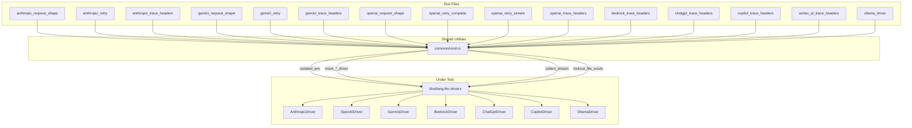

# Other — librefang-llm-drivers-tests

# librefang-llm-drivers Tests

Integration test suite that locks in the wire contracts, error-handling semantics, and observability behaviour of every LLM driver in `librefang-llm-drivers`. Each test runs against a `wiremock` HTTP server so no real provider credentials or network access are needed.

## Architecture



## Test Isolation

Every test follows the same setup pattern:

1. **`isolated_env()`** — creates a temporary directory, sets `LIBREFANG_HOME` to it, configures `NO_PROXY` so no real traffic escapes, and enables `backoff::enable_test_zero_backoff()` to eliminate sleep delays during retries.
2. **`MockServer::start().await`** — spins up an in-process wiremock HTTP server on a random port.
3. **`mock_*_driver(&server)`** — constructs a driver pointed at the mock server with a synthetic API key and short timeout.
4. **`#[serial_test::serial]`** — all tests are serialized because they mutate global process environment variables.

The `TestEnv` guard (returned by `isolated_env`) holds a `TempDir` and a `ZeroBackoffGuard`. Dropping it at test end restores the original state.

## Test Categories

### Request Shape Tests

Files: `anthropic_request_shape.rs`, `gemini_request_shape.rs`, `openai_request_shape.rs`

These lock in the provider-specific wire contract — the HTTP method, URL path, headers, and JSON body shape. They verify:

| Concern | What's Asserted |
|---|---|
| **Endpoint** | Correct URL path (e.g. `/v1/messages`, `/chat/completions`, `/v1beta/models/<model>:generateContent`) |
| **Auth headers** | `x-api-key` / `Authorization: Bearer` / query-string `key=` present |
| **Provider headers** | `anthropic-version`, `content-type: application/json` |
| **Body fields** | `model`, `messages`, `max_tokens`, `system`, `tools` with correct envelopes |
| **Tool envelope** | Anthropic: `{name, input_schema}`; OpenAI: `{type:"function", function:{name,...}}`; Gemini: `tools[].functionDeclarations[]` |
| **Tool-use response** | Provider-specific tool-call blocks parse into `CompletionResponse.tool_calls` with `StopReason::ToolUse` and correct `id`/`name`/`input` |
| **Streaming** | SSE `TextDelta` events concatenate to match `CompletionResponse.text()`; `ContentComplete` terminates the stream |
| **Usage** | Token counts propagate into `resp.usage` |

### Retry Tests

Files: `anthropic_retry.rs`, `gemini_retry.rs`, `openai_retry_complete.rs`, `openai_retry_stream.rs`

Exercise the retry and rate-limit machinery:

| Scenario | Behaviour Verified |
|---|---|
| **429 → retry → success** | Driver retries after `Retry-After` header, eventual success returns `Ok` |
| **429 exhaustion** | After max retries, returns `Err(LlmError::RateLimited)` |
| **529 / 503 overloaded** | Retries succeed; **no lockout file** created (overloaded ≠ account-level rate limit) |
| **529 / 503 exhaustion** | Returns `Err(LlmError::Overloaded)` |
| **Pre-existing lockout** | `create_lockout_file()` blocks the request entirely; zero HTTP calls reach the server |
| **Stream 429 retry** | Streaming endpoint also retries on 429 and succeeds |
| **403 auth failure** (Gemini) | Returns `Err(LlmError::AuthenticationFailed)`, no retry |
| **OpenAI-specific adaptors** | `temperature` stripping, `max_tokens` → `max_completion_tokens` migration, `max_tokens` auto-capping, tool stripping on 500, `tool_use_failed` retry |

Lockout files live at `$LIBREFANG_HOME/rate_limits/{provider}__{key_id_hash}.json`. The helper `lockout_file_exists()` checks for them after 429 tests.

### Trace Header Tests

Files: `anthropic_trace_headers.rs`, `gemini_trace_headers.rs`, `openai_trace_headers.rs`, `bedrock_trace_headers.rs`, `chatgpt_trace_headers.rs`, `copilot_trace_headers.rs`, `vertex_ai_trace_headers.rs`

All drivers share a unified trace-header contract for observability:

| Header | Source Field |
|---|---|
| `x-librefang-agent-id` | `CompletionRequest.agent_id` |
| `x-librefang-session-id` | `CompletionRequest.session_id` |
| `x-librefang-step-id` | `CompletionRequest.step_id` |

Each provider file tests four cases:

1. **Headers present when IDs are set** — both `complete()` and `stream()` emit the headers.
2. **Headers absent when IDs are `None`** — no `x-librefang-*` headers appear.
3. **Operator opt-out via `with_emit_caller_trace_headers(false)`** — suppresses headers even when IDs are populated.
4. **Partial / empty / malformed values** (OpenAI-specific) — empty strings are skipped, partial sets emit only what's populated.

### Ollama Driver Tests

File: `ollama_driver.rs`

The most comprehensive single-driver test file, covering the native `/api/chat` contract (not the OpenAI-compatible shim):

| Test | What It Verifies |
|---|---|
| `request_targets_native_api_chat_with_native_body_shape` | POSTs to `/api/chat`, body has `model`/`messages`/`options.{num_predict,temperature}`, no top-level `max_tokens` |
| `auth_header_only_emitted_when_api_key_configured` | Empty key → no `Authorization`; explicit key → `Bearer` header |
| `thinking_request_sets_native_think_true_field` | `request.thinking = Some(_)` sets native `"think": true` |
| `non_streaming_tool_calls_parse_with_synthesised_ids` | `tool_calls` parse with `ollama-call-*` synthesised IDs, `StopReason::ToolUse` |
| `non_streaming_first_class_thinking_routes_to_thinking_block` | Native `message.thinking` → `ContentBlock::Thinking` |
| `streaming_ndjson_aggregates_text_and_reports_usage` | NDJSON chunks concatenate, `done: true` supplies usage |
| `streaming_thinking_deltas_route_to_thinking_event` | `message.thinking` → `StreamEvent::ThinkingDelta`, never leaks to `TextDelta` |
| `streaming_tool_calls_emit_start_end_pair` | `ToolUseStart`/`ToolUseEnd` events, parsed tool calls in final response |
| `http_404_maps_to_model_not_found` | 404 → `LlmError::ModelNotFound` |
| `http_401_maps_to_authentication_failed` | 401 → `LlmError::AuthenticationFailed` |
| `http_502_passes_through_raw_body_in_api_error` | Non-JSON 502 → `LlmError::Api { status: 502, message: "Bad Gateway" }` |
| `multimodal_image_block_serialises_as_native_images_array` | `ContentBlock::Image` → `images: ["<base64>"]`, not OpenAI `image_url` |
| `tool_result_serialises_as_role_tool_with_tool_name` | `ContentBlock::ToolResult` → `role:"tool"` with `tool_name`, not `tool_call_id` |
| `streaming_tool_call_with_stringified_arguments_is_coerced` | Double-encoded JSON string arguments coerced to real objects |
| `streaming_unparseable_tool_calls_chunk_keeps_prior_snapshot` | Malformed chunk doesn't erase prior valid tool-call snapshot |
| `streaming_truncated_response_returns_partial_with_zero_usage` | Missing `done: true` → partial text, zero usage (no hard error) |
| `reverse_proxy_v1_path_is_not_stripped` | User-explicit `/v1` in custom mount preserved |
| `legacy_v1_suffix_in_user_base_url_is_silently_stripped` | Bare `{host}/v1` migration to `{host}/api/chat` |

## Shared Test Utilities (`common/mod.rs`)

### Environment & Driver Factories

| Function | Purpose |
|---|---|
| `isolated_env()` | Creates temp dir, sets env vars, enables zero-backoff mode |
| `mock_openai_driver(server)` | `OpenAIDriver` pointed at mock with synthetic `sk-test-*` key |
| `mock_anthropic_driver(server)` | `AnthropicDriver` pointed at mock with synthetic `sk-ant-test-*` key |
| `mock_gemini_driver(server)` | `GeminiDriver` pointed at mock with synthetic `test-key-*` key |
| `mock_ollama_driver(server)` | `OllamaDriver` with empty key (localhost default) |

### Request Builders

All return a `CompletionRequest` pre-populated with sensible defaults:

- **`simple_request(model)`** — minimal single-message request
- **`request_with_tools(model)`** — includes a `get_weather` tool definition
- **`request_with_temperature(model, temp)`** — sets explicit temperature
- **`o_series_request()`** — `o3-mini` model with `temperature: 1.0` and `max_tokens: 1000`

### Response Helpers

Pre-built JSON bodies matching each provider's wire format:

| Function | Provider | Notes |
|---|---|---|
| `openai_200_body(text)` | OpenAI | `chat.completion` with usage |
| `openai_sse_body(chunks)` | OpenAI | SSE with `delta.content` per chunk |
| `openai_429_response(secs)` | OpenAI | Rate-limit with `retry-after` |
| `openai_400_temperature_rejected()` | OpenAI | For temperature-strip retry |
| `openai_400_max_tokens_unsupported()` | OpenAI | For `max_tokens` → `max_completion_tokens` migration |
| `openai_400_max_tokens_cap(limit)` | OpenAI | For auto-cap retry |
| `openai_400_tool_not_supported()` | OpenAI | For tool-strip retry |
| `anthropic_200_body(text)` | Anthropic | `message` with `end_turn` |
| `anthropic_sse_body(text)` | Anthropic | Full SSE event sequence (message_start → content_block_delta per char → message_stop) |
| `anthropic_429_response()` | Anthropic | Rate-limit with `anthropic-ratelimit-*` headers |
| `gemini_200_body(text)` | Gemini | `candidates` with `STOP` |
| `gemini_sse_body(text)` | Gemini | Single-chunk SSE |
| `gemini_429_response()` | Gemini | `RESOURCE_EXHAUSTED` |
| `gemini_503_response()` | Gemini | `UNAVAILABLE` |

### Stream Collection

```rust
pub async fn collect_stream(
    driver: &dyn LlmDriver,
    request: CompletionRequest,
) -> (Result<CompletionResponse, LlmError>, Vec<StreamEvent>)
```

Spawns a background task that drains the `mpsc::Receiver` into a `Vec<StreamEvent>`, calls `driver.stream()`, and returns both the final result and all emitted events.

### Rate-Limit Helpers

- **`lockout_file_exists(provider, api_key)`** — checks if a lockout file exists for the given provider/key pair using `shared_rate_guard::key_id_hash()`.
- **`create_lockout_file(provider, api_key, until)`** — writes a lockout record via `shared_rate_guard::record()`.

### Utility

- **`request_json(request)`** — deserialises a wiremock `Request` body into `serde_json::Value` for field-level assertions.
- **`provider_for_openai_mock()`** — returns `"openai-compat"`, the provider name used for lockout file lookups.

## Running the Tests

```bash
# All driver tests (serialized, ~2–5s total with zero backoff)
cargo test -p librefang-llm-drivers

# Single provider
cargo test -p librefang-llm-drivers anthropic_
cargo test -p librefang-llm-drivers gemini_
cargo test -p librefang-llm-drivers openai_
cargo test -p librefang-llm-drivers ollama_

# Single test
cargo test -p librefang-llm-drivers request_shape_includes_model_system_tools
```

All tests use `#[serial_test::serial]` because `isolated_env()` mutates `std::env` vars. Do not remove the serial annotation.

## Conventions for Adding New Tests

1. **Use `common/` helpers** — never construct a `CompletionRequest` by hand if a `simple_request()` or `request_with_tools()` variant exists. Add a new builder to `common/mod.rs` if the existing ones don't cover the shape you need.
2. **Always call `isolated_env()`** as the first line and bind to `_env` (underscore-prefixed so the guard isn't dropped early).
3. **Use `wiremock` matchers** (`method`, `path`, `path_regex`) and `.expect(n)` to assert the correct number of HTTP round-trips.
4. **Name retry tests with ordered prefixes** (`aa1_`, `aa2_`, `oc1_`, `ag1_`) so they appear in logical order in test output.
5. **Assert on wire shape, not just outcome** — use `server.received_requests()` to inspect headers and body, locking in the provider contract.