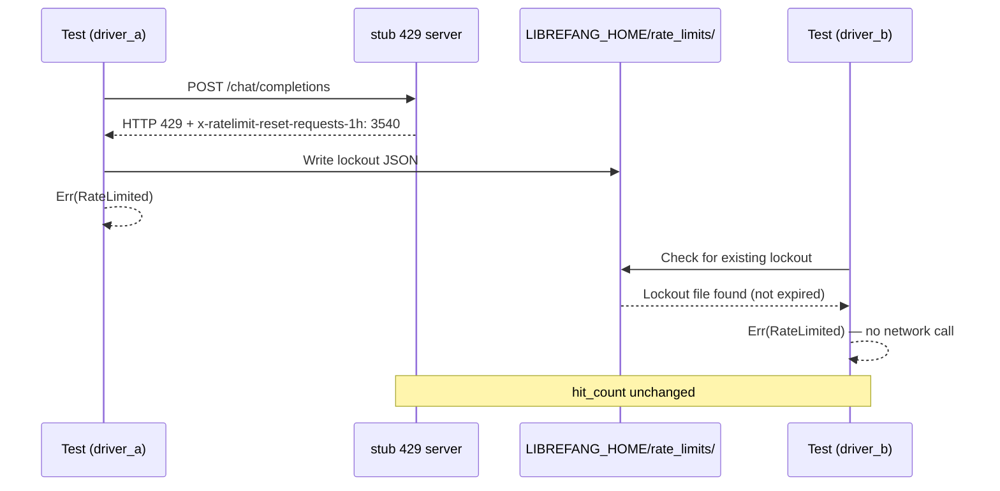

# Other — librefang-llm-drivers-tests

# Shared Rate Guard Integration Tests

## Purpose

This module validates that rate-limit lockouts are **shared across independent driver instances** — simulating what happens when multiple processes (or a restarted process) encounter a 429 from an LLM provider. The core guarantee is that once any driver observes a 429, all subsequent drivers sharing the same `LIBREFANG_HOME` will short-circuit without touching the network until the cooldown expires.

This test locks down three acceptance criteria:

1. A 429 response produces an atomic JSON file under `<LIBREFANG_HOME>/rate_limits/`.
2. A second client instantiated during the cooldown observes the same lockout and **never reaches the provider**.
3. Lockouts persist across simulated process boundaries (achieved here by constructing a brand-new `OpenAIDriver` with no shared in-memory state).

## Architecture



## Test Components

### `spawn_stub_429_server()`

Spawns a background TCP listener on `127.0.0.1:0` (random port) that unconditionally responds with HTTP 429 to every connection. Each accepted connection increments an `Arc<AtomicUsize>` counter, which the test uses as proof of whether the network was actually reached.

The stub's response deliberately **omits the `retry-after` header** so that the driver's internal backoff loop uses its default short base delay (2 seconds) rather than sleeping for a full minute. This keeps the test fast while still validating that the `x-ratelimit-reset-requests-1h` header (set to 3540 seconds, ~59 minutes) is correctly parsed and persisted as the lockout duration.

Returns `(base_url, hit_count)` — the URL for pointing the driver at the stub and the atomic counter for making assertions.

### `drain_request()`

A minimal async helper that reads a single chunk from the incoming TCP stream to consume the request headers. Uses a 200ms timeout as a best-effort drain; since `reqwest` always sends the full request before reading the response, this single read is sufficient for test purposes.

### `simple_request(model)`

Constructs a minimal `CompletionRequest` with a single `"hello"` user message, 16 max tokens, zero temperature, and no tools. Used by the main test to pass a valid request payload through the driver.

### `shared_rate_guard_short_circuits_second_client` (test)

The core integration test, structured in three phases:

**Setup.** Creates an isolated temporary directory via `tempfile::tempdir()` and sets it as `LIBREFANG_HOME`, ensuring the test doesn't interfere with real lockout state. Also sets `NO_PROXY` to `127.0.0.1,localhost` to prevent ambient proxy settings from intercepting loopback traffic.

**Phase 1 — First client.** Instantiates `OpenAIDriver` via `with_proxy_and_timeout`, sends a completion request, and asserts:
- The result is `Err(LlmError::RateLimited { .. })`.
- The stub's `hit_count` is ≥ 1 (the server was actually contacted).

**Phase 2 — Second client.** Creates a completely new `OpenAIDriver` instance (no shared state with the first) and sends the same request. Asserts:
- The result is again `Err(LlmError::RateLimited { .. })`.
- The stub's `hit_count` is **unchanged** — proving the request was short-circuited by the file-based lockout, not the network.

**Phase 3 — Lockout file validation.** Reads the persisted JSON from `<LIBREFANG_HOME>/rate_limits/` and asserts:
- Exactly one `.json` file exists.
- `"provider"` is `"openai-compat"`.
- `"until_unix"` is at least 3000 seconds in the future, confirming the `x-ratelimit-reset-requests-1h: 3540` header was used as the cooldown source.

## Dependencies and Integration Points

| Dependency | Role |
|---|---|
| `librefang_llm_driver` | Provides `CompletionRequest`, `LlmDriver` trait, and `LlmError` |
| `librefang_llm_drivers::drivers::openai::OpenAIDriver` | The concrete driver under test |
| `librefang_types::message::Message` | Used to construct the `Message::user("hello")` payload |
| `LIBREFANG_HOME` env var | Controls where the rate-limit lockout files are persisted |
| `<LIBREFANG_HOME>/rate_limits/*.json` | The file-based shared state mechanism being validated |

## Running

```bash
cargo test -p librefang-llm-drivers --test shared_rate_guard_integration
```

No external services or API keys are required — the stub server provides all responses. The test is fully self-contained and cleans up its temporary directory and environment variables on completion.