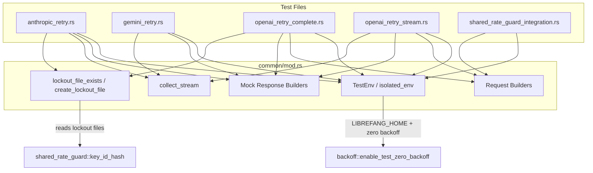

# Other — librefang-llm-drivers-tests

# librefang-llm-drivers-tests

Integration test suite for the LLM driver layer. Validates retry logic, error classification, adaptive request rewriting, and cross-process rate-limit coordination for the OpenAI, Anthropic, and Gemini drivers.

## Architecture

## Shared Infrastructure (`common/mod.rs`)

### Environment Isolation

Every test calls `isolated_env()` to create a `TestEnv` that:

1. Creates a `tempfile::TempDir` and sets `LIBREFANG_HOME` to point at it. This prevents tests from reading or writing real rate-limit state in `~/.librefang/rate_limits/`.
2. Sets `NO_PROXY` / `no_proxy` to `127.0.0.1,localhost` so the HTTP client talks directly to the wiremock server, bypassing any system proxy.
3. Calls `backoff::enable_test_zero_backoff()` to obtain a `ZeroBackoffGuard`. While this guard lives, all exponential-backoff sleeps collapse to zero, keeping test execution fast.

`TestEnv` holds both the temp dir and the guard. Dropping `_env` at test end restores normal behaviour.

### Request Constructors

| Function | Purpose |
|---|---|
| `simple_request(model)` | Minimal `CompletionRequest`: one user message, no tools, `max_tokens=16`, `temperature=0.0`. |
| `request_with_tools(model)` | Adds a single `get_weather` tool definition. Used to test tool-stripping retries. |
| `request_with_temperature(model, temp)` | Sets a non-zero temperature. Used to test temperature-stripping retries. |
| `o_series_request()` | Targets `o3-mini` with `temperature=1.0` and higher token limits. |

All return `CompletionRequest` from `librefang_llm_driver`.

### Mock Response Builders

Per-provider helpers construct `ResponseTemplate` or `serde_json::Value` bodies matching real API shapes:

- **OpenAI**: `openai_200_body`, `openai_429_response`, `openai_400_temperature_rejected`, `openai_400_max_tokens_unsupported`, `openai_400_max_tokens_cap`, `openai_400_tool_not_supported`, `openai_500_tool_error`, `openai_400_tool_use_failed`, `openai_sse_body`
- **Anthropic**: `anthropic_200_body`, `anthropic_429_response`, `anthropic_529_response`, `anthropic_sse_body`
- **Gemini**: `gemini_200_body`, `gemini_429_response`, `gemini_503_response`, `gemini_sse_body`

SSE builders emit properly formatted `data:` lines; Anthropic's includes the full event stream (`message_start` → `content_block_start` → deltas → `content_block_stop` → `message_delta` → `message_stop`).

### Lockout File Utilities

- **`lockout_file_exists(provider, api_key)`** — hashes the key via `shared_rate_guard::key_id_hash`, then checks whether `{LIBREFANG_HOME}/rate_limits/{provider}__{hash}.json` exists on disk.
- **`create_lockout_file(provider, api_key, until)`** — writes a lockout record with the given expiry. Used to simulate a pre-existing lockout.

### Stream Collection

`collect_stream(driver, request)` spawns a `tokio::mpsc` channel, calls `driver.stream(request, tx)`, drains all `StreamEvent` values into a `Vec`, and returns `(result, events)`. This lets tests assert both the final `Result` and the individual stream events.

### Driver Factories

`mock_openai_driver`, `mock_anthropic_driver`, and `mock_gemini_driver` each construct a driver instance with a random API key and the wiremock server URL as proxy, plus a 5-second timeout.

### Miscellaneous

- `request_json(request)` — parses a wiremock `Request` body as JSON for assertion.
- `provider_for_openai_mock()` — returns `"openai-compat"`, the provider string OpenAI-family drivers write into lockout files.
- `rate_limit_dir_path()` — resolves the rate-limit directory from `LIBREFANG_HOME` (falling back to `~/.librefang`).

---

## Test Files

### `anthropic_retry.rs`

Tests `AnthropicDriver` retry behaviour. Uses a local `driver_with_key` helper that creates a driver with a unique `sk-ant-test-{uuid}` key and a 5-second timeout.

Helper functions `anthropic_429_fast_retry()` and `anthropic_529_overloaded()` produce mock responses with short `retry-after` values (1 second) so zero-backoff mode keeps tests instant.

| Test | Scenario | Assertions |
|---|---|---|
| `aa1_429_retry_then_success` | Two 429s then 200 | 3 total requests; lockout file created |
| `aa2_429_exhaustion` | Four consecutive 429s | `RateLimited` error; lockout file exists |
| `aa3_529_retry_then_success_no_lockout` | One 529 then 200 | 2 requests; **no** lockout file (529 = overloaded, not account-level rate limit) |
| `aa4_529_exhaustion_overloaded` | Four consecutive 529s | `Overloaded` error; no lockout file |
| `aa5_stream_429_retry` | Two 429s then SSE stream on `stream()` | Stream completes with non-empty events; 3 requests |

Key distinction: Anthropic 429 triggers a lockout file (account-level rate limit), while 529 (overloaded) does not.

### `gemini_retry.rs`

Tests `GeminiDriver`. Uses a custom `SequencedResponder` that returns responses in order from a `Vec<ResponseTemplate>`, with an `AtomicUsize` counter tracking how many times the mock was hit. This is needed because Gemini's endpoint path includes the model name in the URL, making priority-based mocking less ergonomic.

| Test | Scenario | Assertions |
|---|---|---|
| `ag1_429_retry_then_success` | Two 429s then 200 | 3 hits; lockout file created |
| `ag2_429_exhaustion` | Four consecutive 429s | `RateLimited` error; 4 hits |
| `ag3_503_retry_then_success_no_lockout` | One 503 then 200 | 2 hits; **no** lockout file |
| `ag4_auth_failure_403` | Single 403 | `AuthenticationFailed` error; exactly 1 hit (no retry) |
| `ag5_stream_429_retry` | Two 429s then SSE stream | Stream succeeds; 3 hits |

### `openai_retry_complete.rs`

Tests `OpenAIDriver.complete()` (non-streaming). This is the most extensive file, covering adaptive request rewriting — the driver detects specific error patterns and mutates the request before retrying.

Custom matchers `BodyContains` and `BodyNotContains` implement wiremock `Match` by inspecting the UTF-8 request body, enabling assertions like "second request must not contain `max_tokens`".

| Test | Scenario | Adaptive Behaviour |
|---|---|---|
| `oc1_429_retry_then_success` | Two 429s then 200 | Standard retry; lockout file created |
| `oc2_429_exhaustion` | All 429s | `RateLimited` after 4 attempts (initial + 3 retries) |
| `oc3_preexisting_lockout_blocks_request` | Lockout file pre-created | Zero HTTP requests — short-circuited by file check |
| `oc4_max_tokens_to_max_completion_tokens` | 400: `max_tokens` unsupported | Retries with `max_completion_tokens` instead of `max_tokens` |
| `oc5_temperature_strip` | 400: `temperature` unsupported | First request has `temperature`; retry omits it |
| `oc6_toolless_retry_on_500` | 500 with tools in request | First request has `tools` + `tool_choice`; retry omits both |
| `oc7_max_tokens_auto_cap` | 400: `max_tokens` exceeds limit | Retries with capped value (extracted from error message) |
| `oc8_non_retryable_403` | 403 permission denied | No retry; single request; `Api { status: 403 }` |
| `oc9_groq_tool_use_failed_retries` | 400: `tool_use_failed` | Retries up to 3 times (2 failures + success) |
| `oc10_max_retries_exceeded_generic_500` | Generic 500 without tools | No retry (generic 500 only retries if tools are present) |

### `openai_retry_stream.rs`

Tests `OpenAIDriver.stream()` with the same categories of adaptive rewriting, applied to streaming requests.

| Test | Scenario | Adaptive Behaviour |
|---|---|---|
| `os1_429_retry_then_success_stream` | Two 429s then SSE stream | Stream produces `TextDelta` events; 3 requests |
| `os2_stream_options_strip` | 400: `stream_options` unsupported | First request includes `stream_options`; retry omits it |
| `os3_429_exhaustion_stream` | All 429s | `RateLimited`; empty events; 4 requests |
| `os4_temperature_strip_stream` | 400: `temperature` unsupported | First has `temperature`; retry omits it |

### `shared_rate_guard_integration.rs`

End-to-end test of the cross-process rate-limit guard. Instead of wiremock, it spawns a raw TCP listener (`TcpListener`) that unconditionally responds with HTTP 429 and an `x-ratelimit-reset-requests-1h: 3540` header. An `AtomicUsize` counter tracks accepted connections.

The test flow:

1. Create an isolated `LIBREFANG_HOME` temp directory.
2. Instantiate `OpenAIDriver` (driver A), call `complete()` → server is hit, lockout file is written.
3. Instantiate a **separate** `OpenAIDriver` (driver B) with the same API key → simulates a different process with no shared in-memory state.
4. Call `complete()` on driver B → assert the TCP hit counter did **not** advance (request was short-circuited by the lockout file).
5. Verify the lockout file on disk: valid JSON, provider `"openai-compat"`, `until_unix` approximately 1 hour in the future.

This validates the core acceptance criteria: a rate-limit event in one process prevents network requests from sibling processes.

## Conventions

- **Serial execution**: Every test is annotated `#[serial_test::serial]`. Tests share environment variables (`LIBREFANG_HOME`, `NO_PROXY`) that are process-global in Rust's `std::env`, so concurrent execution would cause cross-test contamination.
- **Deterministic naming**: API keys include UUIDs or process IDs to avoid collisions even if `isolated_env()` weren't used.
- **Priority-based mocking**: In wiremock, `up_to_n_times(N)` with a lower priority number fires first. Higher-priority mocks act as catch-alls. This lets tests express "fail N times, then succeed."
- **Zero backoff**: `backoff::enable_test_zero_backoff()` must be called in every test to avoid real sleeps during retry loops. The returned `ZeroBackoffGuard` restores original behaviour on drop.