# Other — librefang-llm-drivers-tests

# librefang-llm-drivers/tests — Integration Test Suite

## Purpose

This module contains integration tests for the LLM driver layer. Every test spins up a `wiremock::MockServer` that impersonates an upstream LLM provider, fires real HTTP requests through the production driver code, and asserts on either the deserialized response or the raw wire-level request. No test touches a live API.

The tests lock in three cross-cutting contracts that all drivers must honour:

| Contract | What it enforces |
|---|---|
| **Request shape** | URL path, required headers (`Authorization`, `x-api-key`, `anthropic-version`), JSON body fields (`model`, `messages`, `tools`, `max_tokens`, provider-specific envelopes) |
| **Retry / rate-limit behaviour** | 429/529/503 retry loops, `Retry-After` honouring, lockout-file creation, backoff, adaptive parameter stripping (`temperature`, `max_tokens → max_completion_tokens`, tool removal on 500) |
| **Trace headers** | `x-librefang-agent-id`, `x-librefang-session-id`, `x-librefang-step-id` emitted when present, omitted when absent, suppressed by `with_emit_caller_trace_headers(false)` |

```mermaid
graph TD
    subgraph "Test infrastructure"
        CM[common/mod.rs]
        CM -->|isolated_env| TE[TestEnv]
        CM -->|mock_*_driver| DRV[Driver instances]
        CM -->|collect_stream| SE[StreamEvent collector]
        CM -->|lockout_file_exists| LF[Rate-limit lockout checks]
    end

    subgraph "Anthropic"
        ARS[anthropic_request_shape]
        ARE[anthropic_retry]
        ATH[anthropic_trace_headers]
    end

    subgraph "OpenAI"
        ORS[openai_request_shape]
        ORC[openai_retry_complete]
        ORS2[openai_retry_stream]
        OTH[openai_trace_headers]
    end

    subgraph "Gemini"
        GRS[gemini_request_shape]
        GRE[gemini_retry]
        GTH[gemini_trace_headers]
    end

    subgraph "Other drivers"
        OD[ollama_driver]
        BTH[bedrock_trace_headers]
        CTH[chatgpt_trace_headers]
        CP[copilot_trace_headers]
        VT[vertex_ai_trace_headers]
    end

    ARS & ARE & ATH --> CM
    ORS & ORC & ORS2 & OTH --> CM
    GRS & GRE & GTH --> CM
    OD & BTH & CTH & CP & VT --> CM
```



## File layout

```
tests/
├── common/mod.rs                     # Shared helpers (see below)
├── anthropic_request_shape.rs        # Wire contract: body, headers, tools
├── anthropic_retry.rs                # 429 / 529 retry + lockout
├── anthropic_trace_headers.rs        # x-librefang-* header emission
├── openai_request_shape.rs           # Wire contract: body, auth, tools
├── openai_retry_complete.rs          # Non-streaming retry + adaptive fallbacks
├── openai_retry_stream.rs            # Streaming retry
├── openai_trace_headers.rs           # x-librefang-* header emission
├── gemini_request_shape.rs           # Wire contract: URL-embedded model, tools
├── gemini_retry.rs                   # 429 / 503 / 403 retry
├── gemini_trace_headers.rs           # x-librefang-* header emission
├── ollama_driver.rs                  # Native Ollama driver (not compat shim)
├── bedrock_trace_headers.rs          # Bedrock trace headers
├── chatgpt_trace_headers.rs          # ChatGPT Responses API trace headers
├── copilot_trace_headers.rs          # Copilot (delegated OpenAI) trace headers
├── vertex_ai_trace_headers.rs        # Vertex AI trace headers
└── shared_rate_guard_integration.rs  # Cross-driver rate-limit guard
```

## Test infrastructure — `common/mod.rs`

### Environment isolation

```rust
pub fn isolated_env() -> TestEnv
```

Creates a temporary directory, sets `LIBREFANG_HOME` to point at it (so lockout files and rate-limit state don't pollute the developer's home), sets `NO_PROXY` for localhost, and activates `backoff::enable_test_zero_backoff()` so retries happen instantly instead of waiting real seconds. The `TestEnv` guard drops the temp dir and backoff override on exit.

### Driver factories

Each function builds a production driver instance that routes requests to the given mock server instead of the real provider endpoint:

| Function | Driver |
|---|---|
| `mock_openai_driver(server)` | `OpenAIDriver::with_proxy_and_timeout` |
| `mock_anthropic_driver(server)` | `AnthropicDriver::with_proxy_and_timeout` |
| `mock_gemini_driver(server)` | `GeminiDriver::with_proxy_and_timeout` |
| `mock_ollama_driver(server)` | `OllamaDriver::with_proxy_and_timeout` (empty key) |

All use a 5-second timeout and a randomised API key prefixed with the provider's expected scheme (`sk-test-`, `sk-ant-test-`, `test-key-`).

### Request builders

| Function | Purpose |
|---|---|
| `simple_request(model)` | Minimal single-message request, no tools, `max_tokens=16` |
| `request_with_tools(model)` | Includes one `get_weather` tool definition, `max_tokens=256` |
| `request_with_temperature(model, temp)` | Like `simple_request` with a custom temperature |
| `o_series_request()` | Targets `o3-mini` with `max_tokens=1000`, `temperature=1.0` |

Each returns a `CompletionRequest` with `Arc<Vec<Message>>` messages and `Arc<Vec<ToolDefinition>>` tools suitable for cloning.

### Response builders

Provider-specific JSON fixtures that match the shape each driver's deserializer expects:

| Function | Provider | Notes |
|---|---|---|
| `openai_200_body(text)` | OpenAI | `chat.completion` with `finish_reason: "stop"` |
| `openai_429_response(secs)` | OpenAI | 429 with `retry-after` header |
| `openai_sse_body(chunks)` | OpenAI | SSE with `data: [DONE]` terminator |
| `anthropic_200_body(text)` | Anthropic | `message` with `stop_reason: "end_turn"` |
| `anthropic_429_response()` | Anthropic | 429 with rate-limit headers |
| `anthropic_529_response()` | Anthropic | 529 overloaded |
| `anthropic_sse_body(text)` | Anthropic | Full SSE sequence: `message_start` → `content_block_delta` (char-by-char) → `message_stop` |
| `gemini_200_body(text)` | Gemini | `candidates[]` with `finishReason: "STOP"` |
| `gemini_429_response()` / `gemini_503_response()` | Gemini | `RESOURCE_EXHAUSTED` / `UNAVAILABLE` |
| `gemini_sse_body(text)` | Gemini | Single-chunk SSE |

### Stream collection

```rust
pub async fn collect_stream(
    driver: &dyn LlmDriver,
    request: CompletionRequest,
) -> (Result<CompletionResponse, LlmError>, Vec<StreamEvent>)
```

Spawns a background task that drains the `mpsc::Receiver<StreamEvent>` into a `Vec`, calls `driver.stream()`, then returns both the final result and the collected events. Used by every streaming test.

### Lockout file helpers

```rust
pub fn lockout_file_exists(provider: &str, api_key: &str) -> bool
pub fn create_lockout_file(provider: &str, api_key: &str, until: SystemTime)
```

Thin wrappers around `shared_rate_guard::key_id_hash` and `shared_rate_guard::record` that check / create rate-limit lockout files under `$LIBREFANG_HOME/rate_limits/`.

### Request inspection

```rust
pub fn request_json(request: &Request) -> serde_json::Value
```

Deserializes the raw wiremock `Request` body into a `serde_json::Value` for field-level assertions.

---

## Contract tests by concern

### 1. Request shape

Each driver has a `*_request_shape.rs` file that pins the wire contract by inspecting both the recorded HTTP request (URL path, headers, query string) and the deserialized JSON body.

**Anthropic** (`anthropic_request_shape.rs`):
- POST to `/v1/messages`
- Headers: `x-api-key`, `anthropic-version: 2023-06-01`, `content-type: application/json`
- Body fields: `model`, `max_tokens`, `system`, `messages[]`, `tools[]` with `input_schema`
- Tool-call response: `content[].type == "tool_use"` → `CompletionResponse.tool_calls` with `StopReason::ToolUse`
- Streaming: per-character `TextDelta` events concatenated equal the final `resp.text()`

**OpenAI** (`openai_request_shape.rs`):
- POST to `/chat/completions`
- Header: `Authorization: Bearer <key>`
- Body: `model`, `messages[]`, `tools[]` with `type: "function"` envelope
- Tool-call response: `finish_reason: "tool_calls"` → `StopReason::ToolUse`; `function.arguments` JSON string is parsed into a structured value
- Streaming: chunk-based `TextDelta` aggregation + `ContentComplete`

**Gemini** (`gemini_request_shape.rs`):
- POST to `/v1beta/models/<model>:generateContent`
- API key in `?key=` query string, not a header
- Body: `contents[]`, `tools[].functionDeclarations[].parameters`
- Tool-call response: `functionCall` part → `StopReason::ToolUse`; driver mints a synthetic `id` (Gemini doesn't provide one)
- Streaming: single SSE chunk via `streamGenerateContent`

### 2. Retry behaviour

Retry tests use the naming convention `{prefix}{number}_{scenario}` (e.g. `aa1_429_retry_then_success`). The prefix identifies the provider file: `aa` = Anthropic, `oc` = OpenAI complete, `os` = OpenAI stream, `ag` = Gemini.

Common patterns across all providers:

| Scenario | Behaviour |
|---|---|
| 429 then success | Retries with backoff, succeeds on Nth attempt, creates lockout file |
| 429 exhaustion | Retries up to max (typically 3 retries = 4 total requests), returns `LlmError::RateLimited` |
| 529/503 then success | Retries, succeeds, **no** lockout file (overloaded ≠ account-level rate limit) |
| 529/503 exhaustion | Returns `LlmError::Overloaded` (Anthropic/Gemini) or `LlmError::Api` |
| Pre-existing lockout | Returns `RateLimited` immediately without sending any HTTP request |
| Streaming 429 retry | Same retry logic for `driver.stream()` as for `driver.complete()` |

**Provider-specific adaptive retries (OpenAI only):**

`openai_retry_complete.rs` tests additional fallback strategies the OpenAI driver employs when it receives specific 400/500 errors:

| Test | Adaptive behaviour |
|---|---|
| `oc4_max_tokens_to_max_completion_tokens` | On 400 `"max_tokens" unsupported`, retries with `max_completion_tokens` instead |
| `oc5_temperature_strip` | On 400 `"temperature" unsupported`, retries without the `temperature` field |
| `oc6_toolless_retry_on_500` | On 500 with tools, retries with `tools` and `tool_choice` stripped |
| `oc7_max_tokens_auto_cap` | On 400 "max value is X", retries with the server-advised cap |

These use custom `wiremock::Match` impls (`BodyContains`, `BodyNotContains`) to route mock responses based on request body content.

### 3. Trace headers

Every driver has a `*_trace_headers.rs` file that tests the same four scenarios:

1. **Headers emitted when set** — `CompletionRequest` with `agent_id`, `session_id`, `step_id` produces `x-librefang-agent-id`, `x-librefang-session-id`, `x-librefang-step-id` on the outbound request.
2. **Headers omitted when absent** — All three fields are `None`; no `x-librefang-*` headers appear.
3. **Headers suppressed by flag** — `Driver::with_emit_caller_trace_headers(false)` suppresses headers even when the fields are populated. This is the operator opt-out path.
4. **Streaming path** (most but not all drivers) — `driver.stream()` also emits trace headers.

Drivers tested for trace headers: OpenAI, Anthropic, Gemini, Bedrock, ChatGPT, Copilot, Vertex AI.

Notable details:
- **Copilot** delegates to an inner `OpenAIDriver`; tests use `CopilotDriver::new_for_test` to bypass the GitHub token exchange.
- **ChatGPT** uses the Responses API path (`/codex/responses`) with its own SSE format requiring a `response.completed` event.
- **Bedrock** uses Bearer token auth; the emit-flag test also serves as a SigV4 compatibility gate (documenting that if SigV4 is adopted, trace headers must be excluded from the canonical-request hash).

### 4. Ollama native driver — `ollama_driver.rs`

The most extensive single-driver test file, covering the native Ollama API (`/api/chat`, not the OpenAI compat shim at `/v1/chat/completions`):

| Test area | What's verified |
|---|---|
| **Request shape** | POST to `/api/chat`; `model`, `messages`, `options.{num_predict, temperature}`; no top-level `max_tokens` |
| **Auth** | No `Authorization` when key is empty (localhost); `Bearer <key>` when set |
| **Thinking** | `request.thinking = Some(_)` sets native `think: true` in body |
| **Tool calls** | `tool_calls[].function` parsed with synthesised `ollama-call-*` IDs |
| **First-class thinking** | `message.thinking` routes to `ContentBlock::Thinking` (not `<think/>` tags) |
| **Streaming** | NDJSON aggregation of `content` deltas; `thinking` deltas via `StreamEvent::ThinkingDelta` (no leakage into `TextDelta`); `ToolUseStart`/`ToolUseEnd` event pairs |
| **Stringified tool args** | `coerce_tool_args` handles models that double-encode arguments as a JSON string |
| **Malformed tool chunks** | Unparseable `tool_calls` chunks are skipped; prior valid snapshot is preserved |
| **Truncated streams** | Missing `done: true` returns partial text with zero usage (not a hard error) |
| **Error mapping** | 404 → `ModelNotFound`, 401 → `AuthenticationFailed`, 502 raw body → `LlmError::Api` |
| **Multi-modal** | `ContentBlock::Image` serialises as native `images: [...]` array, not OpenAI `image_url` |
| **Tool results** | `ContentBlock::ToolResult` → `role: "tool"` with `tool_name` (not `tool_call_id`) |
| **URL migration** | Legacy `/v1` suffix in base URL is silently stripped; explicit `/openai/v1` mount is preserved |

---

## Serial execution

All tests are annotated with `#[serial_test::serial]`. This is necessary because tests share global state through environment variables (`LIBREFANG_HOME`, `NO_PROXY`) and the backoff zero-delay guard, which is process-global. Running in parallel would cause races between environment mutations.

## Adding a new driver test

1. Create `tests/<driver>_request_shape.rs` with a `mod common;` import.
2. Add a driver factory to `common/mod.rs` (e.g. `pub fn mock_xxx_driver(server: &MockServer) -> XxxDriver`).
3. Add response builder functions to `common/mod.rs` matching the provider's wire format.
4. Test the three contracts: request shape, retry (if applicable), and trace headers.
5. Use `isolated_env()` at the top of every test to avoid polluting other tests' state.