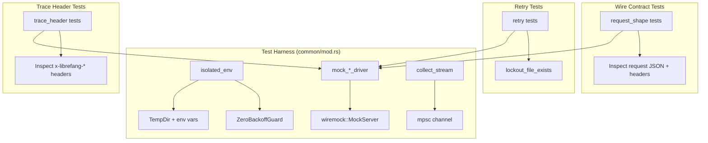

# Other — librefang-llm-drivers-tests

# librefang-llm-drivers Integration Tests

## Purpose

This is the integration test suite for the `librefang-llm-drivers` crate. It validates the **wire contract** between each LLM provider driver and its upstream API — request shapes, response parsing, retry behaviour, streaming aggregation, and observability header propagation — against a local `wiremock` HTTP server rather than live endpoints.

The tests exist to catch regressions where a driver refactor silently breaks the HTTP envelope the provider expects, or where a response shape change stops being parsed correctly. They are intentionally **not** unit tests of internal driver logic; they treat each driver as a black box and inspect what actually goes over the wire.

## Architecture


```mermaid
graph TD
    subgraph "Test Harness (common/mod.rs)"
        IE[isolated_env] --> TD[TempDir + env vars]
        IE --> ZB[ZeroBackoffGuard]
        MD[mock_*_driver] --> WS[wiremock::MockServer]
        CS[collect_stream] --> TX[mpsc channel]
    end

    subgraph "Wire Contract Tests"
        RS[request_shape tests] --> MD
        RS --> RQ[Inspect request JSON + headers]
    end

    subgraph "Retry Tests"
        RT[retry tests] --> MD
        RT --> LF[lockout_file_exists]
    end

    subgraph "Trace Header Tests"
        TH[trace_header tests] --> MD
        TH --> HD[Inspect x-librefang-* headers]
    end
```

## Test File Organisation

Each driver gets up to three dedicated test files plus the shared `common/mod.rs`:

| File | Scope |
|------|-------|
| `common/mod.rs` | Shared harness — mock server construction, request builders, response fixtures, stream collector |
| `<driver>_request_shape.rs` | Request body, headers, URL path, tool serialisation, response parsing (text + tool_calls), streaming text aggregation |
| `<driver>_retry.rs` | HTTP 429/529/503 retry loops, lockout file creation, error variant mapping |
| `<driver>_trace_headers.rs` | `x-librefang-agent-id`, `x-librefang-session-id`, `x-librefang-step-id` header emission/suppression |
| `ollama_driver.rs` | Full Ollama-native driver coverage (request shape + retry + streaming + multimodal + error mapping in one file) |

Drivers covered: **OpenAI**, **Anthropic**, **Gemini**, **Ollama** (native `/api/chat`), **Bedrock**, **ChatGPT** (Responses API), **Copilot**.

## Shared Test Harness — `common/mod.rs`

Every test begins by calling `isolated_env()` which returns a `TestEnv` that:

1. Creates a `tempfile::TempDir` and sets `LIBREFANG_HOME` to it, so rate-limit lockout files land in an isolated directory.
2. Sets `NO_PROXY` / `no_proxy` to `127.0.0.1,localhost` so the drivers reach the local wiremock server instead of a corporate proxy.
3. Activates `backoff::enable_test_zero_backoff()` via a `ZeroBackoffGuard`, collapsing all retry backoff intervals to zero so tests run in milliseconds rather than waiting real seconds.

### Driver Constructors

Each `mock_<provider>_driver(server)` function builds a real driver instance pointed at the wiremock server URI with a randomised API key and a 5-second timeout:

```rust
pub fn mock_anthropic_driver(server: &MockServer) -> AnthropicDriver {
    AnthropicDriver::with_proxy_and_timeout(
        format!("sk-ant-test-{}", Uuid::new_v4()),
        server.uri(),
        None,
        Some(5),
    )
}
```

Equivalent constructors exist for `OpenAIDriver`, `GeminiDriver`, and `OllamaDriver`. Bedrock, ChatGPT, and Copilot tests construct their drivers inline because they have non-standard auth flows (bearer tokens, PAT exchange).

### Request Builders

- **`simple_request(model)`** — minimal `CompletionRequest` with one user message, 16 max tokens, no tools, no system prompt.
- **`request_with_tools(model)`** — includes a single `ToolDefinition` (`get_weather` with a `location` parameter) and 256 max tokens.
- **`request_with_temperature(model, temp)`** — overrides the sampling temperature.
- **`o_series_request()`** — targets the `o3-mini` model with temperature 1.0 and 1000 max tokens.

### Response Fixtures

Pre-built JSON response bodies matching each provider's wire format:

| Fixture | Provider | Shape |
|---------|----------|-------|
| `openai_200_body(text)` | OpenAI | `choices[0].message.content` |
| `anthropic_200_body(text)` | Anthropic | `content[0].text` |
| `gemini_200_body(text)` | Gemini | `candidates[0].content.parts[0].text` |
| `openai_sse_body(chunks)` | OpenAI | SSE `data:` lines with `[DONE]` sentinel |
| `anthropic_sse_body(text)` | Anthropic | Full SSE event sequence (`message_start` → `content_block_delta` → `message_stop`) |
| `gemini_sse_body(text)` | Gemini | Single `data:` line with candidates |

Error fixtures: `openai_429_response`, `anthropic_429_response`, `anthropic_529_response`, `gemini_429_response`, `gemini_503_response`, and Ollama-specific ones (404, 401, 502).

### Stream Collection

`collect_stream(driver, request)` drives `driver.stream()` with an `mpsc` channel, returns `(Result<CompletionResponse, LlmError>, Vec<StreamEvent>)`. Every streaming test uses this to assert both the final aggregated response and the individual events.

### Lockout File Helpers

- **`lockout_file_exists(provider, api_key)`** — checks whether `shared_rate_guard` wrote a rate-limit lockout file under `$LIBREFANG_HOME/rate_limits/`.
- **`create_lockout_file(provider, api_key, until)`** — pre-creates a lockout to test the "already locked out" code path.

## Wire Contract Tests

These lock in the exact shape of HTTP requests the driver emits and the way it parses responses. They are the primary regression guard against silent wire-format breakage.

### What They Assert

**Request side** (by inspecting `server.received_requests()`):

- HTTP method and path (e.g. `POST /v1/messages` for Anthropic, `POST /v1beta/models/<model>:generateContent` for Gemini, `POST /api/chat` for Ollama).
- Auth headers: `Authorization: Bearer ...` for OpenAI/Gemini/Ollama, `x-api-key` for Anthropic, `Authorization: Bearer` for Bedrock.
- Provider-specific required headers: `anthropic-version: 2023-06-01`, `content-type: application/json`.
- Body fields: `model`, `max_tokens`/`max_completion_tokens`, `messages`, `system`, `tools` with their provider-specific envelope shape.
- Ollama-specific: `options.num_predict` instead of top-level `max_tokens`, native `think` boolean, `images[]` for multimodal, `role: "tool"` with `tool_name` for tool results.

**Response side:**

- Non-streaming text responses: `resp.text()` matches the fixture text, `stop_reason` is `EndTurn`.
- Non-streaming tool-call responses: `resp.tool_calls` has the correct id/name/input, `stop_reason` is `ToolUse`, `resp.usage` has correct token counts.
  - Anthropic: `tool_use` content block with `id`, `name`, `input`.
  - OpenAI: `tool_calls[].function` with string-encoded `arguments` (driver must decode).
  - Gemini: `functionCall` part — driver must mint a synthetic `id` since Gemini doesn't provide one.
  - Ollama: `tool_calls[].function` with synthesised `ollama-call-*` IDs.

**Streaming side:**

- `TextDelta` events concatenate to the same string as `resp.text()`.
- A terminal `ContentComplete` event always closes the stream.
- Ollama NDJSON streaming: per-chunk `content` deltas, `thinking` deltas route to `ThinkingDelta` events, tool calls emit `ToolUseStart`/`ToolUseEnd` pairs.

## Retry Tests

Each provider has a retry test file that exercises the retry loop without waiting real time (thanks to `ZeroBackoffGuard`):

### OpenAI (`openai_retry_complete.rs`, `openai_retry_stream.rs`)

| Test | Behaviour |
|------|-----------|
| `oc1_429_retry_then_success` | Two 429s then 200 → success after 3 requests, lockout file created |
| `oc2_429_exhaustion` | All 429s → `LlmError::RateLimited` after 4 attempts |
| `oc3_preexisting_lockout_blocks_request` | Lockout file exists → `RateLimited` with zero HTTP requests |
| `oc4_max_tokens_to_max_completion_tokens` | 400 "unsupported max_tokens" → retry with `max_completion_tokens` |
| `oc5_temperature_strip` | 400 "unsupported temperature" → retry without `temperature` field |
| `oc6_toolless_retry_on_500` | 500 server error → retry with tools stripped |
| `oc7_max_tokens_auto_cap` | 400 "max ≤ N" → retry with capped value |
| Stream equivalents | Same patterns for the streaming path |

### Anthropic (`anthropic_retry.rs`)

| Test | Behaviour |
|------|-----------|
| `aa1_429_retry_then_success` | Two 429s → 200, lockout file created |
| `aa2_429_exhaustion` | Four 429s → `RateLimited`, lockout file created |
| `aa3_529_retry_then_success_no_lockout` | 529 overloaded → 200, **no** lockout file (overloaded ≠ account rate limit) |
| `aa4_529_exhaustion_overloaded` | Four 529s → `LlmError::Overloaded` |
| `aa5_stream_429_retry` | Streaming path retries on 429 |

Key distinction: Anthropic 429 creates a lockout file (account-level rate limit), while 529 does not (transient overload).

### Gemini (`gemini_retry.rs`)

Uses a custom `SequencedResponder` (implements `wiremock::Respond`) to return a programmed sequence of responses, enabling ordered response chains without priority-based mock matching:

| Test | Behaviour |
|------|-----------|
| `ag1_429_retry_then_success` | Two 429s → 200, lockout created |
| `ag2_429_exhaustion` | Four 429s → `RateLimited` |
| `ag3_503_retry_then_success_no_lockout` | 503 overload → 200, no lockout |
| `ag4_auth_failure_403` | 403 → `LlmError::AuthenticationFailed`, no retry |
| `ag5_stream_429_retry` | Streaming retries on 429 |

## Trace Header Tests

Every driver has a `*_trace_headers.rs` file verifying three `x-librefang-*` headers:

- `x-librefang-agent-id` ← `CompletionRequest.agent_id`
- `x-librefang-session-id` ← `CompletionRequest.session_id`
- `x-librefang-step-id` ← `CompletionRequest.step_id`

Each file contains three or four tests:

1. **Headers emitted when IDs are set** — all three headers present with correct values on both `complete()` and `stream()`.
2. **Headers omitted when IDs are absent** — `None` values → no `x-librefang-*` headers at all.
3. **Headers suppressed when emit flag is disabled** — `driver.with_emit_caller_trace_headers(false)` suppresses headers even when IDs are populated. This is the operator opt-out.
4. **Stream variant** (some files) — same assertions via the streaming path.

Provider-specific notes:
- **Copilot** delegates to an inner `OpenAIDriver`; uses `CopilotDriver::new_for_test()` which bypasses the GitHub PAT→Copilot-token exchange.
- **ChatGPT** uses a synthetic session token with `ChatGptDriver::with_proxy()`.
- **Bedrock** uses Bearer token auth (`BedrockDriver::new_for_test`); tests note that a future SigV4 migration would need regression tests for unsigned pass-through headers.

## Ollama Driver Tests

`ollama_driver.rs` is a comprehensive single-file test suite because the Ollama driver has unique characteristics compared to the cloud providers:

### Native API Surface

The driver targets `/api/chat` (Ollama native), never `/v1/chat/completions` (OpenAI compat shim). The test `request_targets_native_api_chat_with_native_body_shape` pins this with an explicit assertion.

### Key Tests

| Test | What It Validates |
|------|-------------------|
| `request_targets_native_api_chat_with_native_body_shape` | POST to `/api/chat`, `max_tokens` under `options.num_predict`, no top-level `max_tokens` |
| `auth_header_only_emitted_when_api_key_configured` | Empty key → no header; explicit key → `Bearer` header |
| `thinking_request_sets_native_think_true_field` | `ThinkingConfig` → `think: true` in body |
| `non_streaming_tool_calls_parse_with_synthesised_ids` | `tool_calls` → `StopReason::ToolUse`, synthetic `ollama-call-*` IDs |
| `non_streaming_first_class_thinking_routes_to_thinking_block` | `message.thinking` → `ContentBlock::Thinking`, separate from text |
| `streaming_ndjson_aggregates_text_and_reports_usage` | Multi-chunk NDJSON → concatenated text, usage from `done: true` chunk |
| `streaming_thinking_deltas_route_to_thinking_event` | `ThinkingDelta` events, no thinking leak into `TextDelta` |
| `streaming_tool_calls_emit_start_end_pair` | `ToolUseStart` / `ToolUseEnd` event pair |
| `http_404_maps_to_model_not_found` | 404 → `LlmError::ModelNotFound` |
| `http_401_maps_to_authentication_failed` | 401 → `LlmError::AuthenticationFailed` |
| `http_502_passes_through_raw_body_in_api_error` | Non-JSON 502 → `LlmError::Api` with raw body |
| `multimodal_image_block_serialises_as_native_images_array` | `ContentBlock::Image` → native `images: [...]`, not OpenAI `image_url` |
| `tool_result_serialises_as_role_tool_with_tool_name` | `ContentBlock::ToolResult` → `role: "tool"` with `tool_name`, not `tool_call_id` |
| `streaming_tool_call_with_stringified_arguments_is_coerced` | Double-encoded JSON arguments → coerced to object |
| `streaming_unparseable_tool_calls_chunk_keeps_prior_snapshot` | Malformed chunk doesn't erase valid prior snapshot |
| `streaming_truncated_response_returns_partial_with_zero_usage` | No `done: true` → partial text, zero usage (not a hard error) |
| `reverse_proxy_v1_path_is_not_stripped` | Custom mount `/openai/v1` preserved verbatim |
| `legacy_v1_suffix_in_user_base_url_is_silently_stripped` | Bare `/v1` suffix stripped for backward compat |

## Running the Tests

All tests are marked `#[serial_test::serial]` to prevent parallel execution from interfering with environment variables and lockout files. They are async (`#[tokio::test]`) and require no external network access — the wiremock server binds to `127.0.0.1`.

```bash
# All driver integration tests
cargo test -p librefang-llm-drivers --test '*'

# Specific driver
cargo test -p librefang-llm-drivers --test anthropic_request_shape
cargo test -p librefang-llm-drivers --test ollama_driver
```

## Adding Tests for a New Driver

1. Add a `mock_newdriver_driver(server)` constructor to `common/mod.rs`.
2. Create `newdriver_request_shape.rs` — assert the URL path, auth header, body shape (model, messages, tools envelope), tool-call response parsing, and streaming text aggregation.
3. Create `newdriver_retry.rs` — exercise 429 and any provider-specific retryable status codes, verify lockout file creation/suppression.
4. Create `newdriver_trace_headers.rs` — copy the three-test pattern (emit when set, omit when absent, suppress when flag disabled).
5. All tests must call `isolated_env()` at the top and hold the returned `TestEnv` for the test lifetime.