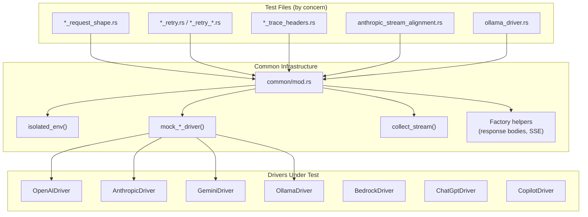

# Other — librefang-llm-drivers-tests

# librefang-llm-drivers-tests

Integration test suite for the LibreFang LLM driver layer. Every test spins up a `wiremock` HTTP server, constructs a driver pointed at it, and asserts on the exact HTTP request/response contract — no live API keys or network access required.

## Purpose

These tests lock in the **wire contract** between each LLM driver and its upstream provider. They protect against silent regressions where a driver refactoring changes the shape of an HTTP request, mishandles a response field, or breaks retry/streaming logic — all without ever hitting a real provider endpoint.

## Architecture


```mermaid
graph TD
    subgraph "Test Files (by concern)"
        RS["*_request_shape.rs"]
        RT["*_retry.rs / *_retry_*.rs"]
        TH["*_trace_headers.rs"]
        SA["anthropic_stream_alignment.rs"]
        OD["ollama_driver.rs"]
    end

    subgraph "Common Infrastructure"
        CM["common/mod.rs"]
        IE["isolated_env()"]
        MS["mock_*_driver()"]
        CS["collect_stream()"]
        FB["Factory helpers<br/>(response bodies, SSE)"]
    end

    subgraph "Drivers Under Test"
        OA["OpenAIDriver"]
        AN["AnthropicDriver"]
        GE["GeminiDriver"]
        OL["OllamaDriver"]
        BE["BedrockDriver"]
        CG["ChatGptDriver"]
        CO["CopilotDriver"]
    end

    RS --> CM
    RT --> CM
    TH --> CM
    SA --> CM
    OD --> CM

    CM --> IE
    CM --> MS
    CM --> CS
    CM --> FB

    MS --> OA
    MS --> AN
    MS --> GE
    MS --> OL
```

## File Organization

Tests are split by **provider** and **concern**. Each provider has its own set of files; each file exercises one orthogonal aspect of the driver.

### Request shape tests (`*_request_shape.rs`)

Validate the outbound HTTP request: URL path, headers, and JSON body structure.

| File | Driver | What it locks in |
|------|--------|-----------------|
| `openai_request_shape.rs` | OpenAI | `POST /chat/completions`, `Authorization: Bearer`, `model`, `messages`, `tools[]` envelope |
| `anthropic_request_shape.rs` | Anthropic | `POST /v1/messages`, `x-api-key`, `anthropic-version: 2023-06-01`, `system`, `tools[].input_schema` |
| `gemini_request_shape.rs` | Gemini | `POST /v1beta/models/<model>:generateContent`, `x-goog-api-key` header (never query string), `contents`, `tools[].functionDeclarations` |

All three also verify:
- **Tool-call response parsing**: non-streaming responses with tool invocations parse into `CompletionResponse.tool_calls` with `StopReason::ToolUse`
- **Streaming SSE aggregation**: `TextDelta` events concatenate to match `CompletionResponse.text()`, and the stream terminates with `ContentComplete`

### Retry tests (`*_retry.rs`)

Exercise retry logic for rate-limit and overload responses.

| File | Driver | Scenarios |
|------|--------|-----------|
| `anthropic_retry.rs` | Anthropic | 429 → retry → success (lockout file created); 429 exhaustion → `LlmError::RateLimited`; 529 retry → success (no lockout); 529 exhaustion → `LlmError::Overloaded`; streaming 429 retry |
| `gemini_retry.rs` | Gemini | 429 retry then success; 429 exhaustion; 503 retry no lockout; 403 auth failure → `AuthenticationFailed`; streaming 429 retry |
| `openai_retry_complete.rs` | OpenAI | 429 retry, lockout mechanics, pre-existing lockout blocking, max_tokens auto-cap, temperature stripping for o-series |
| `openai_retry_stream.rs` | OpenAI | Streaming 429 retry, stream_options stripping, temperature stripping in stream path |

Key pattern: tests use `serial_test::serial` because they share environment variables and the filesystem-based lockout directory.

### Trace header tests (`*_trace_headers.rs`)

Every driver emits optional `x-librefang-agent-id`, `x-librefang-session-id`, and `x-librefang-step-id` headers when the `CompletionRequest` carries caller identity. Each driver file tests:

1. **Headers emitted when set** — all three appear on the wire
2. **Headers omitted when absent** — no `x-librefang-*` headers
3. **Operator opt-out** — `with_emit_caller_trace_headers(false)` suppresses even when IDs are populated

Covered drivers: `openai_trace_headers.rs`, `anthropic_trace_headers.rs`, `gemini_trace_headers.rs`, `bedrock_trace_headers.rs`, `chatgpt_trace_headers.rs`, `copilot_trace_headers.rs`, `vertex_ai_trace_headers.rs`

### Stream alignment tests

**`anthropic_stream_alignment.rs`** — regression test for a specific bug: when Anthropic's SSE stream contains an unrecognized `content_block_start` type (e.g. `server_tool_use`), the parser must still occupy that index slot with a placeholder. The test sends index 0 as unknown, then verifies text at index 1 and `tool_use` at index 2 reassemble correctly.

### Driver-specific tests

**`ollama_driver.rs`** — the most extensive single-driver test file. Covers the native Ollama `/api/chat` wire format:

- **Request shape**: native body (`options.{num_predict, temperature}`, `think`, `images[]`) — never the OpenAI-compatible `/v1/chat/completions`
- **Auth**: `Authorization` header only when API key is non-empty
- **Thinking**: `ThinkingConfig` sets native `think: true`; `message.thinking` routes to `ContentBlock::Thinking`
- **Tool calls**: synthesised IDs, streaming start/end pairs, stringified argument coercion via `coerce_tool_args`
- **Error mapping**: 404 → `ModelNotFound`, 401 → `AuthenticationFailed`, 502 → `Api`
- **Multi-modal**: `ContentBlock::Image` → native `images: [...]` (not OpenAI `image_url`)
- **Tool results**: `ContentBlock::ToolResult` → `role: "tool"` with `tool_name` (not `tool_call_id`)
- **URL migration**: legacy `/v1` suffix stripped; custom reverse-proxy paths preserved
- **Truncated streams**: missing `done: true` returns partial response with zero usage

## Common Infrastructure (`common/mod.rs`)

### `isolated_env()`

Sets up a hermetic test environment:

```rust
pub fn isolated_env() -> TestEnv
```

- Creates a temporary directory and sets `LIBREFANG_HOME` to it (isolates lockout files)
- Sets `NO_PROXY` to prevent proxy interference with `127.0.0.1`
- Enables zero-backoff mode via `backoff::enable_test_zero_backoff()` so retry tests don't actually sleep

Returns a `TestEnv` whose `Drop` cleans up the temp dir and restores backoff.

### Driver constructors

Each returns a driver pointed at the mock server with a unique API key:

```rust
pub fn mock_openai_driver(server: &MockServer) -> OpenAIDriver
pub fn mock_anthropic_driver(server: &MockServer) -> AnthropicDriver
pub fn mock_gemini_driver(server: &MockServer) -> GeminiDriver
pub fn mock_ollama_driver(server: &MockServer) -> OllamaDriver
```

### Request builders

Factory functions that construct `CompletionRequest` structs with sensible defaults:

| Function | Purpose |
|----------|---------|
| `simple_request(model)` | Minimal request, no tools |
| `request_with_tools(model)` | Includes a `get_weather` tool definition, `max_tokens: 256` |
| `request_with_temperature(model, temp)` | Sets a specific temperature |
| `o_series_request()` | `o3-mini` model, `max_tokens: 1000`, `temperature: 1.0` |

### Response factories

Pre-built JSON responses and SSE streams for each provider:

- `openai_200_body(text)`, `openai_sse_body(chunks)`, `openai_429_response(secs)`
- `anthropic_200_body(text)`, `anthropic_sse_body(text)`, `anthropic_429_response()`, `anthropic_529_response()`
- `gemini_200_body(text)`, `gemini_sse_body(text)`, `gemini_429_response()`, `gemini_503_response()`

### `collect_stream()`

Drives the streaming API and collects all events:

```rust
pub async fn collect_stream(
    driver: &dyn LlmDriver,
    request: CompletionRequest,
) -> (Result<CompletionResponse, LlmError>, Vec<StreamEvent>)
```

Returns both the final result and the ordered list of `StreamEvent`s emitted during the stream.

### Lockout file helpers

```rust
pub fn lockout_file_exists(provider: &str, api_key: &str) -> bool
pub fn create_lockout_file(provider: &str, api_key: &str, until: SystemTime)
```

Inspect the filesystem-based rate-limit guard to assert that 429 lockouts are recorded and 529/503 overload errors are not.

## Running the Tests

All tests use `#[serial_test::serial]` because they mutate shared environment variables and use a shared filesystem path for rate-limit lockout files.

```bash
# Run all driver integration tests
cargo test -p librefang-llm-drivers --test '*'

# Run a specific concern across all providers
cargo test -p librefang-llm-drivers --test anthropic_retry
cargo test -p librefang-llm-drivers --test openai_request_shape

# Run a single test case
cargo test -p librefang-llm-drivers --test ollama_driver -- streaming_ndjson_aggregates_text_and_reports_usage
```

No environment configuration is needed — `isolated_env()` handles everything. No network access occurs — all HTTP traffic goes to `wiremock::MockServer` on localhost.