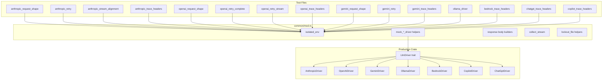

# Other — librefang-llm-drivers-tests

# librefang-llm-drivers Tests

Integration test suite for the LLM driver layer. Every test runs against a `wiremock` HTTP server, exercising the full request/response cycle of each provider driver without touching real APIs.

## Architecture


```mermaid
graph TD
    subgraph "Test Files"
        A[anthropic_request_shape]
        B[anthropic_retry]
        C[anthropic_stream_alignment]
        D[anthropic_trace_headers]
        E[openai_request_shape]
        F[openai_retry_complete]
        G[openai_retry_stream]
        H[openai_trace_headers]
        I[gemini_request_shape]
        J[gemini_retry]
        K[gemini_trace_headers]
        L[ollama_driver]
        M[bedrock_trace_headers]
        N[chatgpt_trace_headers]
        O[copilot_trace_headers]
    end

    subgraph "common/mod.rs"
        ENV[isolated_env]
        MOCK[mock_*_driver helpers]
        BODY[response body builders]
        STREAM[collect_stream]
        LOCK[lockout_file helpers]
    end

    subgraph "Production Crate"
        DRV[LlmDriver trait]
        AD[AnthropicDriver]
        OD[OpenAIDriver]
        GD[GeminiDriver]
        OL[OllamaDriver]
        BD[BedrockDriver]
        CD[CopilotDriver]
        CG[ChatGptDriver]
    end

    A & B & C & D --> ENV
    E & F & G & H --> ENV
    I & J & K --> ENV
    L --> ENV
    M & N & O --> ENV
    MOCK --> DRV
    DRV --> AD & OD & GD & OL & BD & CD & CG
```

## Test Infrastructure (`common/mod.rs`)

The shared `common` module provides the building blocks every test file uses:

### Environment Isolation

**`isolated_env()`** returns a `TestEnv` guard that:
- Creates a temp directory and sets `LIBREFANG_HOME` to it (so rate-limit lockout files don't pollute the developer's real config).
- Sets `NO_PROXY` for `127.0.0.1,localhost` to prevent corporate proxies from intercepting wiremock traffic.
- Activates `backoff::enable_test_zero_backoff()` — a zero-delay backoff guard so retry tests run fast instead of waiting real seconds.

The guard must be held (`let _env = isolated_env()`) for the test's lifetime. Dropping it restores the original state.

### Driver Constructors

Each provider has a `mock_*_driver(server)` helper that constructs a driver pointed at the wiremock server:

| Helper | Provider | Auth token pattern |
|---|---|---|
| `mock_openai_driver` | `OpenAIDriver` | `sk-test-{uuid}` |
| `mock_anthropic_driver` | `AnthropicDriver` | `sk-ant-test-{uuid}` |
| `mock_gemini_driver` | `GeminiDriver` | `test-key-{uuid}` |
| `mock_ollama_driver` | `OllamaDriver` | empty (localhost) |

All use `with_proxy_and_timeout(_, _, None, Some(5))` — no custom headers, 5-second timeout.

### Request Builders

| Function | Purpose |
|---|---|
| `simple_request(model)` | Minimal request: one user message, no tools, 16 max tokens |
| `request_with_tools(model)` | Includes a `get_weather` tool definition, 256 max tokens |
| `request_with_temperature(model, temp)` | Explicit temperature value |
| `o_series_request()` | `o3-mini` model, 1000 max tokens, temperature 1.0 |

### Response Body Builders

Helpers return `serde_json::Value` or `ResponseTemplate` matching each provider's wire format:

- **OpenAI**: `openai_200_body(text)`, `openai_sse_body(&[chunks])`, `openai_429_response(secs)`
- **Anthropic**: `anthropic_200_body(text)`, `anthropic_sse_body(text)`, `anthropic_429_response()`, `anthropic_529_response()`
- **Gemini**: `gemini_200_body(text)`, `gemini_sse_body(text)`, `gemini_429_response()`, `gemini_503_response()`
- **OpenAI error helpers**: `openai_400_temperature_rejected()`, `openai_400_max_tokens_unsupported()`, `openai_400_max_tokens_cap(limit)`, `openai_400_tool_not_supported()`, `openai_500_tool_error()`, `openai_400_tool_use_failed()`

### Stream Collection

**`collect_stream(driver, request)`** drives `driver.stream()` to completion, collecting all `StreamEvent`s into a `Vec`. Returns `(Result<CompletionResponse, LlmError>, Vec<StreamEvent>)`.

### Rate-Limit Lockout Inspection

- **`lockout_file_exists(provider, api_key)`** — checks whether a lockout file exists in `$LIBREFANG_HOME/rate_limits/` for the given provider/key pair. Keys are hashed via `shared_rate_guard::key_id_hash`.
- **`create_lockout_file(provider, api_key, until)`** — pre-creates a lockout file for tests that verify pre-existing lockouts block requests.

---

## Test Categories

Every test is annotated `#[serial_test::serial]` because they share environment variables (`LIBREFANG_HOME`, `NO_PROXY`).

### 1. Request Shape Tests

Verify the exact HTTP request the driver emits — URL path, headers, and JSON body structure. These lock in the wire contract so a silent serialization regression doesn't go undetected.

| File | Provider | Endpoint |
|---|---|---|
| `openai_request_shape.rs` | OpenAI | `POST /chat/completions` |
| `anthropic_request_shape.rs` | Anthropic | `POST /v1/messages` |
| `gemini_request_shape.rs` | Gemini | `POST /v1beta/models/{model}:generateContent` |

What they assert:

- **Headers**: `Authorization: Bearer`, `x-api-key`, `anthropic-version`, `x-goog-api-key`, `content-type: application/json`.
- **Body fields**: `model`, `messages`, `max_tokens`, `system`, `tools` (with provider-specific envelope like `functionDeclarations` for Gemini).
- **Tool serialization**: Tool definitions survive the provider-specific transformation (e.g., OpenAI wraps in `{type: "function", function: {...}}`, Gemini uses `tools[0].functionDeclarations[]`).

### 2. Tool-Call Response Parsing

Each provider's test suite includes a test that feeds a non-streaming response containing a tool invocation and asserts:

- `CompletionResponse.tool_calls` has length 1 with correct `id`, `name`, and `input`.
- `stop_reason` is `StopReason::ToolUse` (the agent loop uses this to dispatch).
- `usage` tokens propagate for metering.
- Provider-specific: Anthropic `tool_use` content blocks, OpenAI `finish_reason: "tool_calls"`, Gemini `functionCall` parts, Ollama synthesises IDs (native API doesn't return one).

### 3. Streaming Aggregation

Each provider has a streaming test that asserts:

- Concatenated `StreamEvent::TextDelta` events equal `CompletionResponse.text()`.
- A terminal `StreamEvent::ContentComplete` closes the stream.

Provider-specific SSE formats are exercised: Anthropic's `event:` + `data:` pairs, OpenAI's `data:` lines, Gemini's single-chunk SSE, Ollama's NDJSON.

### 4. Retry Behaviour

Separate test files exercise retry-on-transient-error logic:

| File | Provider | Codes tested |
|---|---|---|
| `anthropic_retry.rs` | Anthropic | 429 (rate limit), 529 (overloaded) |
| `openai_retry_complete.rs` | OpenAI | 429, 400 (temperature/max_tokens/tool adaptive strip), 500, 403, tool_use_failed |
| `openai_retry_stream.rs` | OpenAI | 429 on streaming, stream options stripping |
| `gemini_retry.rs` | Gemini | 429, 503, 403 (auth failure) |

Key behavioural distinctions verified:

- **429** creates a lockout file (`lockout_file_exists` returns true) — account-level rate limit.
- **529 / 503** (overloaded) does NOT create a lockout — transient, not account-level.
- **5xx** retries up to exhaustion, then returns `LlmError::Api`.
- **403** returns `LlmError::AuthenticationFailed` without retry.
- **Adaptive stripping**: OpenAI tests verify that 400 errors for `temperature`, `max_tokens`, or `tools` cause the driver to strip the offending parameter and retry. Test names like `oc5_temperature_strip` use a naming convention: `o` = OpenAI, `c` = complete, number = ordering.

Retry tests use `wiremock`'s `up_to_n_times` and priority-based matching to serve error responses first, then a success response.

### 5. Trace Headers

Every driver has a `*_trace_headers.rs` test file verifying the `x-librefang-{agent,session,step}-id` header contract:

| File | Provider |
|---|---|
| `anthropic_trace_headers.rs` | Anthropic |
| `openai_trace_headers.rs` | OpenAI |
| `gemini_trace_headers.rs` | Gemini |
| `bedrock_trace_headers.rs` | Bedrock |
| `chatgpt_trace_headers.rs` | ChatGPT |
| `copilot_trace_headers.rs` | Copilot |

Three scenarios per driver:

1. **Headers emitted when set** — `CompletionRequest` with `agent_id`, `session_id`, `step_id` → all three `x-librefang-*` headers appear on the wire.
2. **Headers omitted when absent** — all three IDs are `None` → no `x-librefang-*` headers.
3. **Operator opt-out** — `driver.with_emit_caller_trace_headers(false)` suppresses headers even when IDs are populated.

OpenAI trace headers tests cover additional edge cases: partial IDs (only `agent_id` set), empty-string values are skipped, extended-ASCII values pass through, and trace headers override same-named `extra_headers`.

Both `complete()` and `stream()` paths are tested for Anthropic, Gemini, and other providers that support streaming.

### 6. Ollama Native Driver (`ollama_driver.rs`)

The most comprehensive single-file test suite, covering Ollama's native `/api/chat` endpoint (not the OpenAI-compatible shim):

| Test area | What's verified |
|---|---|
| **Request shape** | POST to `/api/chat` (never `/v1/chat/completions`), native body with `options.{num_predict, temperature}`, no top-level `max_tokens` |
| **Auth** | Empty key → no `Authorization`; explicit key → `Bearer` header |
| **Thinking** | `ThinkingConfig` sets native `think: true` field; response `message.thinking` routes to `ContentBlock::Thinking` |
| **Tool calls** | Non-streaming `tool_calls` parse with synthesised `ollama-call-*` IDs |
| **Streaming NDJSON** | Incremental `content` deltas aggregate; `done: true` chunk supplies usage |
| **Streaming thinking** | `ThinkingDelta` events emitted separately from `TextDelta` |
| **Streaming tool calls** | `ToolUseStart`/`ToolUseEnd` event pair; stringified arguments coerced to objects |
| **Error mapping** | 404 → `ModelNotFound`, 401 → `AuthenticationFailed`, 502 → `Api(502, "Bad Gateway")` |
| **Multi-modal** | `ContentBlock::Image` serialises as native `images: [...]` array |
| **Tool results** | `ContentBlock::ToolResult` serialises as `role: "tool"` with `tool_name` |
| **Truncated streams** | Missing `done: true` returns partial text with zero usage (no hard error) |
| **URL migration** | Legacy `/v1` suffix in base URL is silently stripped; custom `/openai/v1` mount paths are preserved |

### 7. Stream Alignment (`anthropic_stream_alignment.rs`)

A regression test for content-block index alignment in Anthropic's SSE parser. Anthropic's streaming `index` is the absolute position in the response `content` array. When a `content_block_start` carries an unrecognized type (e.g., `server_tool_use`), the parser must still occupy that slot with a placeholder so later blocks align correctly.

The test crafts a stream with:
- Index 0: unknown `server_tool_use` block
- Index 1: text block ("Hello world")
- Index 2: `tool_use` block (`{"q": "rust"}`)

Asserts that both recognized blocks reassemble intact at the correct positions, and the unknown block is dropped from the final response.

---

## Serial Execution

All tests use `#[serial_test::serial]` because `isolated_env()` mutates process-global state (`std::env::set_var`). Running tests in parallel would cause race conditions on environment variables and temp directory paths.

---

## Wire Mock Patterns

Tests consistently use this structure:

```rust
let _env = isolated_env();                    // isolate environment
let server = MockServer::start().await;       // start mock HTTP server
let driver = mock_foo_driver(&server);        // construct driver → wiremock

Mock::given(method("POST"))
    .and(path("/expected/endpoint"))
    .respond_with(ResponseTemplate::new(200).set_body_json(body))
    .expect(1)                                // assert exactly 1 request
    .mount(&server)
    .await;

let result = driver.complete(request).await;  // exercise driver
assert!(result.is_ok());

let received = server.received_requests().await.unwrap();
// inspect request headers/body
```

For retry tests, `up_to_n_times(n)` and priority-based matching control the response sequence:

```rust
// Serve 429 twice, then 200
Mock::given(method("POST"))
    .respond_with(anthropic_429_fast_retry())
    .up_to_n_times(2)
    .with_priority(1)
    .mount(&server)
    .await;

Mock::given(method("POST"))
    .respond_with(ResponseTemplate::new(200).set_body_json(body))
    .with_priority(2)  // lower priority = fallback after first mock exhausts
    .mount(&server)
    .await;
```