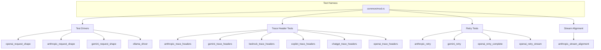

# Other — librefang-llm-drivers-tests

# librefang-llm-drivers Integration Tests

## Purpose

This test suite validates the **wire contracts** and **cross-cutting behaviors** of every LLM provider driver in `librefang-llm-drivers`. Each test fires real HTTP requests at a `wiremock` mock server, then inspects the recorded request/response to lock in the provider-specific contract so silent regressions are caught immediately.

The tests do **not** hit real provider endpoints. They exercise the full driver stack — serialization, HTTP dispatch, response parsing, retry logic, and stream aggregation — against a local mock server.

## Architecture


```mermaid
graph TD
    subgraph "Test Harness"
        CE[common/mod.rs]
    end
    CE --> TD[Test Drivers]
    CE --> TH[Trace Header Tests]
    CE --> RY[Retry Tests]
    CE --> SA[Stream Alignment]

    TD --> OAI[openai_request_shape]
    TD --> ANT[anthropic_request_shape]
    TD --> GEM[gemini_request_shape]
    TD --> OLL[ollama_driver]

    TH --> AT[anthropic_trace_headers]
    TH --> GT[gemini_trace_headers]
    TH --> BT[bedrock_trace_headers]
    TH --> CT[copilot_trace_headers]
    TH --> CGT[chatgpt_trace_headers]
    TH --> OT[openai_trace_headers]

    RY --> AR[anthropic_retry]
    RY --> GR[gemini_retry]
    RY --> ORC[openai_retry_complete]
    RY --> ORS[openai_retry_stream]

    SA --> AS[anthropic_stream_alignment]
```

## Shared Test Infrastructure — `tests/common/mod.rs`

Every test file imports from this module. It provides the building blocks needed to stand up a driver pointed at a mock server without touching real provider credentials or network endpoints.

### Environment Isolation

```rust
pub fn isolated_env() -> TestEnv
```

Creates a temporary directory, sets `LIBREFANG_HOME` to point at it, configures `NO_PROXY` to prevent real HTTP calls, and activates `backoff::enable_test_zero_backoff()` so retry delays collapse to zero during tests. The `TestEnv` guard drops (and cleans up) when the test ends.

### Driver Constructors

Each provider has a factory that builds a driver wired to a specific `MockServer`:

| Function | Driver | Auth |
|---|---|---|
| `mock_openai_driver(server)` | `OpenAIDriver` | `Bearer sk-test-<uuid>` |
| `mock_anthropic_driver(server)` | `AnthropicDriver` | `x-api-key: sk-ant-test-<uuid>` |
| `mock_gemini_driver(server)` | `GeminiDriver` | `x-goog-api-key: test-key-<uuid>` |
| `mock_ollama_driver(server)` | `OllamaDriver` | No auth (empty key) |

All use `with_proxy_and_timeout(_, server.uri(), None, Some(5))` — 5-second timeout.

### Request Builders

- **`simple_request(model)`** — minimal `CompletionRequest` with one user message, no tools, `max_tokens: 16`.
- **`request_with_tools(model)`** — includes a single `get_weather` tool definition, `max_tokens: 256`.
- **`request_with_temperature(model, temp)`** — sets a specific temperature.
- **`o_series_request()`** — tailored for OpenAI o3-mini with `temperature: 1.0` and `max_tokens: 1000`.

### Response Fixtures

Provider-specific 200-body helpers (`openai_200_body`, `anthropic_200_body`, `gemini_200_body`) and SSE builders (`openai_sse_body`, `anthropic_sse_body`, `gemini_sse_body`) produce syntactically correct wire-format responses. Error fixtures (`openai_429_response`, `anthropic_429_response`, etc.) are provided for retry tests.

### Stream Collection

```rust
pub async fn collect_stream(
    driver: &dyn LlmDriver,
    request: CompletionRequest,
) -> (Result<CompletionResponse, LlmError>, Vec<StreamEvent>)
```

Drives `driver.stream()` with an `mpsc` channel, collects all `StreamEvent` values, and returns both the final result and the event list. Every streaming test uses this.

### Rate-Limit Lockout Helpers

- `lockout_file_exists(provider, api_key)` — checks whether a rate-limit lockout file was written to `$LIBREFANG_HOME/rate_limits/`.
- `create_lockout_file(provider, api_key, until)` — pre-creates a lockout file.

### Request Inspection

```rust
pub fn request_json(request: &Request) -> serde_json::Value
```

Deserializes the raw HTTP request body as JSON for field-level assertions.

## Test Categories

### 1. Request Shape Tests

These files lock in what the driver actually sends on the wire:

| File | Endpoint | Validates |
|---|---|---|
| `openai_request_shape.rs` | `POST /chat/completions` | Bearer auth, model, messages, tools envelope (`[{type: "function", function: {…}}]`) |
| `anthropic_request_shape.rs` | `POST /v1/messages` | `x-api-key`, `anthropic-version: 2023-06-01`, model, `system`, `max_tokens`, tools |
| `gemini_request_shape.rs` | `POST /v1beta/models/<model>:generateContent` | `x-goog-api-key` header (never in URL), `contents`, `tools[0].functionDeclarations[]` |

Each test also validates:
- **Tool-call response parsing** — the provider's tool-use response shape maps to `CompletionResponse.tool_calls` with `StopReason::ToolUse`, correct id/name/input, and usage propagation.
- **Streaming text aggregation** — `TextDelta` events concatenate to match the final `CompletionResponse.text()`, and a `ContentComplete` event terminates the stream.

### 2. Retry Behavior Tests

| File | HTTP Statuses | Error Variants |
|---|---|---|
| `openai_retry_complete.rs` | 429, 400 (param stripping) | `RateLimited` |
| `openai_retry_stream.rs` | 429 (streaming path) | `RateLimited` |
| `anthropic_retry.rs` | 429, 529 | `RateLimited`, `Overloaded` |
| `gemini_retry.rs` | 429, 503, 403 | `RateLimited`, `AuthenticationFailed` |

Key behavioral contracts tested:

- **429 retry-then-success**: Two 429 responses followed by 200 → driver succeeds after 3 total requests.
- **429 exhaustion**: All retries consumed → `LlmError::RateLimited` returned.
- **529/503 retry-then-success**: Overloaded errors retry but do **not** create lockout files (overloaded is not an account-level rate limit).
- **403 maps to `AuthenticationFailed`**: No retry.
- **Lockout file creation**: 429 writes a lockout file keyed by provider + hashed API key; 529/503 does not.
- **Streaming retry**: The `stream()` path retries 429s just like `complete()`.

Anthropic retry tests use `anthropic_429_fast_retry()` with `retry-after: 1` and `anthropic_529_overloaded()` helpers. Gemini uses a `SequencedResponder` that serves responses in order via `AtomicUsize` counter.

### 3. Trace Header Tests

Every driver has a `*_trace_headers.rs` file that validates the same three-concern contract:

```
x-librefang-agent-id:   <agent_id>
x-librefang-session-id: <session_id>
x-librefang-step-id:    <step_id>
```

| File | Driver | Notes |
|---|---|---|
| `openai_trace_headers.rs` | `OpenAIDriver` | Canonical implementation |
| `anthropic_trace_headers.rs` | `AnthropicDriver` | Headers alongside `x-api-key` |
| `gemini_trace_headers.rs` | `GeminiDriver` | Headers alongside `x-goog-api-key` |
| `bedrock_trace_headers.rs` | `BedrockDriver` | Bearer auth; notes SigV4 migration concern |
| `copilot_trace_headers.rs` | `CopilotDriver` | Delegates to inner `OpenAIDriver` |
| `chatgpt_trace_headers.rs` | `ChatGptDriver` | Responses API at `/codex/responses` |
| `vertex_ai_trace_headers.rs` | `VertexAIDriver` | Google Cloud endpoint |

Each file tests three scenarios:

1. **Headers present when IDs are set** — `agent_id`, `session_id`, `step_id` map to corresponding `x-librefang-*` headers.
2. **Headers absent when IDs are `None`** — no header emitted at all.
3. **Operator opt-out via `with_emit_caller_trace_headers(false)`** — suppresses headers even when IDs are populated.

Streaming variants (`stream_emits_trace_headers_when_set`) confirm the same headers appear on streaming requests.

The `CompletionRequest` fields `agent_id`, `session_id`, and `step_id` drive this behavior. All drivers share a common `build_trace_header_map` helper.

### 4. Stream Alignment Regression — `anthropic_stream_alignment.rs`

This is a targeted regression test for a specific SSE parsing bug. Anthropic's streaming `index` field is the **absolute position** in the response `content` array. The original code used a `_ => {}` catch-all for unrecognized `content_block_start` types (like `server_tool_use`), which pushed nothing — shifting all later blocks left by one slot.

The test constructs a stream with:
- Index 0: unknown `server_tool_use` block
- Index 1: text block with deltas `"Hello"` + `" world"`
- Index 2: `tool_use` block with `input_json_delta` pieces

It asserts:
- Text reassembles to `"Hello world"` (pre-fix: empty due to misaligned accumulator)
- Tool call input reassembles to `{"q": "rust"}` (pre-fix: garbled)
- Unknown block is dropped from final `response.content` (length == 2)
- `ToolUseEnd` event carries the correct id/name/input

### 5. Ollama Native Driver — `tests/ollama_driver.rs`

The most comprehensive single-driver test file, covering the native Ollama API (`/api/chat`, not the OpenAI compat shim):

**Request shape:**
- POSTs to `/api/chat` (never `/v1/chat/completions`)
- `max_tokens` maps to `options.num_predict` (not top-level)
- Sampler params live under `options` envelope
- `thinking` request sets native `think: true` boolean

**Auth:**
- Empty API key → no `Authorization` header (localhost default)
- Non-empty key → `Bearer <token>` (tunnelled/hosted Ollama)

**Non-streaming parsing:**
- Tool calls parse with synthesised IDs (`ollama-call-*`) since native API lacks IDs
- `done_reason: "stop"` + tool calls → `StopReason::ToolUse`
- `message.thinking` routes to `ContentBlock::Thinking` (not `<![CDATA[<think]]>` tags)

**Streaming (NDJSON):**
- `content` deltas aggregate into final text
- `thinking` deltas surface as `StreamEvent::ThinkingDelta` without leaking into `TextDelta`
- Tool calls in final `done: true` chunk emit `ToolUseStart`/`ToolUseEnd` pair
- Stringified JSON arguments (`"arguments": "{\"city\":\"Berlin\"}"`) are coerced to objects
- Malformed tool call chunks keep the prior valid snapshot (no hard error)
- Truncated response (no `done: true`) returns partial text with zero usage instead of erroring

**Error mapping:**
- 404 → `LlmError::ModelNotFound`
- 401 → `LlmError::AuthenticationFailed`
- 502 → `LlmError::Api { status: 502, message: "Bad Gateway" }`

**Multi-modal:**
- `ContentBlock::Image` serializes as native `images: ["<base64>"]` (not OpenAI `image_url`)

**Tool result round-trip:**
- `ContentBlock::ToolResult` → `role: "tool"` with `tool_name` field (not `tool_call_id`)

**URL migration:**
- Legacy `base_url` ending in `/v1` is silently stripped so `/api/chat` composes correctly
- Non-legacy `/v1` embedded in a custom path (e.g. `/openai/v1`) is preserved

## Conventions

### Serial Execution

All tests are annotated `#[serial_test::serial]` because they mutate process-global state (environment variables via `std::env::set_var`, rate-limit files in `LIBREFANG_HOME`). The serial attribute prevents concurrent test interference.

### Naming Scheme

Retry tests follow a prefix convention for predictable execution order:
- `aa1_`, `aa2_`, … for Anthropic retry
- `ag1_`, `ag2_`, … for Gemini retry
- `oc1_`, `oc2_`, … for OpenAI complete retry
- `os1_`, `os2_`, … for OpenAI stream retry

### Assertions as Contract Locks

Tests use `expect(1)` on mock mounts and explicit `assert_eq!` on recorded request fields (headers, body JSON) to lock the wire contract. Comments like `"the daemon will not work without these"` and `"regression: #4810"` annotate why each assertion matters.