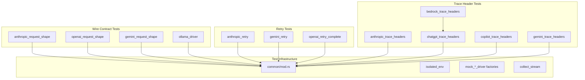

# Other — librefang-llm-drivers-tests

# librefang-llm-drivers Tests

Integration test suite that locks in the wire contract, error-recovery behaviour, and observability headers for every LLM provider driver in `librefang-llm-drivers`.

## Architecture

Every test stands up an in-process `wiremock::MockServer`, constructs a driver pointed at it, fires a request, and asserts on the recorded HTTP exchange. Tests never touch a real LLM API.

```mermaid
graph TD
    subgraph Test Infrastructure
        CE[common/mod.rs]
        IE[isolated_env]
        MD[mock_*_driver factories]
        CS[collect_stream]
    end

    subgraph Wire Contract Tests
        ARS[anthropic_request_shape]
        ORS[openai_request_shape]
        GRS[gemini_request_shape]
        ODR[ollama_driver]
    end

    subgraph Retry Tests
        ARE[anthropic_retry]
        GRE[gemini_retry]
        ORC[openai_retry_complete]
    end

    subgraph Trace Header Tests
        ATH[anthropic_trace_headers]
        BTH[bedrock_trace_headers]
        CTH[chatgpt_trace_headers]
        CPTH[copilot_trace_headers]
        GTH[gemini_trace_headers]
    end

    ARS --> CE
    ORS --> CE
    GRS --> CE
    ODR --> CE
    ARE --> CE
    GRE --> CE
    ORC --> CE
    ATH --> CE
    BTH --> CTH
    CTH --> CE
    CPTH --> CE
    GTH --> CE
```

## Test Isolation

All tests are marked `#[serial_test::serial]` because they mutate process-global state (environment variables, rate-limit lockout files). Running them concurrently would cause false failures from env-var races.

`isolated_env()` in `common/mod.rs` provides three guarantees:

1. **Temp home directory** — `LIBREFANG_HOME` is set to a fresh `tempfile::TempDir` so rate-limit lockout files don't leak between tests or interfere with the developer's real config.
2. **Proxy bypass** — `NO_PROXY` / `no_proxy` are set to `127.0.0.1,localhost` so HTTP requests to the mock server don't route through a system proxy.
3. **Zero backoff** — `backoff::enable_test_zero_backoff()` eliminates sleep delays in retry loops so the test suite runs in seconds, not minutes.

The returned `TestEnv` owns the `TempDir` and a `ZeroBackoffGuard`; dropping them at test end restores the original state.

## Common Test Utilities (`common/mod.rs`)

### Driver Factories

Each function builds a driver wired to the mock server with a unique API key and 5-second timeout:

| Function | Driver | Notes |
|---|---|---|
| `mock_openai_driver` | `OpenAIDriver` | Key prefix `sk-test-` |
| `mock_anthropic_driver` | `AnthropicDriver` | Key prefix `sk-ant-test-` |
| `mock_gemini_driver` | `GeminiDriver` | Key prefix `test-key-` |
| `mock_ollama_driver` | `OllamaDriver` | Empty key (localhost default) |

### Request Builders

- **`simple_request(model)`** — Minimal `CompletionRequest` with a single user message, no tools, `max_tokens: 16`, `temperature: 0.0`.
- **`request_with_tools(model)`** — Adds a `get_weather` tool definition with a JSON schema, `max_tokens: 256`.
- **`request_with_temperature(model, temp)`** — Overrides the temperature value.

### Response Helpers

Helpers construct well-formed provider-specific JSON responses and SSE streams:

- **OpenAI**: `openai_200_body(text)`, `openai_sse_body(chunks)`, `openai_429_response(secs)`, `openai_400_temperature_rejected()`, `openai_400_max_tokens_unsupported()`, `openai_400_max_tokens_cap(limit)`, `openai_400_tool_not_supported()`, `openai_500_tool_error()`, `openai_400_tool_use_failed()`
- **Anthropic**: `anthropic_200_body(text)`, `anthropic_sse_body(text)`, `anthropic_429_response()`, `anthropic_529_response()`
- **Gemini**: `gemini_200_body(text)`, `gemini_sse_body(text)`, `gemini_429_response()`, `gemini_503_response()`

### Stream Collection

`collect_stream(driver, request)` calls `driver.stream()` and captures all `StreamEvent` values into a `Vec`. Returns the final `Result<CompletionResponse, LlmError>` alongside the event list so tests can assert on both the terminal state and intermediate events.

### Rate-Limit Guard Helpers

- **`lockout_file_exists(provider, api_key)`** — Checks whether a lockout file exists in `$LIBREFANG_HOME/rate_limits/` for the given provider and key (key is hashed via `shared_rate_guard::key_id_hash`).
- **`create_lockout_file(provider, api_key, until)`** — Pre-creates a lockout file to test the "already locked out" code path.

### Request Inspection

`request_json(request)` deserialises a `wiremock::Request` body into `serde_json::Value` for field-level assertions.

## Wire Contract Tests

These tests lock in the exact HTTP request shape each driver sends. They are the primary defence against silent wire-format regressions.

### `anthropic_request_shape.rs`

Verifies the Anthropic Messages API contract:

- **Request shape**: POST to `/v1/messages` with `x-api-key`, `anthropic-version: 2023-06-01`, `content-type: application/json`. Body includes `model`, `max_tokens`, `system`, `messages`, and `tools` (serialised as a JSON array with `input_schema` objects).
- **Tool-use parsing**: A response containing a `tool_use` content block parses into `CompletionResponse.tool_calls` with `StopReason::ToolUse`, carrying the `id`, `name`, and structured `input` fields. Usage tokens propagate.
- **Streaming aggregation**: `TextDelta` events concatenate to match `CompletionResponse.text()`. Stream terminates with `ContentComplete`.

### `openai_request_shape.rs`

Verifies the OpenAI Chat Completions API contract:

- **Request shape**: POST to `/chat/completions` with `Authorization: Bearer <key>`. Body includes `model`, `messages`, and `tools` wrapped in the OpenAI `[{type: "function", function: {…}}]` envelope.
- **Tool-call parsing**: `finish_reason: "tool_calls"` maps to `StopReason::ToolUse`. The `arguments` string is decoded into a structured JSON value.
- **Streaming aggregation**: Same delta-concatenation invariant as Anthropic.

### `gemini_request_shape.rs`

Verifies the Gemini GenerateContent API contract:

- **Request shape**: POST to `/v1beta/models/<model>:generateContent` with API key in `?key=` query parameter. Body uses `contents` (not `messages`) and tools serialise as `tools[].functionDeclarations[]` with `parameters` (not `input_schema`).
- **Function-call parsing**: A `functionCall` part maps to `ToolCall`. Gemini doesn't return tool-use IDs natively, so the driver mints one — tests assert non-empty rather than a specific format.
- **Streaming**: Uses `:streamGenerateContent` endpoint path.

### `ollama_driver.rs`

The most comprehensive single-driver test file, covering the native `/api/chat` endpoint (not the OpenAI compat shim):

- **Native body shape**: `messages`, `tools` (when present), `think` boolean for reasoning, `options.{temperature, num_predict}` envelope. No top-level `max_tokens`.
- **Conditional auth**: Empty key → no `Authorization` header (localhost). Non-empty key → `Bearer` header (tunnelled/hosted).
- **Thinking**: `ThinkingConfig` flips the native `think: true` field. First-class `message.thinking` routes to `ContentBlock::Thinking` without `Ⴏ` tag embedding.
- **Tool calls**: Synthesised IDs (`ollama-call-*`). `done_reason: "stop"` with populated `tool_calls` maps to `StopReason::ToolUse`.
- **NDJSON streaming**: Aggregates `content` deltas across chunks. `thinking` deltas surface as `StreamEvent::ThinkingDelta` without leaking into `TextDelta`. Usage comes from the final `done: true` chunk.
- **Streaming tool calls**: Emits `ToolUseStart` / `ToolUseEnd` event pairs. Stringified JSON arguments are coerced into structured objects. Malformed `tool_calls` chunks are skipped, preserving the prior valid snapshot.
- **Truncated streams**: Missing `done: true` returns partial text with zero usage (caller detects incompleteness via `usage == 0`).
- **Error mapping**: 404 → `ModelNotFound`, 401 → `AuthenticationFailed`, 5xx with raw body → `Api { status, message }`.
- **Multi-modal**: `ContentBlock::Image` serialises as native `images: ["<base64>"]`, not OpenAI `image_url`.
- **Tool results**: `ContentBlock::ToolResult` serialises as `role: "tool"` with `tool_name` (not `tool_call_id`).
- **URL migration**: Legacy `base_url` ending in `/v1` has the suffix silently stripped. Custom paths containing `/v1` as a sub-component are preserved verbatim.

## Retry Tests

These tests verify error recovery, adaptive parameter stripping, and rate-limit lockout behaviour.

### `anthropic_retry.rs`

Tests 429 (rate limit) and 529 (overloaded) handling:

- **`aa1_429_retry_then_success`** — Two 429s with `Retry-After: 1`, then 200. Driver retries and succeeds. Lockout file is created.
- **`aa2_429_exhaustion`** — Four consecutive 429s exhaust retries. Returns `LlmError::RateLimited`. Lockout file is created.
- **`aa3_529_retry_then_success_no_lockout`** — One 529, then 200. Succeeds. No lockout file (overloaded is transient, not account-level).
- **`aa4_529_exhaustion_overloaded`** — Four consecutive 529s. Returns `LlmError::Overloaded`.
- **`aa5_stream_429_retry`** — Streaming path also retries on 429 before delivering SSE events.

### `gemini_retry.rs`

Uses a custom `SequencedResponder` for deterministic multi-response sequences:

- **`ag1_429_retry_then_success`** — 429 × 2, then 200. Lockout file created.
- **`ag2_429_exhaustion`** — Four 429s exhaust retries. Returns `RateLimited`.
- **`ag3_503_retry_then_success_no_lockout`** — 503 is transient; no lockout file.
- **`ag4_auth_failure_403`** — 403 returns `AuthenticationFailed` immediately (no retry).
- **`ag5_stream_429_retry`** — Streaming path retries on 429.

### `openai_retry_complete.rs`

Tests the OpenAI driver's adaptive retry logic where it inspects error responses and modifies the retry request:

- **`oc1_429_retry_then_success`** — Standard rate-limit retry with lockout file creation.
- **`oc2_429_exhaustion`** — 4 retries (initial + 3 retries), then `RateLimited`.
- **`oc3_preexisting_lockout_blocks_request`** — A pre-created lockout file causes immediate `RateLimited` without any HTTP request.
- **`oc4_max_tokens_to_max_completion_tokens`** — On receiving a 400 about unsupported `max_tokens`, retries with `max_completion_tokens` instead.
- **`oc5_temperature_strip`** — On receiving a 400 about unsupported `temperature`, retries without the parameter.
- **`oc6_toolless_retry_on_500`** — On 500 with tools present, retries without `tools` or `tool_choice`.
- **`oc7_max_tokens_auto_cap`** — On receiving a 400 with a max token limit, retries with the capped value.
- **`oc9_groq_tool_use_failed`** — Retries on `tool_use_failed` errors from Groq.
- **`oc10_max_retries_exceeded_generic_500`** — Generic 5xx exhausts retries.

## Trace Header Tests

Every driver that makes outbound HTTP requests must propagate optional caller-identity headers for observability. The pattern is identical across all driver-specific trace-header files:

| Header | Source field |
|---|---|
| `x-librefang-agent-id` | `CompletionRequest.agent_id` |
| `x-librefang-session-id` | `CompletionRequest.session_id` |
| `x-librefang-step-id` | `CompletionRequest.step_id` |

### Three-assertion pattern per driver

1. **Headers emitted when IDs are set** — All three `x-librefang-*` headers appear on the wire with the correct values.
2. **Headers absent when IDs are `None`** — No `x-librefang-*` headers on the wire.
3. **Operator opt-out suppresses headers** — `driver.with_emit_caller_trace_headers(false)` prevents headers even when IDs are populated.

### Driver-specific notes

- **Anthropic** (`anthropic_trace_headers.rs`) — Headers alongside `x-api-key` and `anthropic-version`. Also tests the streaming path.
- **Bedrock** (`bedrock_trace_headers.rs`) — Uses Bearer token auth (not SigV4). Test serves as a SigV4-compatibility gate: if the driver migrates to SigV4, trace headers must be excluded from the canonical-request hash.
- **ChatGPT** (`chatgpt_trace_headers.rs`) — Tests against the `/codex/responses` endpoint with the Responses API SSE format (requires `response.completed` event).
- **Copilot** (`copilot_trace_headers.rs`) — Uses `CopilotDriver::new_for_test` to bypass GitHub token exchange. Asserts on the downstream `/chat/completions` request specifically (filtering out any token-exchange calls).
- **Gemini** (`gemini_trace_headers.rs`) — Headers alongside the `?key=` query parameter. Tests both `generateContent` and `streamGenerateContent` paths.

## Adding a New Test

1. If testing a new driver, add a `mock_<driver>_driver` factory to `common/mod.rs` and provider-specific response helpers.
2. If testing the wire contract, create `<provider>_request_shape.rs` asserting on URL, headers, and body shape. Cover tool-use parsing and streaming aggregation.
3. If testing retry behaviour, create `<provider>_retry.rs` covering 429 recovery, 429 exhaustion, server-error recovery, and authentication failures.
4. If the driver makes outbound HTTP calls, create `<provider>_trace_headers.rs` following the three-assertion pattern and test the streaming path if applicable.
5. Mark all tests `#[serial_test::serial]` and start with `let _env = isolated_env();`.