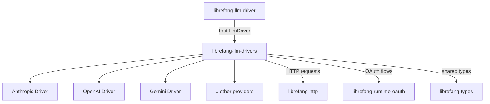

# Other — librefang-llm-drivers

# librefang-llm-drivers

Concrete LLM provider drivers implementing the `librefang-llm-driver` trait. Each driver encapsulates the API specifics, authentication, and request/response handling for a particular LLM provider (Anthropic, OpenAI, Gemini, etc.).

## Architecture

All drivers share a common interface defined in `librefang-llm-driver`, allowing the rest of the codebase to interact with any LLM provider without knowing the specifics of its API.

## Key Dependencies and Their Roles

| Dependency | Purpose |
|---|---|
| `librefang-llm-driver` | Provides the trait (`LlmDriver` or similar) that each concrete driver implements |
| `librefang-http` | Shared HTTP client configuration, request building, and response handling |
| `librefang-runtime-oauth` | OAuth token acquisition and refresh for providers that require it (e.g., Gemini via Google Cloud credentials) |
| `librefang-types` | Shared domain types — model identifiers, message structures, completion responses, error types |
| `reqwest` | Underlying HTTP client used to call provider APIs |
| `serde` / `serde_json` | Serialization of request payloads and deserialization of provider-specific JSON responses |
| `dashmap` | Concurrent hashmap used for thread-safe caching (likely token/credential caching) |
| `sha2` / `base64` | Cryptographic hashing and encoding — used in request signing or key derivation |
| `zeroize` | Secure memory clearing for sensitive credentials after use |
| `dirs` | Resolution of platform-specific config/cache directories for credential storage |

## How Drivers Work

Each driver follows the same general pattern:

1. **Configuration** — The driver is constructed with provider-specific configuration (API key, base URL, default model, etc.).

2. **Authentication** — Depending on the provider, the driver either attaches a static API key to requests or uses `librefang-runtime-oauth` to obtain and refresh OAuth tokens. Credentials are held in memory with `zeroize`-protected types where sensitivity demands it, and may be cached in a `DashMap` to avoid redundant auth round-trips.

3. **Request Construction** — The driver translates the generic input types from `librefang-types` into the provider's expected JSON format using `serde`. Provider-specific quirks (e.g., Anthropic's `messages` format vs. OpenAI's `chat.completions` endpoint) are handled here.

4. **HTTP Call** — Requests are dispatched through `librefang-http` / `reqwest`. The driver manages retries, timeouts, and rate-limit handling as appropriate for each provider.

5. **Response Parsing** — Provider-specific JSON responses are deserialized into the shared response types from `librefang-types`, normalizing differences across APIs into a uniform shape.

6. **Error Handling** — Provider-specific error responses are mapped into the common error types defined in `librefang-types`.

## Relationship to the Rest of the Codebase

This module is a **pure consumer** of the trait defined in `librefang-llm-driver`. Downstream code (e.g., orchestration layers, evaluation pipelines) depends only on the trait, selecting a concrete driver at runtime based on configuration. This separation means:

- Adding a new LLM provider requires only a new driver module here, implementing the existing trait.
- The rest of the codebase remains agnostic to provider specifics.
- Drivers can be tested in isolation using mocked HTTP responses.

## Credential Security

Given the dependency on `zeroize` and `sha2`, this module takes care to:

- Clear sensitive credentials (API keys, OAuth tokens) from memory when they are no longer needed.
- Avoid logging raw credentials via `tracing`.
- Store cached credentials in platform-appropriate directories resolved through `dirs`, never hardcoding paths.