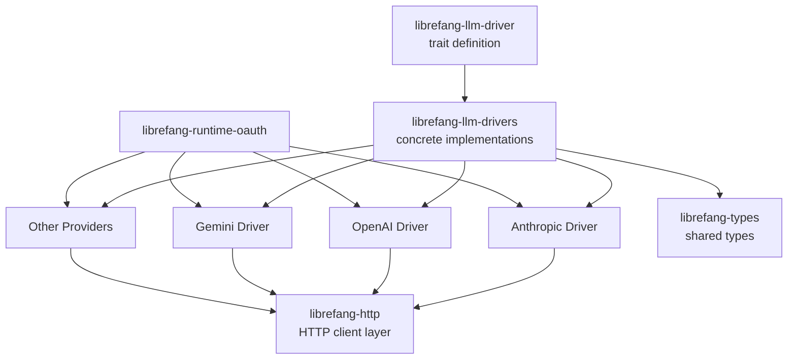

# Other — librefang-llm-drivers

# librefang-llm-drivers

Concrete LLM provider drivers implementing the `librefang-llm-driver` trait. This crate contains the actual integrations with LLM APIs—Anthropic, OpenAI, Gemini, and others—translating the shared driver interface into provider-specific HTTP requests and response parsing.

## Purpose

While `librefang-llm-driver` defines *what* an LLM driver looks like (the trait), this crate provides the *implementations*. Each driver handles the specifics of its provider's authentication scheme, request format, streaming protocol, and response structure, while exposing a uniform interface to the rest of the application.

## Architecture

## Key Dependencies and Their Roles

| Dependency | Role |
|---|---|
| `librefang-llm-driver` | Provides the trait (`LlmDriver` or similar) that each provider implements |
| `librefang-types` | Shared types for prompts, completions, messages, and error types |
| `librefang-http` | HTTP client abstraction used to make outbound requests to provider APIs |
| `librefang-runtime-oauth` | OAuth token acquisition for providers that require dynamic authentication |
| `reqwest` | Underlying HTTP client for raw request/response handling |
| `async-trait` | Enables async methods in the driver trait implementation |
| `serde` / `serde_json` | Serialization of request bodies and deserialization of provider responses |
| `dashmap` | Concurrent map, likely used for caching tokens or connection state |
| `sha2` | Hashing, possibly for request signing or cache key generation |
| `zeroize` | Secure clearing of sensitive data (API keys, tokens) from memory |

## How It Works

Each driver follows a consistent internal pattern:

1. **Request Construction** — Translates the generic prompt/completion request into the provider's native JSON format.
2. **Authentication** — Attaches the appropriate credentials. This may be a static API key, a Bearer token, or an OAuth token obtained via `librefang-runtime-oauth`.
3. **HTTP Dispatch** — Sends the request through `librefang-http`, which wraps `reqwest` with shared configuration, retry logic, and observability.
4. **Response Parsing** — Deserializes the provider-specific response into the shared types from `librefang-types`.
5. **Credential Cleanup** — Uses `zeroize` to securely clear API keys and tokens from memory when they are no longer needed.

## Adding a New Provider

To add support for a new LLM provider:

1. Create a new module file (e.g., `src/newprovider.rs`).
2. Define a struct representing the driver, holding any provider-specific configuration (API key, base URL, model identifiers).
3. Implement the driver trait from `librefang-llm-driver` for your struct.
4. Handle request serialization matching the provider's API specification.
5. Register the driver in the module's public exports so consumers can instantiate it.

Key considerations for new drivers:
- Use `librefang-http` for all outbound requests rather than calling `reqwest` directly, to maintain consistent tracing, error handling, and retry behavior.
- If the provider uses OAuth, integrate with `librefang-runtime-oauth` for token management.
- Ensure all sensitive fields (keys, tokens) derive or implement `Zeroize` so they are scrubbed from memory on drop.
- Use `tracing` instrumentation on public methods for observability.

## Connection to the Codebase

This crate sits between the abstract driver interface and the network layer:

- **Downstream consumers** (e.g., `librefang-core`, application code) depend only on `librefang-llm-driver` for the trait, then select a concrete driver from this crate at runtime or configuration time.
- **Upstream dependencies** provide the building blocks: trait definition, types, HTTP transport, and OAuth flow.

Because the trait is the contract, the rest of the codebase never needs to know which provider is in use. Swapping from OpenAI to Anthropic is a matter of changing which concrete driver is instantiated.