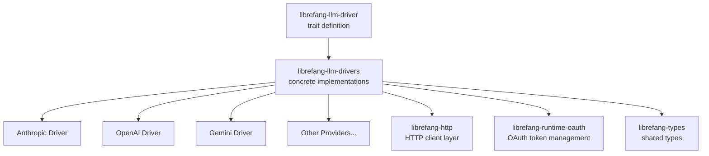

# Other — librefang-llm-drivers

# librefang-llm-drivers

Concrete LLM provider drivers that implement the `librefang-llm-driver` trait. Each driver translates a uniform API surface into the specific HTTP protocol, authentication scheme, and payload format required by a given LLM provider (Anthropic, OpenAI, Gemini, etc.).

## Architecture

Downstream consumers depend only on the `librefang-llm-driver` trait. They never reference this crate directly — it is plugged in at application assembly time, keeping provider specifics behind a stable interface.

## Role in the Codebase

| Concern | Owning Crate |
|---|---|
| Trait definition / abstract interface | `librefang-llm-driver` |
| **Concrete provider implementations** | **`librefang-llm-drivers` (this crate)** |
| Shared domain types | `librefang-types` |
| HTTP transport | `librefang-http` |
| OAuth token lifecycle | `librefang-runtime-oauth` |

## Key Design Patterns

### Authentication

Drivers handle provider-specific authentication internally:

- **API-key-based providers** (Anthropic, OpenAI) attach keys via request headers. The `zeroize` dependency ensures sensitive key material is cleared from memory when dropped.
- **OAuth-based providers** (Gemini) delegate token acquisition and refresh to `librefang-runtime-oauth`.
- **Signed-request providers** use `sha2`, `hmac`, and `hex` to compute request signatures when a provider requires it (for example, AWS-derived signing schemes).

### Streaming

The `tokio-stream` dependency indicates that drivers support streaming (server-sent events) for incremental token delivery. Each driver parses its provider's specific SSE wire format into the common stream type defined by the driver trait.

### Concurrency and Caching

`dashmap` is used for lock-free concurrent access to internal state, likely for:

- Caching OAuth tokens between requests
- Storing resolved model capabilities or endpoint metadata

## Dependency Rationale

Several dependencies are worth calling out because they signal implementation details:

| Dependency | Purpose |
|---|---|
| `async-trait` | Provides the async-compatible trait implementation that each driver fulfills |
| `reqwest` | Low-level HTTP client used through the `librefang-http` abstraction |
| `serde` / `serde_json` | Serialization of request payloads and deserialization of provider-specific response envelopes |
| `base64` | Encoding for providers that transmit credentials or content in base64 |
| `regex-lite` | Lightweight pattern matching, likely for response post-processing or content extraction |
| `url` | URL construction for provider-specific API endpoints |
| `uuid` / `rand` | Request ID generation and nonce creation |
| `chrono` | Timestamp handling for authentication signatures and logging |
| `bytes` | Efficient byte-buffer handling for streaming response bodies |
| `tracing` | Structured logging and span creation for observability |

## Adding a New Provider

1. Create a new module within this crate (e.g., `src/newprovider.rs`).
2. Define a struct that holds provider-specific configuration (API key, endpoint URL, etc.).
3. Implement the `LlmDriver` trait from `librefang-llm-driver`:
   - `complete` (or equivalent) — build the provider's JSON request body, send it via `librefang-http`, parse the response.
   - `stream` — same, but return a `Stream` of partial results using `tokio-stream`.
4. Map provider-specific error codes into the error type from `librefang-llm-driver` or `librefang-types`.
5. Register the new driver in whatever factory or configuration resolver the application uses.

When adding a provider that uses OAuth, reuse the token management from `librefang-runtime-oauth` rather than implementing a bespoke flow. For providers requiring request signing, follow the existing pattern using `sha2`/`hmac` and ensure key material is wrapped in a `zeroize::Zeroize`-compatible structure.