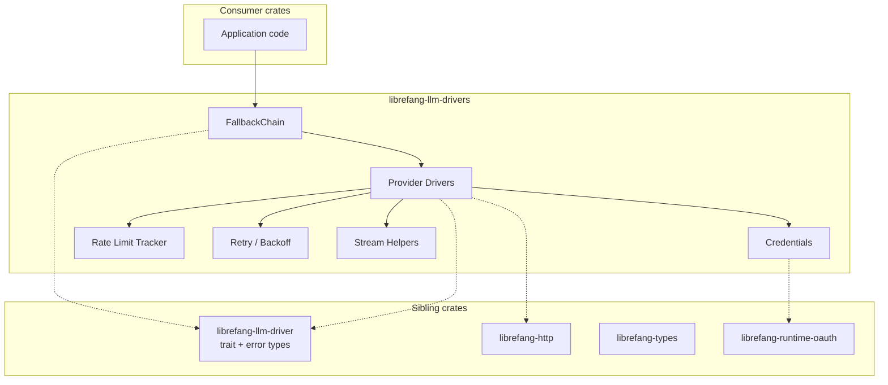

# Other — librefang-llm-drivers

# librefang-llm-drivers

Concrete LLM provider drivers for the LibreFang platform. This crate bridges the abstract driver interface defined in `librefang-llm-driver` with real HTTP integrations for Anthropic, OpenAI, Gemini, Groq, Ollama, and other LLM providers. It also ships production-grade infrastructure for credential management, failover, rate limiting, and stream handling.

## Architecture



Every public driver implements the `LlmDriver` trait re-exported from `librefang-llm-driver`. Consumers interact with drivers through that trait, keeping their code provider-agnostic.

## Public API

### Provider Drivers

The `drivers` module contains one sub-module per provider. Each exposes a concrete driver struct that can be instantiated with provider-specific configuration and used through the `LlmDriver` trait.

Supported providers:

| Module | Provider | Notes |
|---|---|---|
| `drivers::anthropic` | Anthropic | Claude family models |
| `drivers::openai` | OpenAI | GPT family models |
| `drivers::gemini` | Google Gemini | |
| `drivers::groq` | Groq | |
| `drivers::ollama` | Ollama | Local / self-hosted models |

### Fallback Chain

```rust
use librefang_llm_drivers::drivers::fallback_chain::{FallbackChain, ChainEntry};
```

`FallbackChain` composes multiple driver instances into an ordered failover list. When a request fails for a transient reason (rate limit, network error, server error), the chain advances to the next entry automatically.

- **`ChainEntry`** — pairs a driver with optional per-entry configuration (priority, weight, or provider-specific overrides).
- **`FallbackChain`** — iterates entries on failure, reports the `FailoverReason` for each attempt, and returns the first successful response or the last error.

This is the recommended entry point for production workloads that require resilience across providers.

### Credential Pool

```rust
use librefang_llm_drivers::credential_pool::{
    ArcCredentialPool, CredentialPool, PoolStrategy, PooledCredential, new_arc_pool,
};
```

Manages a shared pool of API keys so multiple concurrent tasks can draw credentials without hard-coding a single key.

- **`CredentialPool`** / **`ArcCredentialPool`** — thread-safe pool backed by `DashMap`. `ArcCredentialPool` is the `Arc`-wrapped alias for cheap cloning across tasks.
- **`new_arc_pool`** — convenience constructor that accepts an initial list of credentials and returns a ready-to-use `ArcCredentialPool`.
- **`PoolStrategy`** — selects how the next credential is chosen (e.g., round-robin, random, least-recently-used). This lets you spread load evenly across keys to avoid per-key rate limits.
- **`PooledCredential`** — wraps a raw credential string with bookkeeping metadata (last-used timestamp, usage counters) that the strategy consults.

### Rate Limit Tracking

```rust
use librefang_llm_drivers::rate_limit_tracker::{RateLimitBucket, RateLimitSnapshot};
```

Provides observability into per-provider rate-limit state gleaned from response headers.

- **`RateLimitBucket`** — represents a single provider's rate-limit window (requests remaining, reset timestamp, etc.). Updated by drivers after each HTTP response.
- **`RateLimitSnapshot`** — a read-only copy of current bucket state, suitable for logging, metrics emission, or display in dashboards.

### Supporting Utilities

These modules are public so that custom driver implementations outside this crate can reuse them.

| Module | Purpose |
|---|---|
| `backoff` | Exponential backoff calculation with jitter for retries. |
| `retry_after` | Parses `Retry-After` headers (seconds or HTTP-date) into a `Duration`. |
| `shared_rate_guard` | RAII-style guard that temporarily marks a rate-limit bucket as occupied, releasing it on drop. Prevents thundering-herd retries. |
| `stream_backpressure` | Applies backpressure when consuming SSE/token streams so a slow consumer doesn't unboundedly buffer responses. |
| `think_filter` | Strips or transforms "thinking" tokens that some providers emit during extended reasoning. |
| `utf8_stream` | Handles partial UTF-8 sequences that can be split across chunk boundaries in byte-oriented streams. Reassembles them into valid `String` chunks. |

### Re-exports

For convenience, the crate re-exports common types so consumers need fewer explicit dependencies:

- **`llm_driver`** — the trait and associated types from `librefang-llm-driver`.
- **`llm_errors`** — error categories shared across drivers.
- **`FailoverReason`** — enum describing why a fallback occurred (rate-limited, timed out, server error, etc.).

## How Drivers Work

Each provider driver follows the same lifecycle:

1. **Construction** — Instantiate the driver struct with an endpoint URL, a credential source (either a static key or a `CredentialPool`), optional model overrides, and HTTP client configuration via `librefang-http`.

2. **Request building** — The driver translates the provider-agnostic request type from `librefang-types` into the provider's wire format (JSON body, headers, query parameters).

3. **HTTP dispatch** — The request is sent through `librefang-http`, which may inject OAuth tokens from `librefang-runtime-oauth` when the credential pool supplies an OAuth-backed credential.

4. **Response handling** — On success, the provider-specific JSON response is parsed back into the shared response type. On failure:
   - Rate-limit responses update the `RateLimitBucket` and consult `retry_after`.
   - Transient errors trigger the backoff/retry loop if the driver was constructed with retry enabled.
   - Permanent errors are returned immediately.

5. **Streaming** — For streaming requests, the driver opens an SSE connection and yields tokens through an async stream. `stream_backpressure` and `utf8_stream` ensure correct flow control and encoding.

## Adding a New Provider

To add support for a new LLM provider:

1. Create a new submodule under `drivers/` (e.g., `drivers::mistral`).
2. Define a driver struct that holds configuration and an HTTP client.
3. Implement the `LlmDriver` trait, delegating HTTP work to `librefang-http`.
4. Use `backoff`, `retry_after`, `shared_rate_guard`, and `rate_limit_tracker` for retry and observability — these are designed to be shared across all drivers.
5. For streaming, compose `stream_backpressure` and `utf8_stream` into your token pipeline.
6. Register the driver in `FallbackChain` tests to verify failover behavior.

## Key Dependencies

| Crate | Role |
|---|---|
| `librefang-llm-driver` | Provides the `LlmDriver` trait and error types that every driver implements. |
| `librefang-types` | Shared request/response types exchanged across the trait boundary. |
| `librefang-http` | HTTP client construction, middleware, and request execution. |
| `librefang-runtime-oauth` | OAuth token acquisition for providers that require it. |
| `reqwest` | Underlying HTTP client. |
| `tokio` | Async runtime for spawning tasks and timers. |
| `dashmap` | Concurrent map backing `CredentialPool` and `RateLimitBucket`. |
| `sha2` / `base64` | Credential hashing and encoding where needed. |
| `zeroize` | Secure clearing of credential material from memory on drop. |
| `serde` / `serde_json` | Serialization of provider wire formats. |