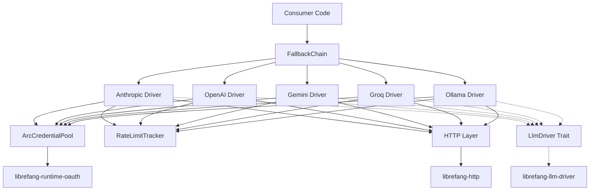

# Other — librefang-llm-drivers

# librefang-llm-drivers

Concrete LLM provider drivers for LibreFang. This crate implements the `LlmDriver` trait (defined in `librefang-llm-driver`) for Anthropic, OpenAI, Gemini, Groq, Ollama, and other providers, along with the infrastructure needed to manage credentials, rate limits, retries, and failover across them.

## Architecture



All drivers implement the same `LlmDriver` trait, making them interchangeable. `FallbackChain` composes multiple drivers behind a single interface, automatically trying the next provider when one fails.

## Provider Drivers

Each provider lives in its own submodule under `drivers`. They translate the generic `LlmDriver` interface into provider-specific HTTP requests, handling authentication headers, request body formatting, and response parsing.

| Module | Provider | Auth Method |
|--------|----------|-------------|
| `drivers::anthropic` | Anthropic (Claude) | API key (`x-api-key`) |
| `drivers::openai` | OpenAI (GPT) | Bearer token |
| `drivers::gemini` | Google Gemini | API key |
| `drivers::groq` | Groq | Bearer token |
| `drivers::ollama` | Ollama (local) | None / optional |

All drivers depend on `librefang-http` for outbound HTTP calls and `librefang-types` for shared data structures like chat messages and model configurations.

## Credential Pool

**Module:** `credential_pool`

Manages a shared pool of API keys, allowing multiple concurrent requests to rotate through available credentials rather than hammering a single key.

### Key Types

- **`CredentialPool`** — Inner pool managing credential state and rotation.
- **`ArcCredentialPool`** — Thread-safe `Arc` wrapper suitable for sharing across tasks.
- **`PooledCredential`** — A credential borrowed from the pool, automatically returned on drop.
- **`PoolStrategy`** — Enum controlling how credentials are selected (e.g., round-robin, random).
- **`new_arc_pool`** — Constructor that takes a list of credentials and returns an `ArcCredentialPool`.

### Usage Pattern

```rust
let pool = new_arc_pool(vec!["key-1".into(), "key-2".into()], PoolStrategy::RoundRobin);

// Each request borrows a credential; it's returned to the pool when dropped
let cred = pool.acquire().await?;
make_request(cred.secret()).await;
// cred dropped here → key returns to pool
```

The `zeroize` dependency ensures secrets are securely wiped from memory when no longer in use.

## Fallback Chain

**Module:** `drivers::fallback_chain`

Composes multiple `LlmDriver` instances into a single driver that tries providers in order. If a request fails, the chain advances to the next provider.

### Key Types

- **`FallbackChain`** — The composite driver. Implements `LlmDriver` itself.
- **`ChainEntry`** — A single entry in the chain, pairing a driver with its configuration.
- **`FailoverReason`** — Enum describing why a failover occurred (rate limit, server error, timeout, etc.).

The chain respects rate-limit signals. When a provider returns a 429, the chain marks that provider as temporarily unavailable and moves to the next.

## Rate Limit Tracking

**Module:** `rate_limit_tracker`

Provides observability into per-provider rate limit windows.

- **`RateLimitBucket`** — Tracks remaining capacity and reset time for a single provider.
- **`RateLimitSnapshot`** — A point-in-time read of bucket state, used for metrics and logging.

Drivers update the tracker based on response headers (`x-ratelimit-remaining`, `x-ratelimit-reset`, etc.). The `shared_rate_guard` utility wraps access to these buckets with proper synchronization (`dashmap`).

## Retry and Backoff

**Module:** `backoff`, `retry_after`, `shared_rate_guard`

Handles transient failures with configurable retry strategies:

- **`backoff`** — Exponential backoff computation with jitter.
- **`retry_after`** — Parses `Retry-After` headers (both delta-seconds and HTTP-date formats) and integrates them into the backoff calculation. When a provider sends `Retry-After`, it overrides the computed backoff.
- **`shared_rate_guard`** — Coordinates retry state across concurrent tasks to avoid thundering-herd behavior.

## Stream Handling

**Module:** `stream_backpressure`, `utf8_stream`, `think_filter`

Utilities for processing streaming LLM responses:

- **`stream_backpressure`** — Applies backpressure when the consumer can't keep up with the stream, preventing unbounded memory growth.
- **`utf8_stream`** — Handles partial UTF-8 sequences that can appear when SSE frames split multi-byte characters mid-stream. Reassembles them before yielding to the caller.
- **`think_filter`** — Strips "thinking" tokens (internal reasoning blocks) from provider responses when the caller only wants the final output.

## Re-exports

The crate re-exports key types from its dependency crates for convenience:

- **`llm_driver`** — The `LlmDriver` trait and associated types from `librefang-llm-driver`.
- **`llm_errors`** — Error types for LLM operations.
- **`FailoverReason`** — Reason enum for fallback events.

## Testing

Dev dependencies include `wiremock` for HTTP mocking, `serial_test` for test serialization, and `tempfile` for temporary file management. Each driver has integration tests that mock the provider's HTTP API to verify request formatting and response parsing without hitting real endpoints.

## Integration with the Workspace

This crate sits between the abstract trait layer and the application layer:

1. **`librefang-llm-driver`** defines the `LlmDriver` trait — this crate implements it.
2. **`librefang-types`** provides shared types (messages, models, configs) — this crate consumes them.
3. **`librefang-http`** handles the actual HTTP transport — this crate builds provider-specific requests on top of it.
4. **`librefang-runtime-oauth`** provides OAuth token management — used by drivers that require OAuth flows (e.g., some Gemini configurations).
5. Application code depends on this crate (or a facade that re-exports it) to get concrete, ready-to-use driver instances.