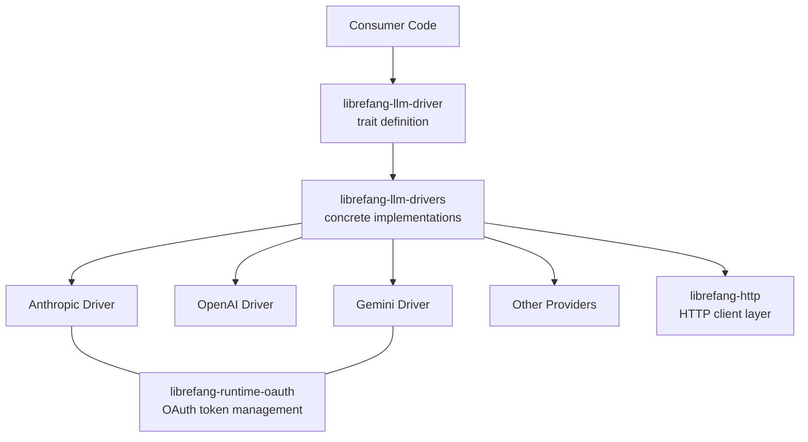

# Other — librefang-llm-drivers

# librefang-llm-drivers

Concrete LLM provider drivers implementing the `librefang-llm-driver` trait for Anthropic, OpenAI, Google Gemini, and other LLM backends.

## Purpose

This crate provides the actual HTTP integrations with large language model APIs. Each provider gets its own driver that knows how to format requests, handle authentication, parse responses, and manage streaming — all behind a unified interface defined in `librefang-llm-driver`.

## Architecture



The crate follows a provider-plugin model: callers depend on the abstract trait from `librefang-llm-driver` and instantiate whichever concrete driver they need from this crate.

## Key Dependencies and Their Roles

| Dependency | Role in this crate |
|---|---|
| `librefang-llm-driver` | Defines the trait interface (`LlmDriver` or similar) that each provider implements |
| `librefang-types` | Shared domain types — messages, tool calls, completion responses, etc. |
| `librefang-http` | HTTP client abstraction layer, shared across the project |
| `librefang-runtime-oauth` | OAuth 2.0 token acquisition and refresh, used by providers that require it (Google, Azure) |
| `reqwest` | Underlying HTTP client for making API calls to provider endpoints |
| `tokio` / `tokio-stream` / `futures` | Async runtime and stream processing for SSE-based streaming completions |
| `serde` / `serde_json` | Request serialization and response deserialization for each provider's JSON schema |
| `sha2` / `hmac` / `hex` | HMAC-SHA256 request signing for providers that use sigv4-style auth (AWS Bedrock) |
| `base64` | Encoding binary content in multimodal messages |
| `dashmap` | Concurrent hashmap for thread-safe state such as active stream tracking or request deduplication |
| `zeroize` | Secure clearing of secrets (API keys, tokens) from memory |
| `regex-lite` | Lightweight regex for response post-processing or content extraction |
| `url` | URL construction and validation for provider endpoints |
| `chrono` / `uuid` | Timestamps and correlation IDs for request tracing |

## Provider Driver Pattern

Each driver is expected to follow the same general structure:

1. **Configuration struct** — Holds provider-specific settings: base URL, API key or credential reference, model name, timeout values, etc.

2. **Request building** — Translates the generic request types from `librefang-types` into the provider's wire format. This includes message formatting, tool/function definition serialization, and any provider-specific parameters.

3. **Authentication** — Applies the appropriate auth method:
   - **Bearer token** (Anthropic, OpenAI): Header injection via `x-api-key` or `Authorization`.
   - **OAuth 2.0** (Gemini, Azure): Token acquisition and refresh through `librefang-runtime-oauth`.
   - **HMAC signing** (AWS Bedrock): Request signing using `sha2`/`hmac` with the provider's signing algorithm.

4. **Response parsing** — Deserializes the provider's JSON response into the shared `librefang-types` response types, normalizing differences between provider schemas.

5. **Streaming** — For streaming completions, processes server-sent events (SSE) via `tokio-stream`, yielding partial results as they arrive.

## Implementing a New Provider

To add support for a new LLM provider:

1. Create a new module within this crate (e.g., `src/newprovider.rs`).
2. Define a configuration struct holding the provider's required settings.
3. Implement the trait from `librefang-llm-driver`, covering:
   - Non-streaming completion requests
   - Streaming completion requests (if supported)
   - Tool/function call handling
   - Error mapping from provider-specific errors to the shared error type
4. Add serialization types matching the provider's request/response JSON schemas.
5. Register the module in `src/lib.rs` (or the appropriate mod declaration).

### Authentication Checklist

- If the provider uses static API keys: inject them as headers in the request builder.
- If the provider uses OAuth: integrate with `librefang-runtime-oauth` for token management.
- If the provider uses request signing: implement the signing logic using `hmac` and `sha2`, and call `zeroize::Zeroize` on key material after use.

## Connection to the Wider Codebase

```
librefang-types ← librefang-llm-driver ← librefang-llm-drivers
                                            ↕
                                     librefang-http
                                     librefang-runtime-oauth
```

- **Upstream**: Consumer crates depend on `librefang-llm-driver` for the trait and inject a concrete driver from this crate at runtime.
- **Side dependencies**: HTTP communication goes through `librefang-http`, and OAuth flows go through `librefang-runtime-oauth`.
- **Shared types**: All message, completion, and error types come from `librefang-types`, keeping drivers decoupled from application logic.