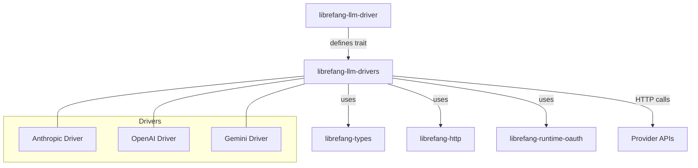

# Other — librefang-llm-drivers

# librefang-llm-drivers

Concrete LLM provider drivers implementing the `librefang-llm-driver` trait. Each driver encapsulates the HTTP communication, authentication, request formatting, and response parsing required to interact with a specific LLM provider's API.

## Purpose

This crate serves as the bridge between Librefang's generic LLM abstraction layer (`librefang-llm-driver`) and the actual provider APIs. It ships ready-to-use driver implementations for providers such as **Anthropic**, **OpenAI**, and **Google Gemini**, handling the idiosyncrasies of each provider's wire format, authentication scheme, and error semantics.

## Architecture



## Key Dependencies

| Dependency | Role |
|---|---|
| `librefang-llm-driver` | Defines the trait (`LlmDriver` or similar) that each concrete driver implements |
| `librefang-types` | Shared domain types — request/response models, error types, configuration structs |
| `librefang-http` | Shared HTTP client utilities, middleware, or request building helpers |
| `librefang-runtime-oauth` | OAuth token acquisition and refresh, used by providers that require OAuth (e.g., Gemini via Google credentials) |
| `reqwest` | Underlying HTTP client for making API calls to provider endpoints |
| `async-trait` | Enables async methods in the driver trait implementation |
| `dashmap` | Concurrent hashmap used for thread-safe caching (e.g., token caches, response memoization) |
| `sha2` / `zeroize` | Secure hashing and memory zeroing for credential handling |
| `base64` | Encoding for API keys and payload construction |

## How Drivers Work

Each driver follows the same general pattern:

1. **Configuration** — Accept provider-specific configuration (API key, base URL, model name, etc.) at construction time.
2. **Authentication** — Attach credentials to outgoing requests. For OpenAI and Anthropic, this is typically an `Authorization` header with an API key. For Gemini, OAuth tokens are obtained and refreshed via `librefang-runtime-oauth`.
3. **Request Formatting** — Translate the generic `librefang-types` request model into the provider's expected JSON payload format, including any provider-specific parameters.
4. **HTTP Dispatch** — Send the request using `reqwest` (often through `librefang-http` helpers for retries, timeouts, and middleware).
5. **Response Parsing** — Deserialize the provider's JSON response into `librefang-types` response models, normalizing away provider-specific field names and structures.
6. **Error Handling** — Map provider-specific error responses (rate limits, auth failures, server errors) into the shared error types from `librefang-types`.

## Adding a New Provider Driver

To add support for a new LLM provider:

1. Create a new module file (e.g., `src/newprovider.rs`).
2. Define a struct holding the provider's configuration and any runtime state (token caches, HTTP client handle).
3. Implement the driver trait from `librefang-llm-driver` for your struct.
4. Handle authentication — use a static API key header, or integrate with `librefang-runtime-oauth` if the provider uses OAuth.
5. Implement request serialization and response deserialization, mapping to/from `librefang-types`.
6. Register the driver in any factory or registry module so it can be instantiated by name.

### Example Skeleton

```rust
use async_trait::async_trait;
use librefang_llm_driver::LlmDriver; // adjust to actual trait name
use librefang_types::{LlmRequest, LlmResponse, LlmError};

pub struct NewProviderDriver {
    api_key: String,
    client: reqwest::Client,
}

#[async_trait]
impl LlmDriver for NewProviderDriver {
    async fn complete(&self, request: LlmRequest) -> Result<LlmResponse, LlmError> {
        // 1. Build provider-specific HTTP request
        // 2. Send via self.client
        // 3. Parse response into LlmResponse
        todo!()
    }
}
```

## Security Considerations

- **Credential zeroing**: The `zeroize` dependency ensures sensitive data (API keys, tokens) can be securely erased from memory when dropped.
- **OAuth token caching**: Tokens obtained via `librefang-runtime-oauth` are stored in a `DashMap` for concurrent access, and should be refreshed proactively before expiry.
- **No credential logging**: The `tracing` integration should be configured to never log full API keys or tokens. Drivers should redact sensitive headers in trace output.

## Testing

The `dev-dependencies` indicate the testing strategy:

- **`wiremock`** — Mock HTTP servers for integration testing against simulated provider APIs. Each driver should have wiremock-based tests that verify request formatting, response parsing, and error handling without hitting real endpoints.
- **`serial_test`** — Serializes tests that share state (e.g., credential files, environment variables), preventing race conditions in concurrent test runs.
- **`tempfile`** — Creates temporary directories and files for tests that involve credential storage or file-based configuration.

Tests are typically organized per driver, with a shared wiremock setup that stubs the provider's API endpoints.