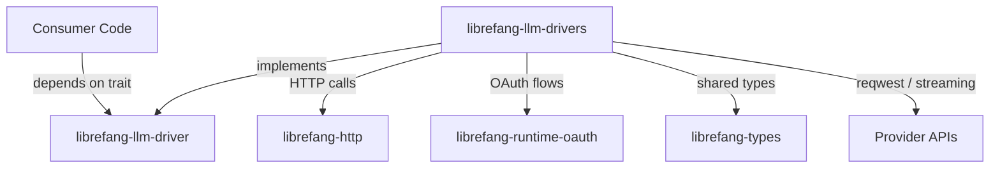

# Other — librefang-llm-drivers

# librefang-llm-drivers

Concrete LLM provider drivers implementing the `librefang-llm-driver` trait. This module contains the provider-specific logic for communicating with large language model APIs such as Anthropic (Claude), OpenAI (GPT), and Google Gemini.

## Purpose

This crate is the **implementation layer** that sits behind the `librefang-llm-driver` trait abstraction. Each provider has its own driver module handling:

- Request serialization in the provider's expected format
- Authentication (API keys, OAuth tokens, request signing)
- HTTP communication via `librefang-http` and `reqwest`
- Response parsing, including streaming Server-Sent Events (SSE)
- Error mapping into a unified error type

Consumers of the LLM subsystem depend on the trait crate (`librefang-llm-driver`), not on this crate directly. This keeps provider details isolated and swappable.

## Architecture

## Key Dependencies and Why They Exist

| Dependency | Role in this crate |
|---|---|
| `librefang-llm-driver` | Defines the trait each driver implements. |
| `librefang-types` | Shared types: messages, tool definitions, completion responses, etc. |
| `librefang-http` | Shared HTTP client construction and configuration. |
| `librefang-runtime-oauth` | OAuth token acquisition for providers that require it (e.g., Gemini with service accounts). |
| `reqwest` | Underlying HTTP client for sending requests to provider endpoints. |
| `tokio-stream` / `futures` | Async stream handling for SSE-based streaming completions. |
| `serde` / `serde_json` | JSON serialization of requests and deserialization of responses. |
| `sha2` / `hmac` / `hex` / `zeroize` | Cryptographic request signing for providers that require signed payloads (e.g., AWS Sigv4-style auth). `zeroize` ensures sensitive key material is cleared from memory. |
| `base64` | Encoding binary data in authentication headers or image content parts. |
| `dashmap` | Concurrent map for caching tokens, session state, or rate-limit tracking across async tasks. |
| `regex-lite` | Lightweight pattern matching, likely for extracting structured data from model output. |
| `url` | URL construction and validation for provider endpoints. |
| `chrono` / `uuid` | Timestamps and request IDs used in signed requests or correlation headers. |
| `rand` | Randomness for nonce generation in signing flows. |

## Provider Drivers

Each driver translates the generic trait interface into a specific provider's wire format. While the exact module layout is provider-specific, the general pattern is:

1. **Build the request body** — Map `librefang-types` structures (messages, tools, parameters) into the provider's JSON schema.
2. **Authenticate** — Attach API keys via headers, obtain OAuth tokens via `librefang-runtime-oauth`, or compute HMAC signatures.
3. **Send the request** — Use `librefang-http` (backed by `reqwest`) to POST to the provider's completions endpoint.
4. **Parse the response** — Deserialize the provider's JSON response into the shared `librefang-types` completion types.
5. **Handle streaming** — For streaming completions, parse SSE frames from the byte stream (`tokio-stream`) and yield partial results incrementally.

### Supported Providers

- **Anthropic** — Claude family of models. Uses `x-api-key` header authentication.
- **OpenAI** — GPT family. Uses `Authorization: Bearer` header authentication.
- **Gemini** — Google's Gemini models. May use OAuth service-account flows via `librefang-runtime-oauth`.

## Error Handling

Driver-specific errors (HTTP status codes, provider error payloads, network failures, auth failures) are mapped into the unified error type defined in `librefang-llm-driver`. This ensures that consumer code handles errors consistently regardless of which provider is in use.

`thiserror` is used for ergonomic error derivation.

## Observability

All drivers emit structured log events via `tracing` for request/response lifecycle events (request sent, response received, errors, retries). This integrates with the workspace-wide tracing setup.

## Adding a New Provider

1. Create a new module file named after the provider.
2. Define a struct that holds configuration (API key, base URL, model name).
3. Implement the trait from `librefang-llm-driver`.
4. Handle serialization, authentication, HTTP, and deserialization within the impl.
5. Register the driver in whatever factory/registry the workspace uses for instantiation.

## Relationship to the Workspace

This crate is consumed at runtime by whatever orchestration or agent layer the Librefang project provides. It is intentionally a leaf dependency — it depends on abstractions (`librefang-llm-driver`, `librefang-types`) but nothing in the workspace depends on it directly. Higher-level code selects and instantiates the appropriate driver based on configuration.