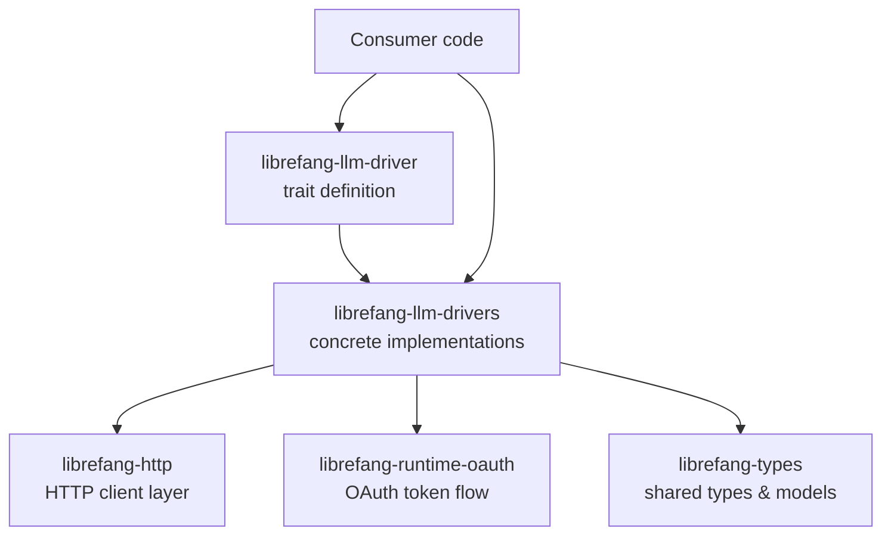

# Other — librefang-llm-drivers

# librefang-llm-drivers

Concrete LLM provider drivers implementing the `librefang-llm-driver` trait. Each driver translates the crate's unified LLM interface into provider-specific HTTP API calls, handling authentication, request formatting, response parsing, and streaming.

## Purpose

This crate is the bridge between the abstract LLM driver interface and real-world provider APIs. It ships ready-to-use driver implementations for major LLM providers (Anthropic, OpenAI, Gemini, and others), so consumers can instantiate a driver and pass it to higher-level orchestration without worrying about each provider's unique API surface.

## Architecture



Each driver is a struct that implements the trait from `librefang-llm-driver`. Drivers delegate HTTP communication to `librefang-http` rather than constructing `reqwest` clients directly, keeping transport concerns in one place.

## Dependency Breakdown

| Dependency | Role in this crate |
|---|---|
| `librefang-llm-driver` | Provides the trait each concrete driver implements. |
| `librefang-types` | Shared types — message formats, model identifiers, completion responses, error types. |
| `librefang-http` | HTTP client abstraction; drivers use this to make requests instead of raw `reqwest`. |
| `librefang-runtime-oauth` | OAuth flows required by providers like Gemini that use Google's auth. |
| `serde` / `serde_json` | Serializing requests and deserializing provider-specific JSON responses. |
| `tokio` / `tokio-stream` / `futures` | Async runtime support and SSE/response stream handling. |
| `reqwest` | Underlying HTTP client (used via `librefang-http`). |
| `bytes` | Efficient byte handling for streaming response bodies. |
| `dashmap` | Concurrent hashmap — used for caching auth tokens, session state, or rate-limit counters across async tasks. |
| `sha2` / `hmac` / `hex` | Request signing for providers that require HMAC-based authentication schemes. |
| `zeroize` | Secure clearing of sensitive data (API keys, tokens) from memory. |
| `rand` | Randomness for nonce generation or request IDs. |
| `chrono` / `uuid` | Timestamps and unique identifiers for request metadata. |
| `base64` | Encoding binary payloads or auth headers. |
| `regex-lite` | Lightweight pattern matching on provider response payloads. |
| `url` | Programmatic URL construction for provider endpoints. |

## Provider Implementations

Based on the crate description, the following providers are supported:

- **Anthropic** — Claude API integration
- **OpenAI** — GPT-family models via the OpenAI API
- **Gemini** — Google's Gemini models, using OAuth from `librefang-runtime-oauth`

Each provider driver is responsible for:

1. **Authentication** — Attaching the correct auth mechanism (API key header, Bearer token, OAuth token, HMAC signature).
2. **Request formatting** — Translating the generic message/completion request into the provider's JSON schema.
3. **Response parsing** — Deserializing the provider's response into the shared types from `librefang-types`.
4. **Streaming** — Converting provider-specific SSE or chunked responses into a unified async stream.

## Integration with the Codebase

To use a driver, consumer code selects the appropriate implementation, constructs it with provider-specific configuration (API key, endpoint, model), and uses it through the `librefang-llm-driver` trait:

```
librefang-types        ← shared data structures
librefang-llm-driver   ← trait definition (no implementations)
librefang-llm-drivers  ← concrete drivers (this crate)
librefang-http         ← shared HTTP transport
librefang-runtime-oauth ← OAuth support for Google/Gemini
```

The trait boundary means consumers remain decoupled from any single provider. Swapping from OpenAI to Anthropic is a matter of constructing a different driver struct — the calling code stays the same.

## Security Considerations

- **`zeroize`** ensures API keys and tokens are cleared from memory when dropped.
- **`dashmap`** provides safe concurrent access to cached credentials without unsafe code.
- Auth tokens managed through `librefang-runtime-oauth` follow standard OAuth2 refresh flows rather than storing long-lived credentials.