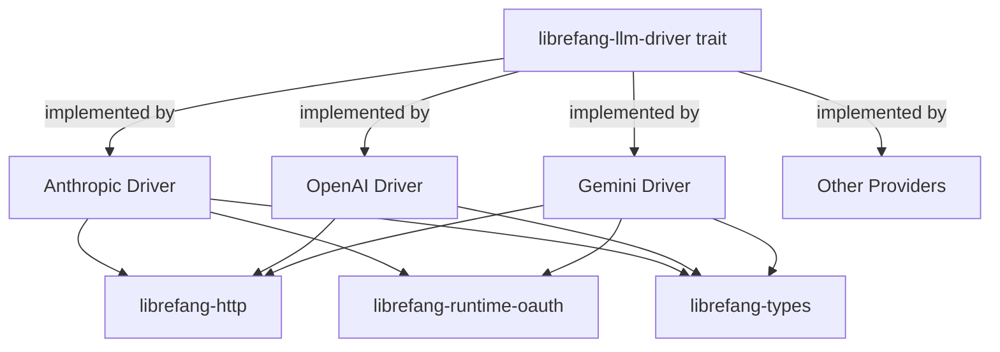

# Other — librefang-llm-drivers

# librefang-llm-drivers

Concrete LLM provider drivers implementing the `librefang-llm-driver` trait for Anthropic, OpenAI, Google Gemini, and other providers.

## Overview

This crate contains the actual HTTP+API integrations for each supported LLM provider. It is the "plug-in" layer: every driver in this crate implements the trait defined in `librefang-llm-driver`, translating a generic request into provider-specific HTTP payloads and converting provider-specific responses back into the shared types from `librefang-types`.

```
┌──────────────────┐      trait bound      ┌──────────────────────────────┐
│ librefang-llm-   │◄──────────────────────│  librefang-llm-drivers       │
│ driver (trait)   │                       │  ┌─────────┐ ┌───────────┐  │
└──────────────────┘                       │  │Anthropic│ │  OpenAI   │  │
                                           │  └─────────┘ └───────────┘  │
┌──────────────────┐      shared types     │  ┌─────────┐ ┌───────────┐  │
│ librefang-types  │◄──────────────────────│  │ Gemini  │ │  …more    │  │
└──────────────────┘                       │  └─────────┘ └───────────┘  │
                                           └──────────────────────────────┘
```

## Architecture



Each driver follows the same pattern:

1. **Serialize** a `librefang-types` request into the provider's JSON schema.
2. **Authenticate** using API keys, HMAC signatures, or OAuth tokens (via `librefang-runtime-oauth`).
3. **Send** the request through `librefang-http` / `reqwest`.
4. **Parse** the provider-specific response JSON into shared `librefang-types`.
5. **Stream** partial responses token-by-token when the caller requests streaming mode (`tokio-stream` / `futures`).

## Dependencies and Why They Exist

| Dependency | Purpose |
|---|---|
| `librefang-llm-driver` | Provides the `LlmDriver` trait each provider must implement. |
| `librefang-types` | Shared request/response types, message roles, tool-call definitions. |
| `librefang-http` | Centralised HTTP client configuration, retries, rate-limit awareness. |
| `librefang-runtime-oauth` | OAuth2 token acquisition and refresh for providers that require it (e.g. Gemini via service accounts). |
| `reqwest` | Underlying HTTP client. |
| `serde` / `serde_json` | Serialisation of provider-specific payloads. |
| `async-trait` | Async-compatible trait definitions. |
| `tokio` / `futures` / `tokio-stream` | Async runtime and stream combinators for SSE/token streaming. |
| `sha2` / `hmac` / `hex` / `base64` | Cryptographic signing used by providers that require HMAC-signed payloads. |
| `zeroize` | Securely zero API keys and secrets from memory after use. |
| `dashmap` | Concurrent map for caching tokens, session state, or rate-limit counters. |
| `chrono` / `uuid` | Timestamps and correlation IDs for request tracing. |
| `regex-lite` | Lightweight regex for parsing provider-specific error messages or extracting structured output. |
| `url` | URL construction and validation for provider endpoints. |
| `rand` | Randomised back-off jitter on retries. |
| `thiserror` | Ergonomic error types per driver. |
| `tracing` | Structured logging of requests, responses, and errors. |

## Adding a New Provider

1. Create a new module file (e.g. `src/cohere.rs`).
2. Define a struct that holds configuration (API key, base URL, model overrides).
3. Implement `LlmDriver` from `librefang-llm-driver`.
4. Map the generic request type to the provider's API format and vice-versa.
5. Register the driver in the crate's public API so consumers can instantiate it by name.

Key points when implementing:

- **Never log secrets.** Use `zeroize::Zeroize` on any structure that temporarily holds API keys.
- **Respect rate limits.** Return structured errors that the retry layer in `librefang-http` can act on.
- **Support streaming.** Even if the provider uses a non-standard SSE format, convert it to the stream type expected by the trait so callers see a uniform interface.

## Relationship to the Rest of the Codebase

- **Consumed by** the orchestration/application layer, which selects a driver at runtime based on user configuration and passes it around as a `dyn LlmDriver`.
- **Depends on** `librefang-types` for all cross-crate data shapes; provider-specific JSON is an internal detail never leaked outside this crate.
- **Uses** `librefang-http` rather than calling `reqwest` directly, ensuring all outbound HTTP traffic goes through the project's shared client configuration (TLS settings, proxies, timeouts, observability hooks).

## Security Considerations

- API keys are held in structs that implement `Zeroize`; keys are cleared on `Drop`.
- `hmac`/`sha2` are used for providers that sign request bodies rather than sending bearer tokens.
- OAuth tokens obtained via `librefang-runtime-oauth` are cached in a `DashMap` with automatic refresh, avoiding unnecessary credential exposure.
- All outbound traffic should go through `librefang-http` to ensure consistent TLS enforcement.